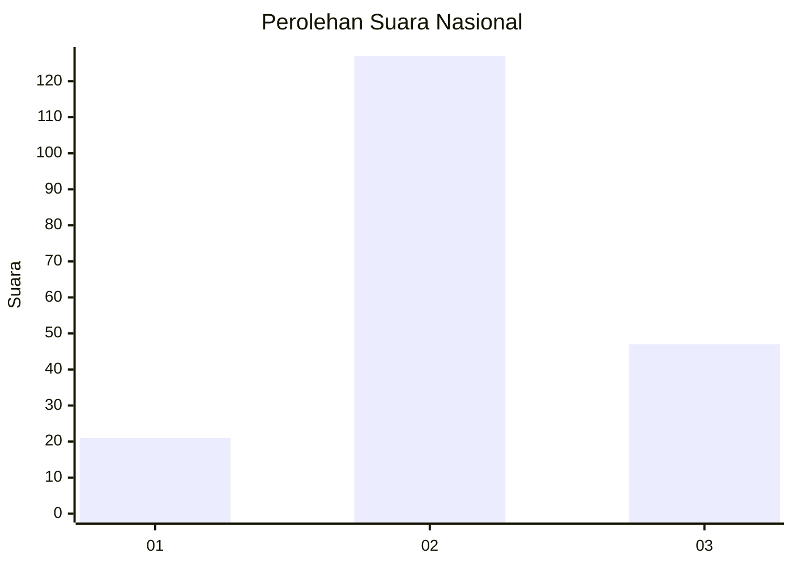
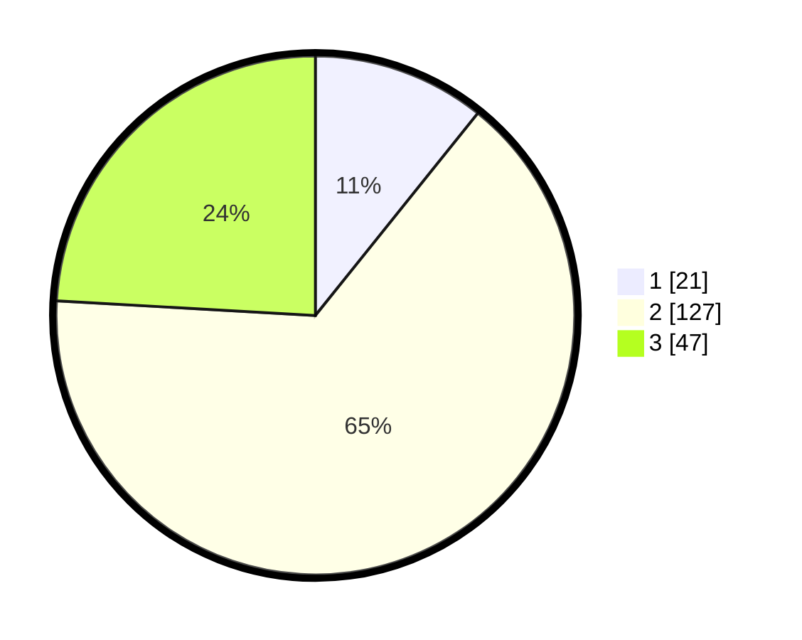

# Hasil

## Grafik

## Tabel

| No. | Nama Paslon    | Suara | Suara (raw) | Persentase |
|:--- |:-------------- | -----:| -----------:| ----------:|
| 1   | ANIES MUHAIMIN | 21    | [21][p-1]   | 10,77      |
| 2   | PRABOWO GIBRAN | 127   | [127][p-2]  | 65,13      |
| 3   | GANJAR MAHFUD  | 47    | [47][p-3]   | 24,10      |

[p-1]: https://github.com/gigit-pemilu/pemilu-2024/blob/main/pilpres/hitung-suara/sub/34-di-yogyakarta/sub/02-bantul/sub/06-pandak/sub/2002-triharjo/sub/013-tps/sub/paslon-1.txt
[p-2]: https://github.com/gigit-pemilu/pemilu-2024/blob/main/pilpres/hitung-suara/sub/34-di-yogyakarta/sub/02-bantul/sub/06-pandak/sub/2002-triharjo/sub/013-tps/sub/paslon-2.txt
[p-3]: https://github.com/gigit-pemilu/pemilu-2024/blob/main/pilpres/hitung-suara/sub/34-di-yogyakarta/sub/02-bantul/sub/06-pandak/sub/2002-triharjo/sub/013-tps/sub/paslon-3.txt

## Foto C Plano

https://sirekap-obj-formc.kpu.go.id/0081/pemilu/ppwp/34/02/06/20/02/3402062002013-20240214-214822--2c8566ab-1a4a-4c22-b874-43539af6a34a.jpg

https://sirekap-obj-formc.kpu.go.id/0081/pemilu/ppwp/34/02/06/20/02/3402062002013-20240214-214933--fe0fabd6-6505-4e25-9b21-f931fe7b90c9.jpg

https://sirekap-obj-formc.kpu.go.id/0081/pemilu/ppwp/34/02/06/20/02/3402062002013-20240214-215138--e65f623b-7bd0-41b3-9d2f-209df6000fdd.jpg

## Metadata

| Key        | Value               |
| ---------- | ------------------- |
| Time Stamp | 2024-02-24 22:31:28 |

