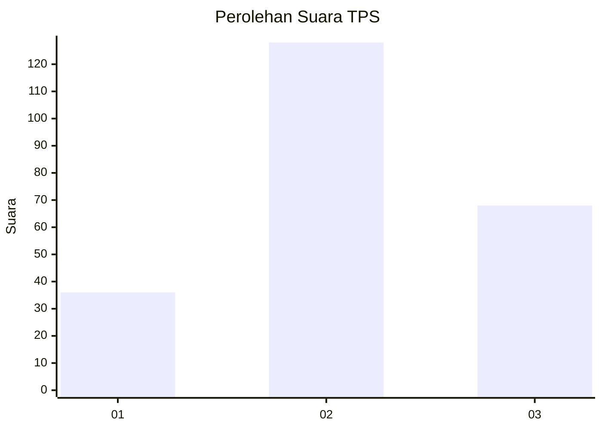
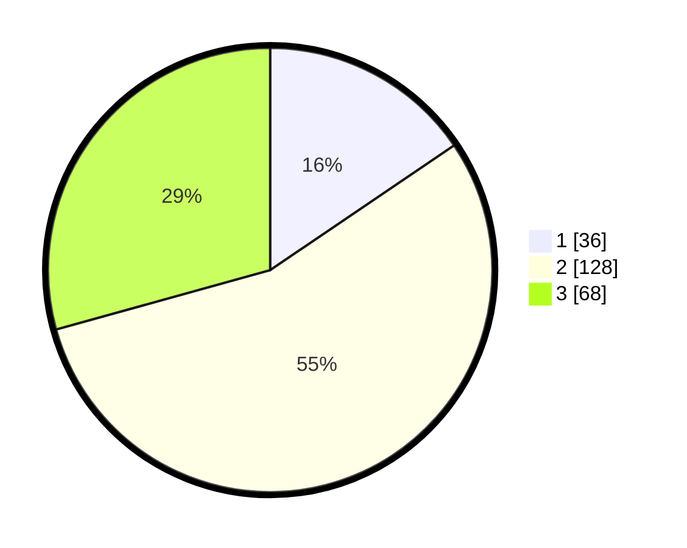

# Hasil

## Grafik

## Tabel

| No. | Nama Paslon    | Suara | Suara (raw) | Persentase |
|:--- |:-------------- | -----:| -----------:| ----------:|
| 1   | ANIES MUHAIMIN | 36    | [36][p-1]   | 15,52      |
| 2   | PRABOWO GIBRAN | 128   | [128][p-2]  | 55,17      |
| 3   | GANJAR MAHFUD  | 68    | [68][p-3]   | 29,31      |

[p-1]: https://github.com/gigit-pemilu/pemilu-2024-34-di-yogyakarta/blob/main/pilpres/hitung-suara/sub/34-di-yogyakarta/sub/02-bantul/sub/06-pandak/sub/2002-triharjo/sub/014-tps/sub/paslon-1.txt
[p-2]: https://github.com/gigit-pemilu/pemilu-2024-34-di-yogyakarta/blob/main/pilpres/hitung-suara/sub/34-di-yogyakarta/sub/02-bantul/sub/06-pandak/sub/2002-triharjo/sub/014-tps/sub/paslon-2.txt
[p-3]: https://github.com/gigit-pemilu/pemilu-2024-34-di-yogyakarta/blob/main/pilpres/hitung-suara/sub/34-di-yogyakarta/sub/02-bantul/sub/06-pandak/sub/2002-triharjo/sub/014-tps/sub/paslon-3.txt

## Foto C Plano

https://sirekap-obj-formc.kpu.go.id/e956/pemilu/ppwp/34/02/06/20/02/3402062002014-20240215-004838--78a65870-9362-4859-a520-b4b81c044dc7.jpg

https://sirekap-obj-formc.kpu.go.id/e956/pemilu/ppwp/34/02/06/20/02/3402062002014-20240215-004843--f7158b0d-0064-4322-92d4-19a37de58402.jpg

https://sirekap-obj-formc.kpu.go.id/e956/pemilu/ppwp/34/02/06/20/02/3402062002014-20240215-004849--8432d77b-64a7-4730-be2b-49f18749314b.jpg

## Metadata

| Key        | Value               |
| ---------- | ------------------- |
| Time Stamp | 2024-02-24 22:31:28 |

