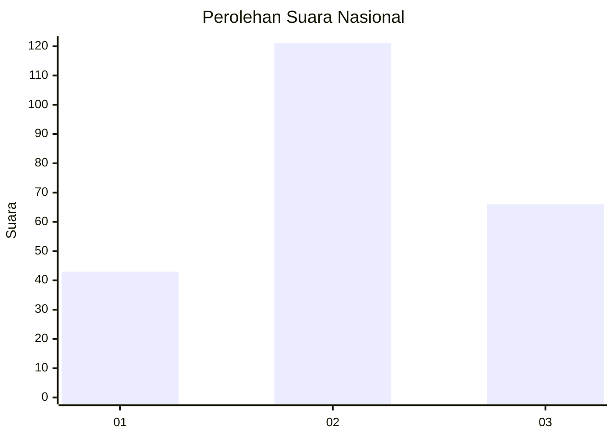
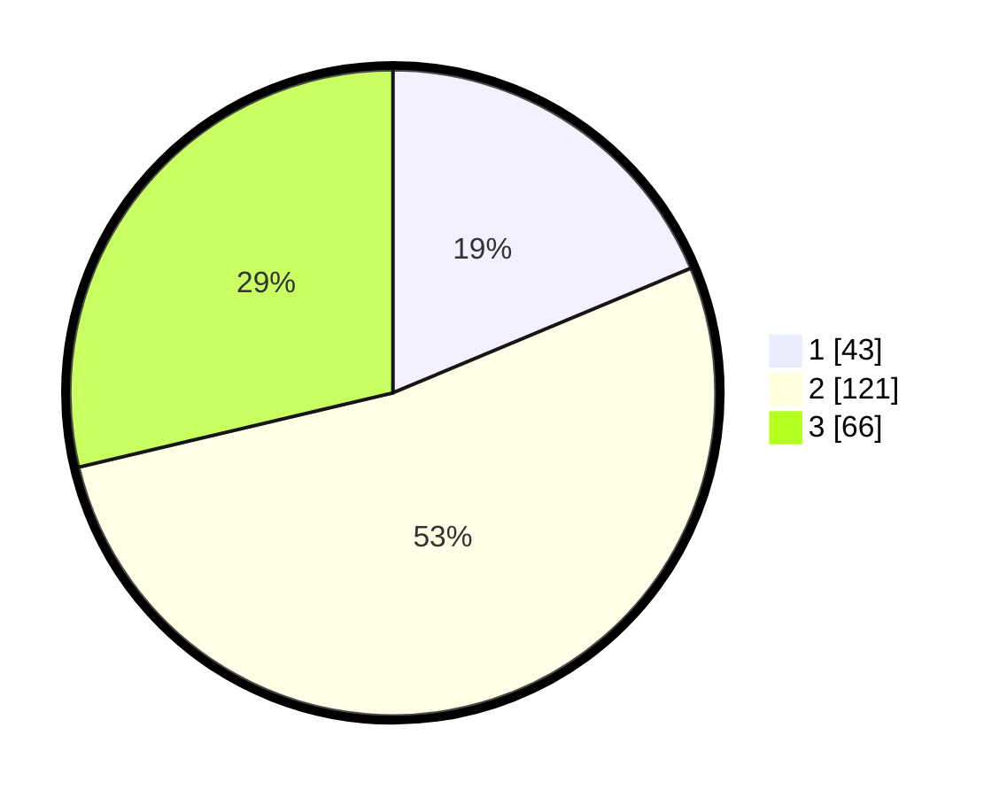

# Hasil

## Grafik

## Tabel

| No. | Nama Paslon    | Suara | Suara (raw) | Persentase |
|:--- |:-------------- | -----:| -----------:| ----------:|
| 1   | ANIES MUHAIMIN | 43    | [43][p-1]   | 18,70      |
| 2   | PRABOWO GIBRAN | 121   | [121][p-2]  | 52,61      |
| 3   | GANJAR MAHFUD  | 66    | [66][p-3]   | 28,70      |

[p-1]: https://github.com/gigit-pemilu/pemilu-2024/blob/main/pilpres/hitung-suara/sub/34-di-yogyakarta/sub/02-bantul/sub/06-pandak/sub/2002-triharjo/sub/015-tps/sub/paslon-1.txt
[p-2]: https://github.com/gigit-pemilu/pemilu-2024/blob/main/pilpres/hitung-suara/sub/34-di-yogyakarta/sub/02-bantul/sub/06-pandak/sub/2002-triharjo/sub/015-tps/sub/paslon-2.txt
[p-3]: https://github.com/gigit-pemilu/pemilu-2024/blob/main/pilpres/hitung-suara/sub/34-di-yogyakarta/sub/02-bantul/sub/06-pandak/sub/2002-triharjo/sub/015-tps/sub/paslon-3.txt

## Foto C Plano

https://sirekap-obj-formc.kpu.go.id/7a9f/pemilu/ppwp/34/02/06/20/02/3402062002015-20240217-162752--4831d95e-436d-4135-84dd-69a8341b0876.jpg

https://sirekap-obj-formc.kpu.go.id/7a9f/pemilu/ppwp/34/02/06/20/02/3402062002015-20240217-162830--4c5e8afb-2556-47ce-9c55-3f6dc83af2b8.jpg

https://sirekap-obj-formc.kpu.go.id/7a9f/pemilu/ppwp/34/02/06/20/02/3402062002015-20240217-162902--5b510b56-69aa-4cf7-9d0d-712612dbace8.jpg

## Metadata

| Key        | Value               |
| ---------- | ------------------- |
| Time Stamp | 2024-02-24 22:31:28 |

