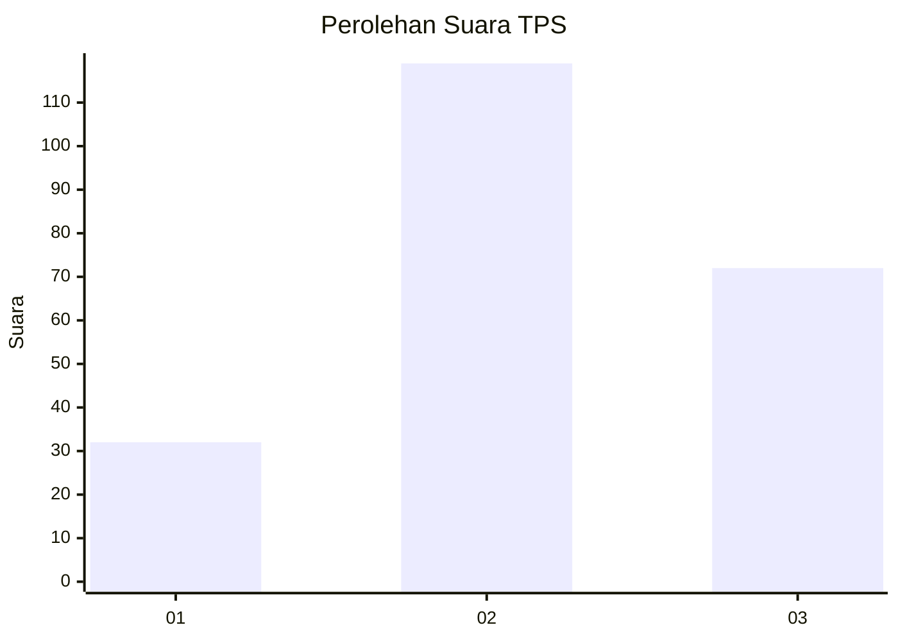
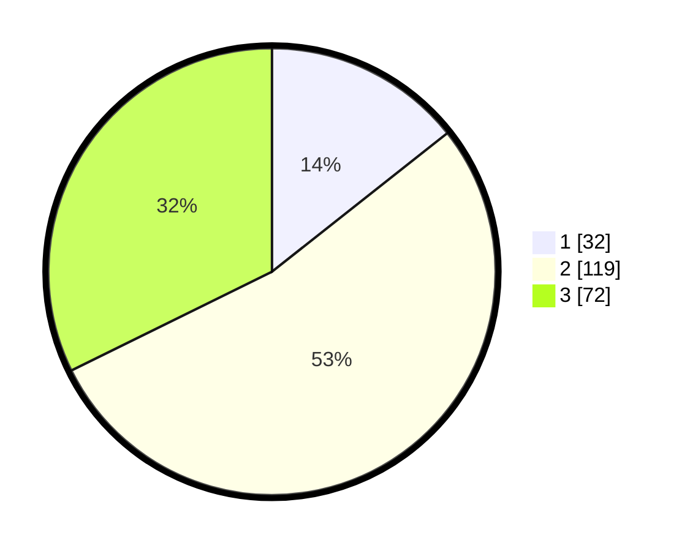

# Hasil

## Grafik

## Tabel

| No. | Nama Paslon    | Suara | Suara (raw) | Persentase |
|:--- |:-------------- | -----:| -----------:| ----------:|
| 1   | ANIES MUHAIMIN | 32    | [32][p-1]   | 14,35      |
| 2   | PRABOWO GIBRAN | 119   | [119][p-2]  | 53,36      |
| 3   | GANJAR MAHFUD  | 72    | [72][p-3]   | 32,29      |

[p-1]: https://github.com/gigit-pemilu/pemilu-2024-34-di-yogyakarta/blob/main/pilpres/hitung-suara/sub/34-di-yogyakarta/sub/02-bantul/sub/06-pandak/sub/2002-triharjo/sub/016-tps/sub/paslon-1.txt
[p-2]: https://github.com/gigit-pemilu/pemilu-2024-34-di-yogyakarta/blob/main/pilpres/hitung-suara/sub/34-di-yogyakarta/sub/02-bantul/sub/06-pandak/sub/2002-triharjo/sub/016-tps/sub/paslon-2.txt
[p-3]: https://github.com/gigit-pemilu/pemilu-2024-34-di-yogyakarta/blob/main/pilpres/hitung-suara/sub/34-di-yogyakarta/sub/02-bantul/sub/06-pandak/sub/2002-triharjo/sub/016-tps/sub/paslon-3.txt

## Foto C Plano

https://sirekap-obj-formc.kpu.go.id/e96a/pemilu/ppwp/34/02/06/20/02/3402062002016-20240214-224902--0f5ab194-eb3c-4dd7-a65b-88e7a0715a6d.jpg

https://sirekap-obj-formc.kpu.go.id/e96a/pemilu/ppwp/34/02/06/20/02/3402062002016-20240214-225003--82ae49a9-2708-4346-a520-2f4a366d217c.jpg

https://sirekap-obj-formc.kpu.go.id/e96a/pemilu/ppwp/34/02/06/20/02/3402062002016-20240214-225106--b826dd5d-677a-4977-9c4f-2594a2670a26.jpg

## Metadata

| Key        | Value               |
| ---------- | ------------------- |
| Time Stamp | 2024-02-24 22:31:28 |

