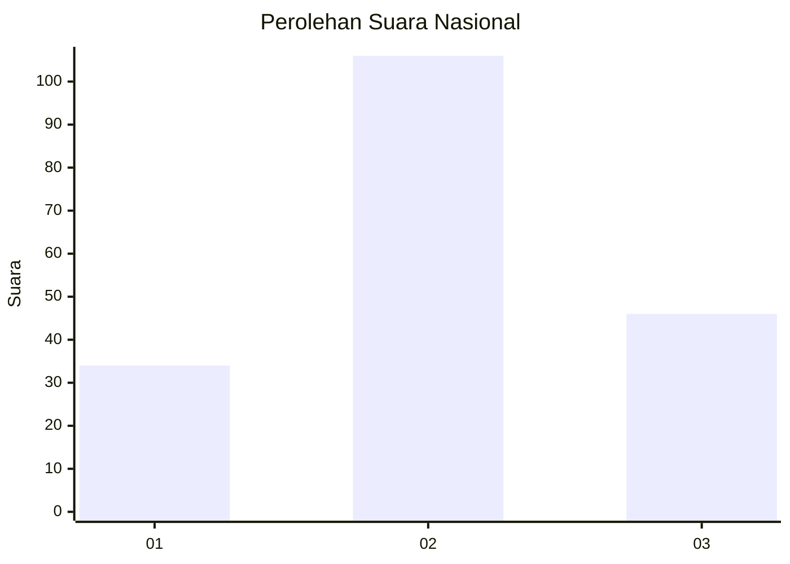
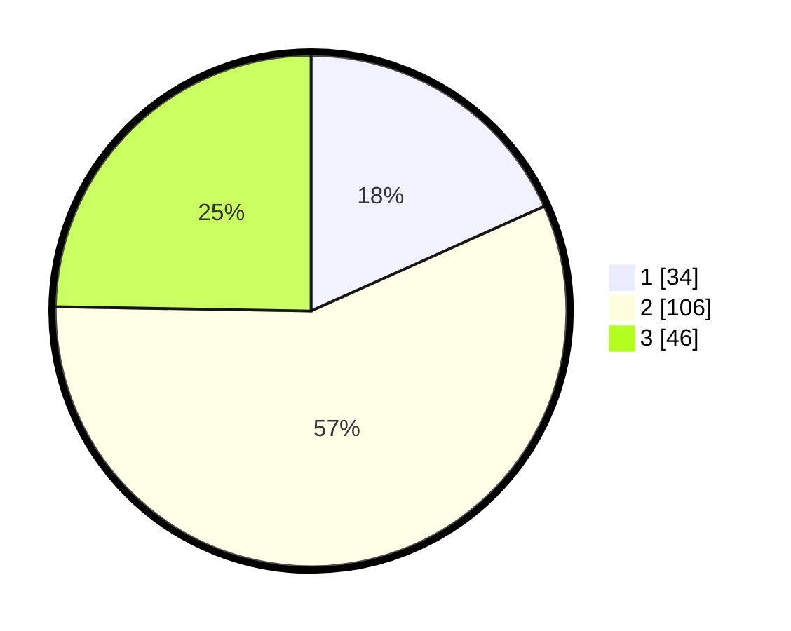

# Hasil

## Grafik

## Tabel

| No. | Nama Paslon    | Suara | Suara (raw) | Persentase |
|:--- |:-------------- | -----:| -----------:| ----------:|
| 1   | ANIES MUHAIMIN | 34    | [34][p-1]   | 18,28      |
| 2   | PRABOWO GIBRAN | 106   | [106][p-2]  | 56,99      |
| 3   | GANJAR MAHFUD  | 46    | [46][p-3]   | 24,73      |

[p-1]: https://github.com/gigit-pemilu/pemilu-2024/blob/main/pilpres/hitung-suara/sub/34-di-yogyakarta/sub/02-bantul/sub/06-pandak/sub/2002-triharjo/sub/017-tps/sub/paslon-1.txt
[p-2]: https://github.com/gigit-pemilu/pemilu-2024/blob/main/pilpres/hitung-suara/sub/34-di-yogyakarta/sub/02-bantul/sub/06-pandak/sub/2002-triharjo/sub/017-tps/sub/paslon-2.txt
[p-3]: https://github.com/gigit-pemilu/pemilu-2024/blob/main/pilpres/hitung-suara/sub/34-di-yogyakarta/sub/02-bantul/sub/06-pandak/sub/2002-triharjo/sub/017-tps/sub/paslon-3.txt

## Foto C Plano

https://sirekap-obj-formc.kpu.go.id/69b1/pemilu/ppwp/34/02/06/20/02/3402062002017-20240214-210135--6ade9a0b-a17c-455d-93ee-c0d92b131c49.jpg

https://sirekap-obj-formc.kpu.go.id/69b1/pemilu/ppwp/34/02/06/20/02/3402062002017-20240214-210338--ae341e91-b0cb-48fd-993b-27670586ab01.jpg

https://sirekap-obj-formc.kpu.go.id/69b1/pemilu/ppwp/34/02/06/20/02/3402062002017-20240214-210435--71134dc3-3812-431a-8df6-960cba4f5926.jpg

## Metadata

| Key        | Value               |
| ---------- | ------------------- |
| Time Stamp | 2024-02-25 17:00:00 |

