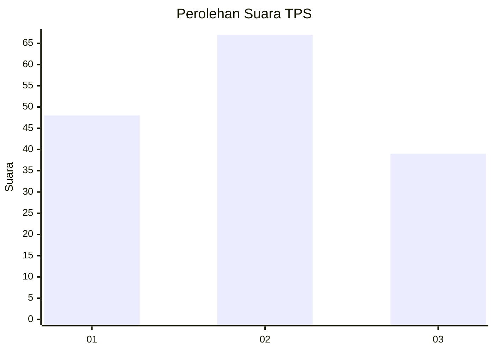
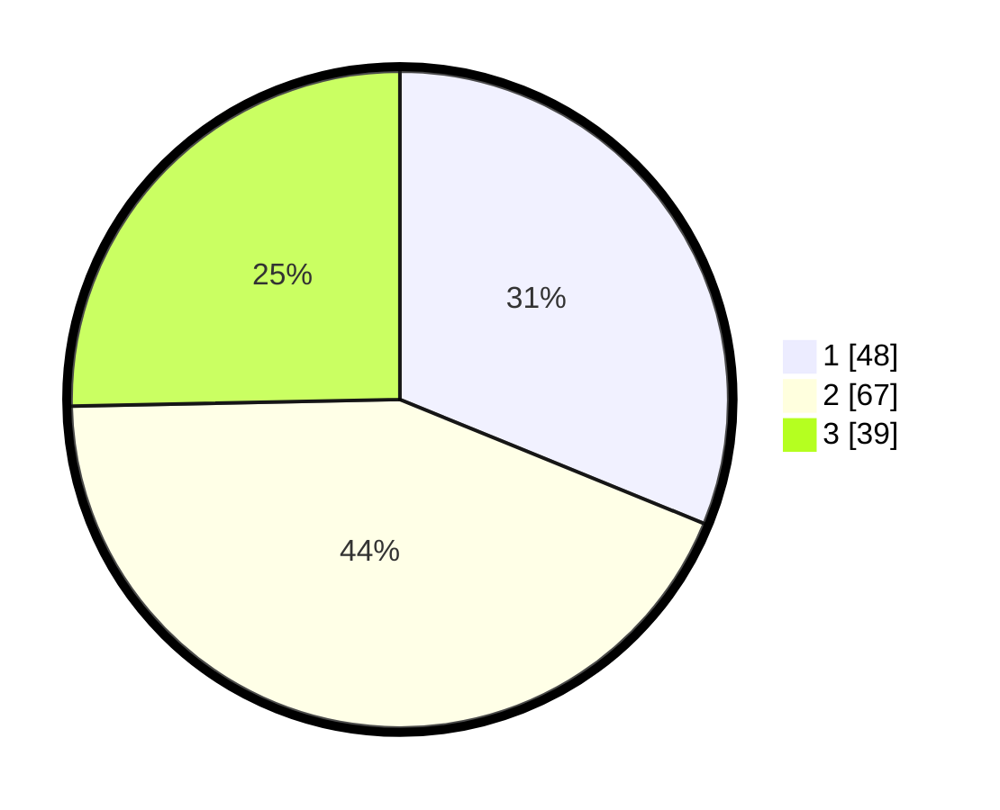

# Hasil

## Grafik

## Tabel

| No. | Nama Paslon    | Suara | Suara (raw) | Persentase |
|:--- |:-------------- | -----:| -----------:| ----------:|
| 1   | ANIES MUHAIMIN | 48    | [48][p-1]   | 31,17      |
| 2   | PRABOWO GIBRAN | 67    | [67][p-2]   | 43,51      |
| 3   | GANJAR MAHFUD  | 39    | [39][p-3]   | 25,32      |

[p-1]: https://github.com/gigit-pemilu/pemilu-2024-34-di-yogyakarta/blob/main/pilpres/hitung-suara/sub/34-di-yogyakarta/sub/02-bantul/sub/06-pandak/sub/2002-triharjo/sub/018-tps/sub/paslon-1.txt
[p-2]: https://github.com/gigit-pemilu/pemilu-2024-34-di-yogyakarta/blob/main/pilpres/hitung-suara/sub/34-di-yogyakarta/sub/02-bantul/sub/06-pandak/sub/2002-triharjo/sub/018-tps/sub/paslon-2.txt
[p-3]: https://github.com/gigit-pemilu/pemilu-2024-34-di-yogyakarta/blob/main/pilpres/hitung-suara/sub/34-di-yogyakarta/sub/02-bantul/sub/06-pandak/sub/2002-triharjo/sub/018-tps/sub/paslon-3.txt

## Foto C Plano

https://sirekap-obj-formc.kpu.go.id/ca90/pemilu/ppwp/34/02/06/20/02/3402062002018-20240217-203603--293a3edb-0d73-47c9-9be2-55b9f54eb6b6.jpg

https://sirekap-obj-formc.kpu.go.id/ca90/pemilu/ppwp/34/02/06/20/02/3402062002018-20240217-203440--d53cfea2-1a9a-46fc-8143-1d098458c68b.jpg

https://sirekap-obj-formc.kpu.go.id/ca90/pemilu/ppwp/34/02/06/20/02/3402062002018-20240217-203501--21b8cb6a-8407-40b6-8b9e-cc8f0331ba5e.jpg

## Metadata

| Key        | Value               |
| ---------- | ------------------- |
| Time Stamp | 2024-02-24 22:31:28 |

