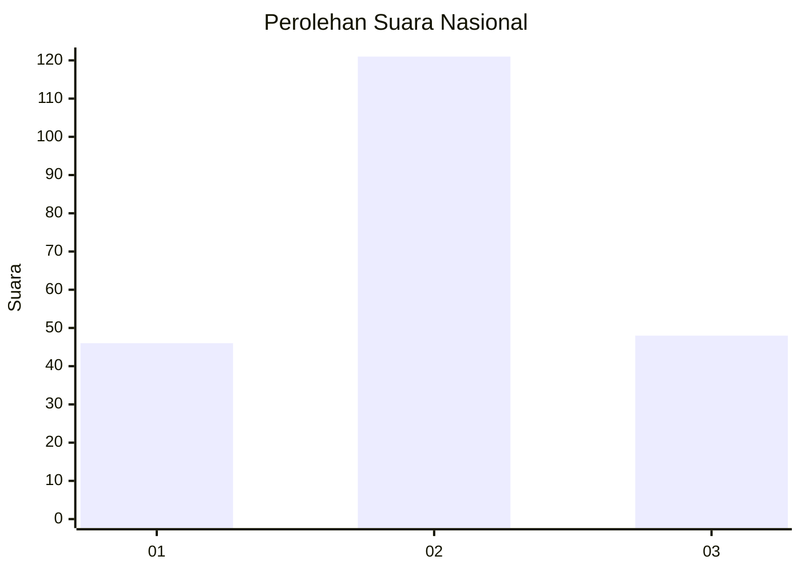
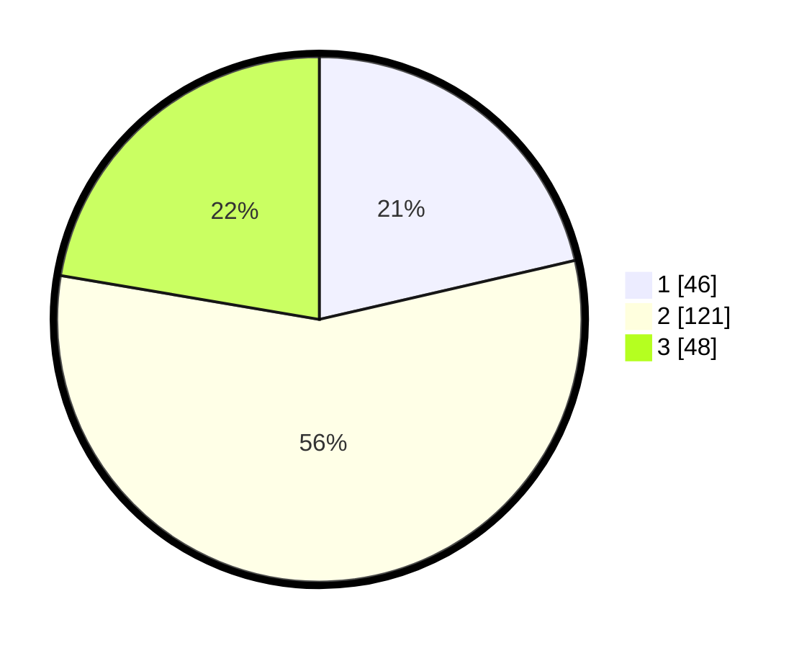

# Hasil

## Grafik

## Tabel

| No. | Nama Paslon    | Suara | Suara (raw) | Persentase |
|:--- |:-------------- | -----:| -----------:| ----------:|
| 1   | ANIES MUHAIMIN | 46    | [46][p-1]   | 21,40      |
| 2   | PRABOWO GIBRAN | 121   | [121][p-2]  | 56,28      |
| 3   | GANJAR MAHFUD  | 48    | [48][p-3]   | 22,33      |

[p-1]: https://github.com/gigit-pemilu/pemilu-2024/blob/main/pilpres/hitung-suara/sub/34-di-yogyakarta/sub/02-bantul/sub/06-pandak/sub/2002-triharjo/sub/021-tps/sub/paslon-1.txt
[p-2]: https://github.com/gigit-pemilu/pemilu-2024/blob/main/pilpres/hitung-suara/sub/34-di-yogyakarta/sub/02-bantul/sub/06-pandak/sub/2002-triharjo/sub/021-tps/sub/paslon-2.txt
[p-3]: https://github.com/gigit-pemilu/pemilu-2024/blob/main/pilpres/hitung-suara/sub/34-di-yogyakarta/sub/02-bantul/sub/06-pandak/sub/2002-triharjo/sub/021-tps/sub/paslon-3.txt

## Foto C Plano

https://sirekap-obj-formc.kpu.go.id/d2ba/pemilu/ppwp/34/02/06/20/02/3402062002021-20240215-011220--3bf4f050-f1bd-4f5f-a3b0-895e83fe4373.jpg

https://sirekap-obj-formc.kpu.go.id/d2ba/pemilu/ppwp/34/02/06/20/02/3402062002021-20240215-011256--8fb6e89a-8f2f-49d1-b311-661762658b3f.jpg

https://sirekap-obj-formc.kpu.go.id/d2ba/pemilu/ppwp/34/02/06/20/02/3402062002021-20240215-011418--2c3ca1b7-877f-43f1-8828-363f833641db.jpg

## Metadata

| Key        | Value               |
| ---------- | ------------------- |
| Time Stamp | 2024-02-25 16:00:00 |

