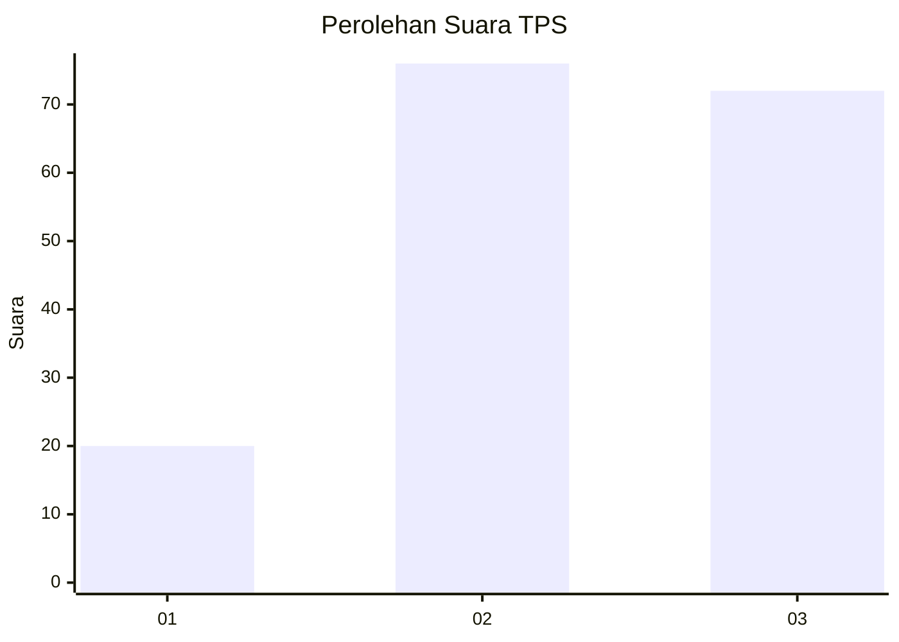
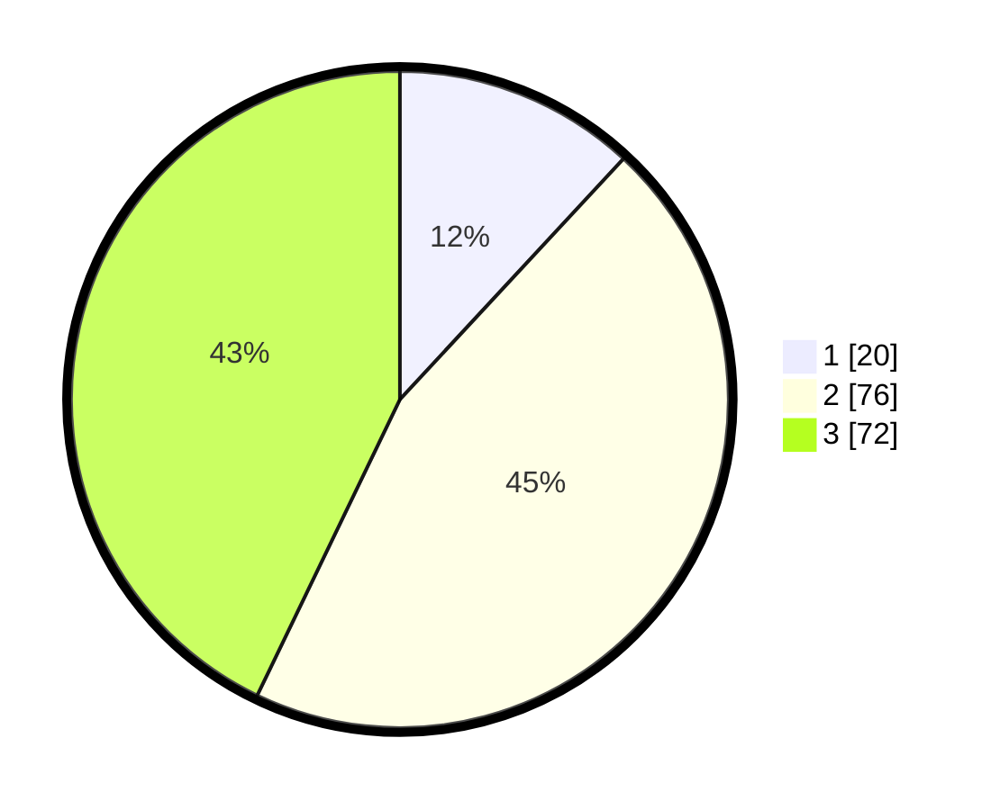

# Hasil

## Grafik

## Tabel

| No. | Nama Paslon    | Suara | Suara (raw) | Persentase |
|:--- |:-------------- | -----:| -----------:| ----------:|
| 1   | ANIES MUHAIMIN | 20    | [20][p-1]   | 11,90      |
| 2   | PRABOWO GIBRAN | 76    | [76][p-2]   | 45,24      |
| 3   | GANJAR MAHFUD  | 72    | [72][p-3]   | 42,86      |

[p-1]: https://github.com/gigit-pemilu/pemilu-2024-34-di-yogyakarta/blob/main/pilpres/hitung-suara/sub/34-di-yogyakarta/sub/02-bantul/sub/06-pandak/sub/2002-triharjo/sub/023-tps/sub/paslon-1.txt
[p-2]: https://github.com/gigit-pemilu/pemilu-2024-34-di-yogyakarta/blob/main/pilpres/hitung-suara/sub/34-di-yogyakarta/sub/02-bantul/sub/06-pandak/sub/2002-triharjo/sub/023-tps/sub/paslon-2.txt
[p-3]: https://github.com/gigit-pemilu/pemilu-2024-34-di-yogyakarta/blob/main/pilpres/hitung-suara/sub/34-di-yogyakarta/sub/02-bantul/sub/06-pandak/sub/2002-triharjo/sub/023-tps/sub/paslon-3.txt

## Foto C Plano

https://sirekap-obj-formc.kpu.go.id/3fd5/pemilu/ppwp/34/02/06/20/02/3402062002023-20240214-214215--11e8aa0f-ad24-45d9-b9ac-20ad95c6a7be.jpg

https://sirekap-obj-formc.kpu.go.id/3fd5/pemilu/ppwp/34/02/06/20/02/3402062002023-20240214-141628--df994efb-7535-418f-9a81-14dc9e989b8c.jpg

https://sirekap-obj-formc.kpu.go.id/3fd5/pemilu/ppwp/34/02/06/20/02/3402062002023-20240214-141443--e0a8ef2b-1d1b-4423-a1a2-530ce76d4363.jpg

## Metadata

| Key        | Value               |
| ---------- | ------------------- |
| Time Stamp | 2024-02-14 21:46:01 |

