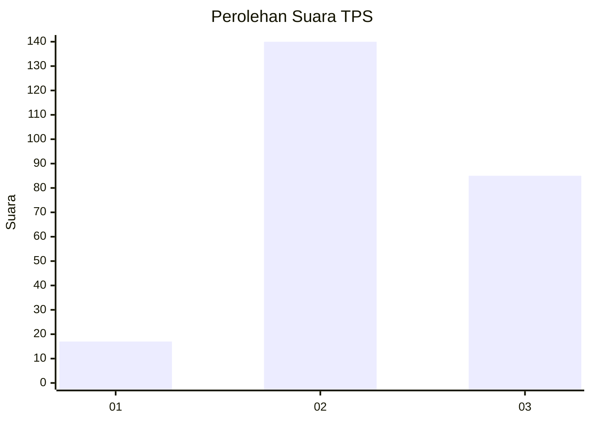
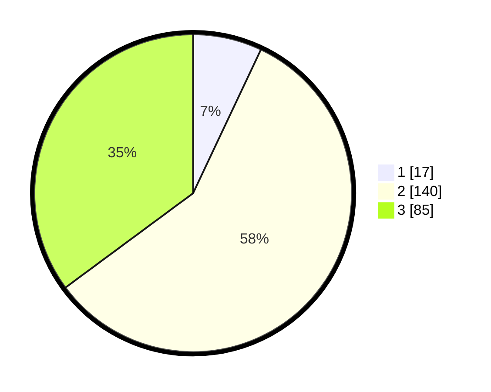

# Hasil

## Grafik

## Tabel

| No. | Nama Paslon    | Suara | Suara (raw) | Persentase |
|:--- |:-------------- | -----:| -----------:| ----------:|
| 1   | ANIES MUHAIMIN | 17    | [17][p-1]   | 7,02       |
| 2   | PRABOWO GIBRAN | 140   | [140][p-2]  | 57,85      |
| 3   | GANJAR MAHFUD  | 85    | [85][p-3]   | 35,12      |

[p-1]: https://github.com/gigit-pemilu/pemilu-2024-34-di-yogyakarta/blob/main/pilpres/hitung-suara/sub/34-di-yogyakarta/sub/02-bantul/sub/06-pandak/sub/2002-triharjo/sub/026-tps/sub/paslon-1.txt
[p-2]: https://github.com/gigit-pemilu/pemilu-2024-34-di-yogyakarta/blob/main/pilpres/hitung-suara/sub/34-di-yogyakarta/sub/02-bantul/sub/06-pandak/sub/2002-triharjo/sub/026-tps/sub/paslon-2.txt
[p-3]: https://github.com/gigit-pemilu/pemilu-2024-34-di-yogyakarta/blob/main/pilpres/hitung-suara/sub/34-di-yogyakarta/sub/02-bantul/sub/06-pandak/sub/2002-triharjo/sub/026-tps/sub/paslon-3.txt

## Foto C Plano

https://sirekap-obj-formc.kpu.go.id/eaff/pemilu/ppwp/34/02/06/20/02/3402062002026-20240218-134516--08e8c297-3665-400a-950f-dc1ce30bb486.jpg

https://sirekap-obj-formc.kpu.go.id/eaff/pemilu/ppwp/34/02/06/20/02/3402062002026-20240218-134701--fafed0a3-cff2-4629-b359-a1e325dfc042.jpg

https://sirekap-obj-formc.kpu.go.id/eaff/pemilu/ppwp/34/02/06/20/02/3402062002026-20240218-135035--4865bb0d-f05c-4b22-a56d-7acd95890d36.jpg

## Metadata

| Key        | Value               |
| ---------- | ------------------- |
| Time Stamp | 2024-02-24 22:31:28 |

