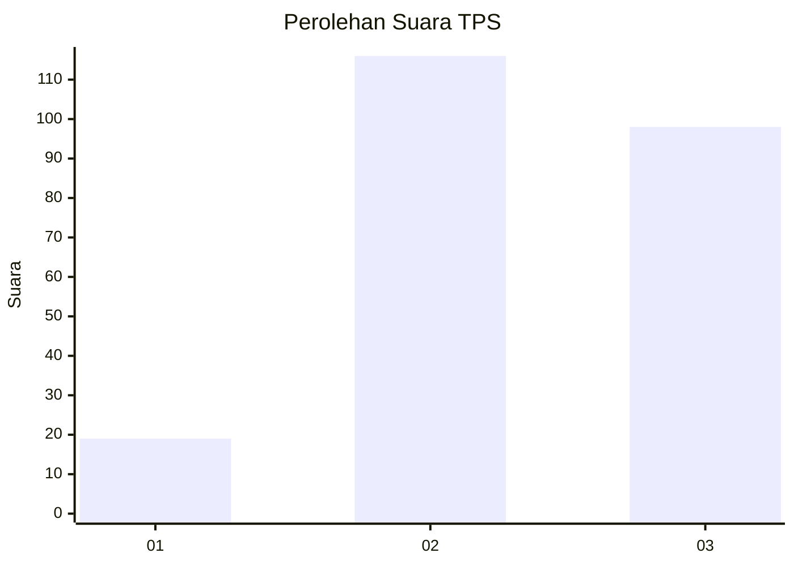
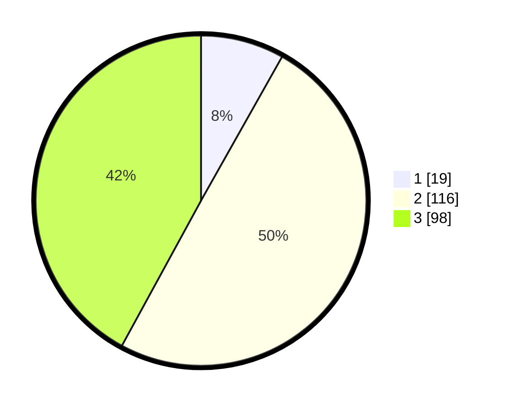

# Hasil

## Grafik

## Tabel

| No. | Nama Paslon    | Suara | Suara (raw) | Persentase |
|:--- |:-------------- | -----:| -----------:| ----------:|
| 1   | ANIES MUHAIMIN | 19    | [19][p-1]   | 8,15       |
| 2   | PRABOWO GIBRAN | 116   | [116][p-2]  | 49,79      |
| 3   | GANJAR MAHFUD  | 98    | [98][p-3]   | 42,06      |

[p-1]: https://github.com/gigit-pemilu/pemilu-2024-34-di-yogyakarta/blob/main/pilpres/hitung-suara/sub/34-di-yogyakarta/sub/02-bantul/sub/06-pandak/sub/2002-triharjo/sub/027-tps/sub/paslon-1.txt
[p-2]: https://github.com/gigit-pemilu/pemilu-2024-34-di-yogyakarta/blob/main/pilpres/hitung-suara/sub/34-di-yogyakarta/sub/02-bantul/sub/06-pandak/sub/2002-triharjo/sub/027-tps/sub/paslon-2.txt
[p-3]: https://github.com/gigit-pemilu/pemilu-2024-34-di-yogyakarta/blob/main/pilpres/hitung-suara/sub/34-di-yogyakarta/sub/02-bantul/sub/06-pandak/sub/2002-triharjo/sub/027-tps/sub/paslon-3.txt

## Foto C Plano

https://sirekap-obj-formc.kpu.go.id/d20e/pemilu/ppwp/34/02/06/20/02/3402062002027-20240218-144821--9d94e36f-b6b2-4bdf-9f7e-22a4ca55f789.jpg

https://sirekap-obj-formc.kpu.go.id/d20e/pemilu/ppwp/34/02/06/20/02/3402062002027-20240218-144920--698fcb4e-d6c0-4a2a-9a30-4eddd6ea1bd2.jpg

https://sirekap-obj-formc.kpu.go.id/d20e/pemilu/ppwp/34/02/06/20/02/3402062002027-20240218-145031--b92953cb-59f5-4bfa-8649-a0a8b74c1e33.jpg

## Metadata

| Key        | Value               |
| ---------- | ------------------- |
| Time Stamp | 2024-02-24 22:31:28 |

