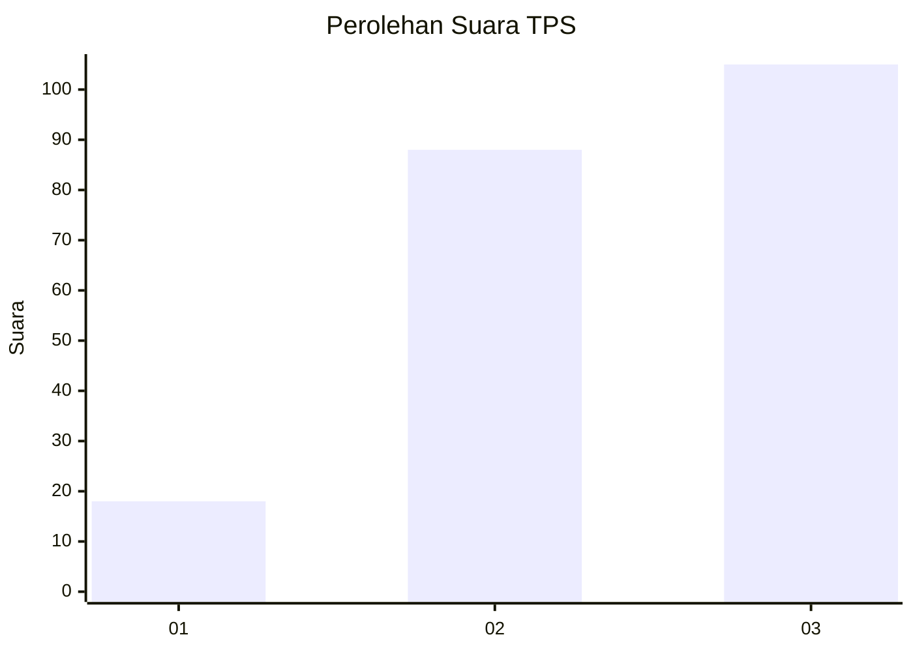
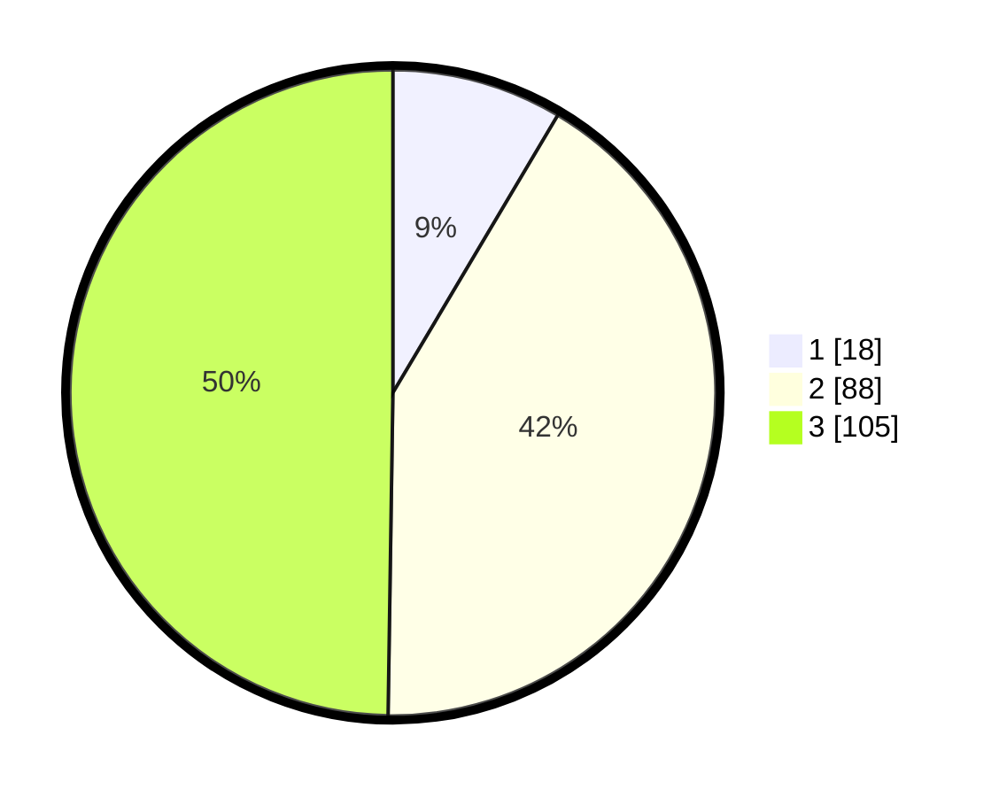

# Hasil

## Grafik

## Tabel

| No. | Nama Paslon    | Suara | Suara (raw) | Persentase |
|:--- |:-------------- | -----:| -----------:| ----------:|
| 1   | ANIES MUHAIMIN | 18    | [18][p-1]   | 8,53       |
| 2   | PRABOWO GIBRAN | 88    | [88][p-2]   | 41,71      |
| 3   | GANJAR MAHFUD  | 105   | [105][p-3]  | 49,76      |

[p-1]: https://github.com/gigit-pemilu/pemilu-2024-34-di-yogyakarta/blob/main/pilpres/hitung-suara/sub/34-di-yogyakarta/sub/02-bantul/sub/06-pandak/sub/2002-triharjo/sub/028-tps/sub/paslon-1.txt
[p-2]: https://github.com/gigit-pemilu/pemilu-2024-34-di-yogyakarta/blob/main/pilpres/hitung-suara/sub/34-di-yogyakarta/sub/02-bantul/sub/06-pandak/sub/2002-triharjo/sub/028-tps/sub/paslon-2.txt
[p-3]: https://github.com/gigit-pemilu/pemilu-2024-34-di-yogyakarta/blob/main/pilpres/hitung-suara/sub/34-di-yogyakarta/sub/02-bantul/sub/06-pandak/sub/2002-triharjo/sub/028-tps/sub/paslon-3.txt

## Foto C Plano

https://sirekap-obj-formc.kpu.go.id/2ec9/pemilu/ppwp/34/02/06/20/02/3402062002028-20240215-022404--b0073485-0b0a-4eaf-a6e8-36079b014985.jpg

https://sirekap-obj-formc.kpu.go.id/2ec9/pemilu/ppwp/34/02/06/20/02/3402062002028-20240215-022506--79a8a80e-a35c-40e3-8259-c8cc4569e9ad.jpg

https://sirekap-obj-formc.kpu.go.id/2ec9/pemilu/ppwp/34/02/06/20/02/3402062002028-20240215-022747--34d2bde8-526e-4e95-bd4e-c1fd12f0dff6.jpg

## Metadata

| Key        | Value               |
| ---------- | ------------------- |
| Time Stamp | 2024-02-24 22:31:28 |

