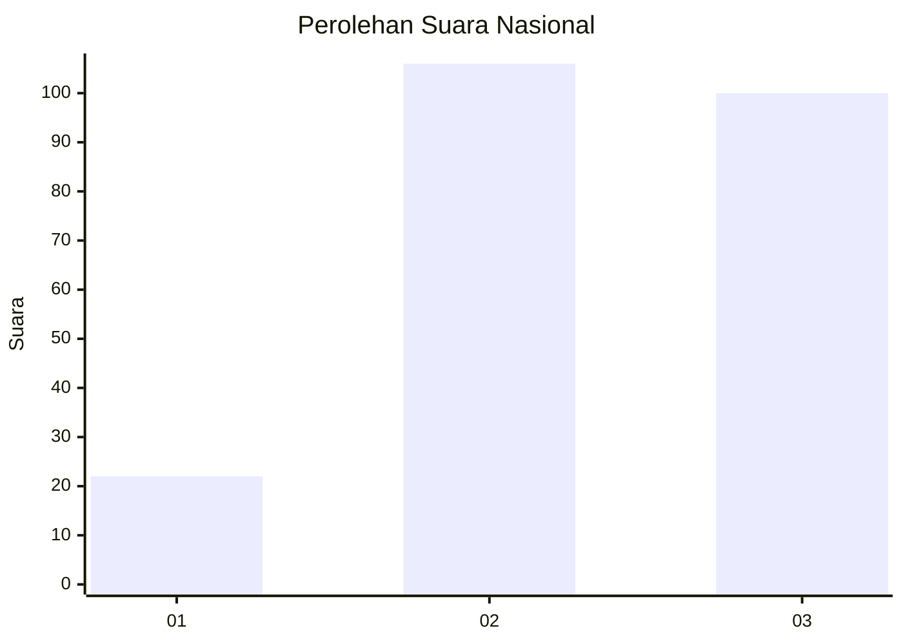
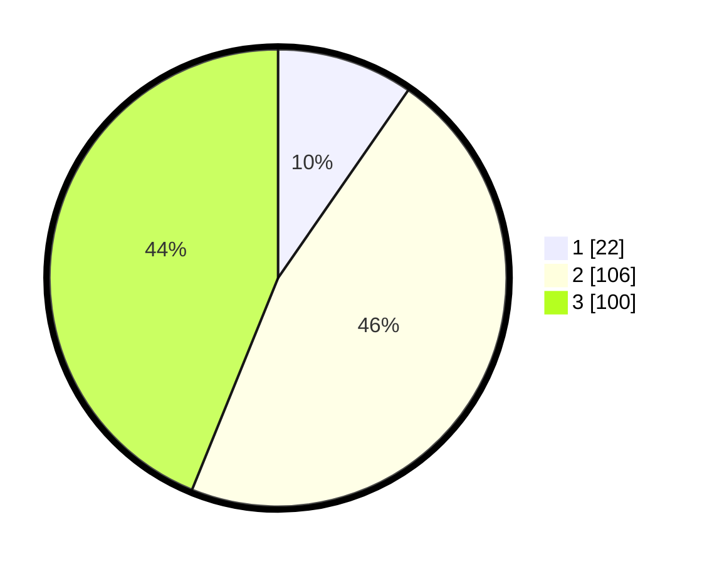

# Hasil

## Grafik

## Tabel

| No. | Nama Paslon    | Suara | Suara (raw) | Persentase |
|:--- |:-------------- | -----:| -----------:| ----------:|
| 1   | ANIES MUHAIMIN | 22    | [22][p-1]   | 9,65       |
| 2   | PRABOWO GIBRAN | 106   | [106][p-2]  | 46,49      |
| 3   | GANJAR MAHFUD  | 100   | [100][p-3]  | 43,86      |

[p-1]: https://github.com/gigit-pemilu/pemilu-2024/blob/main/pilpres/hitung-suara/sub/34-di-yogyakarta/sub/02-bantul/sub/06-pandak/sub/2002-triharjo/sub/029-tps/sub/paslon-1.txt
[p-2]: https://github.com/gigit-pemilu/pemilu-2024/blob/main/pilpres/hitung-suara/sub/34-di-yogyakarta/sub/02-bantul/sub/06-pandak/sub/2002-triharjo/sub/029-tps/sub/paslon-2.txt
[p-3]: https://github.com/gigit-pemilu/pemilu-2024/blob/main/pilpres/hitung-suara/sub/34-di-yogyakarta/sub/02-bantul/sub/06-pandak/sub/2002-triharjo/sub/029-tps/sub/paslon-3.txt

## Foto C Plano

https://sirekap-obj-formc.kpu.go.id/5c43/pemilu/ppwp/34/02/06/20/02/3402062002029-20240214-232333--b6aaea8f-0339-4c92-b401-1549f78c125a.jpg

https://sirekap-obj-formc.kpu.go.id/5c43/pemilu/ppwp/34/02/06/20/02/3402062002029-20240214-232254--4e356928-c874-478c-88e9-dc6d799cad5b.jpg

https://sirekap-obj-formc.kpu.go.id/5c43/pemilu/ppwp/34/02/06/20/02/3402062002029-20240214-232310--d823324b-e82d-42cb-b199-1b9554c21b2f.jpg

## Metadata

| Key        | Value               |
| ---------- | ------------------- |
| Time Stamp | 2024-02-24 22:31:28 |

