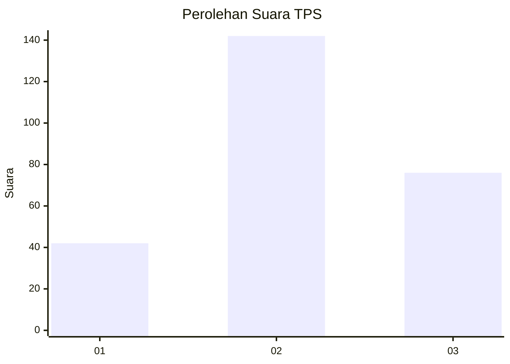
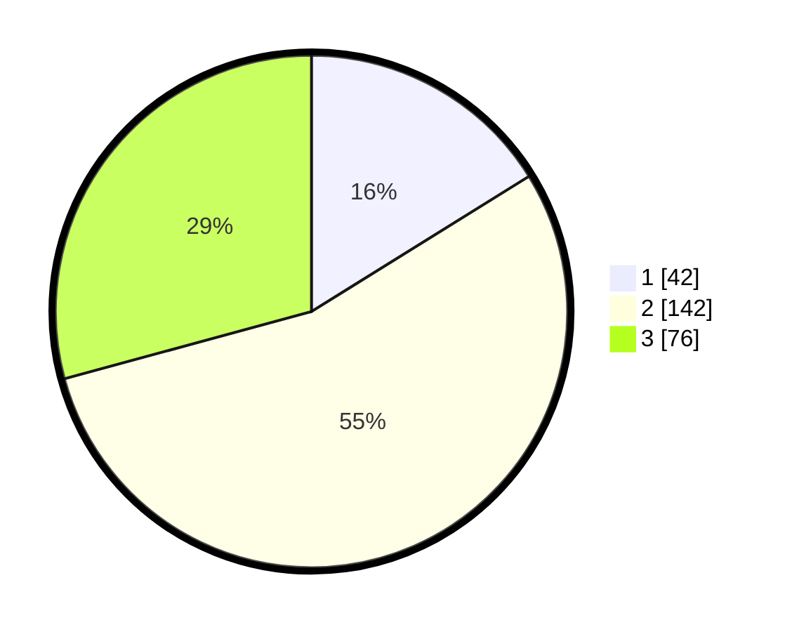

# Hasil

## Grafik

## Tabel

| No. | Nama Paslon    | Suara | Suara (raw) | Persentase |
|:--- |:-------------- | -----:| -----------:| ----------:|
| 1   | ANIES MUHAIMIN | 42    | [42][p-1]   | 16,15      |
| 2   | PRABOWO GIBRAN | 142   | [142][p-2]  | 54,62      |
| 3   | GANJAR MAHFUD  | 76    | [76][p-3]   | 29,23      |

[p-1]: https://github.com/gigit-pemilu/pemilu-2024-34-di-yogyakarta/blob/main/pilpres/hitung-suara/sub/34-di-yogyakarta/sub/02-bantul/sub/06-pandak/sub/2002-triharjo/sub/030-tps/sub/paslon-1.txt
[p-2]: https://github.com/gigit-pemilu/pemilu-2024-34-di-yogyakarta/blob/main/pilpres/hitung-suara/sub/34-di-yogyakarta/sub/02-bantul/sub/06-pandak/sub/2002-triharjo/sub/030-tps/sub/paslon-2.txt
[p-3]: https://github.com/gigit-pemilu/pemilu-2024-34-di-yogyakarta/blob/main/pilpres/hitung-suara/sub/34-di-yogyakarta/sub/02-bantul/sub/06-pandak/sub/2002-triharjo/sub/030-tps/sub/paslon-3.txt

## Foto C Plano

https://sirekap-obj-formc.kpu.go.id/346e/pemilu/ppwp/34/02/06/20/02/3402062002030-20240221-210738--1b5ec071-a50e-4e03-a6c4-6b3778d5dfc3.jpg

https://sirekap-obj-formc.kpu.go.id/346e/pemilu/ppwp/34/02/06/20/02/3402062002030-20240221-210834--a826b344-97b7-40ed-a279-6eb42d35482a.jpg

https://sirekap-obj-formc.kpu.go.id/346e/pemilu/ppwp/34/02/06/20/02/3402062002030-20240221-210926--ceab7d02-c4c6-45e4-87fb-6a1f388a294c.jpg

## Metadata

| Key        | Value               |
| ---------- | ------------------- |
| Time Stamp | 2024-02-24 22:31:28 |

