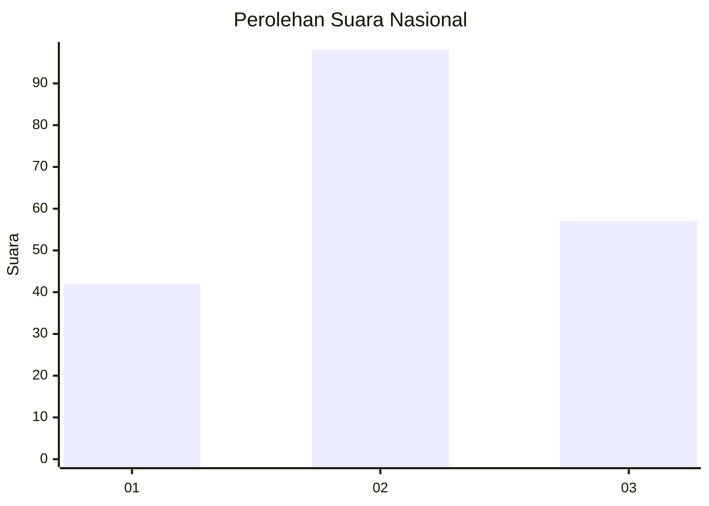
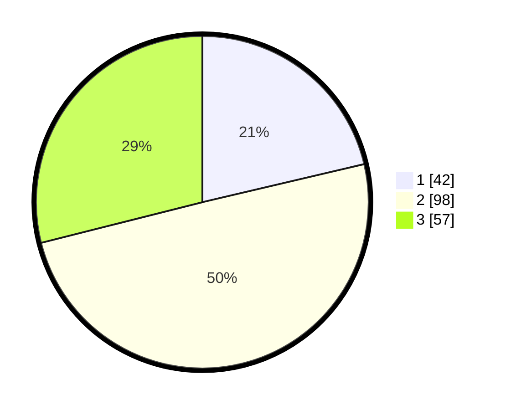

# Hasil

## Grafik

## Tabel

| No. | Nama Paslon    | Suara | Suara (raw) | Persentase |
|:--- |:-------------- | -----:| -----------:| ----------:|
| 1   | ANIES MUHAIMIN | 42    | [42][p-1]   | 21,32      |
| 2   | PRABOWO GIBRAN | 98    | [98][p-2]   | 49,75      |
| 3   | GANJAR MAHFUD  | 57    | [57][p-3]   | 28,93      |

[p-1]: https://github.com/gigit-pemilu/pemilu-2024/blob/main/pilpres/hitung-suara/sub/34-di-yogyakarta/sub/02-bantul/sub/06-pandak/sub/2002-triharjo/sub/032-tps/sub/paslon-1.txt
[p-2]: https://github.com/gigit-pemilu/pemilu-2024/blob/main/pilpres/hitung-suara/sub/34-di-yogyakarta/sub/02-bantul/sub/06-pandak/sub/2002-triharjo/sub/032-tps/sub/paslon-2.txt
[p-3]: https://github.com/gigit-pemilu/pemilu-2024/blob/main/pilpres/hitung-suara/sub/34-di-yogyakarta/sub/02-bantul/sub/06-pandak/sub/2002-triharjo/sub/032-tps/sub/paslon-3.txt

## Foto C Plano

https://sirekap-obj-formc.kpu.go.id/7d08/pemilu/ppwp/34/02/06/20/02/3402062002032-20240218-195347--960ee5e3-c69b-4ec1-8f31-5477686184c7.jpg

https://sirekap-obj-formc.kpu.go.id/7d08/pemilu/ppwp/34/02/06/20/02/3402062002032-20240218-195426--58790d3e-9044-47dc-b42d-b29a1ee3ed13.jpg

https://sirekap-obj-formc.kpu.go.id/7d08/pemilu/ppwp/34/02/06/20/02/3402062002032-20240218-195546--a16fc6a5-4a2e-4e09-b55f-afe3bc9d39f7.jpg

## Metadata

| Key        | Value               |
| ---------- | ------------------- |
| Time Stamp | 2024-02-24 22:31:28 |

