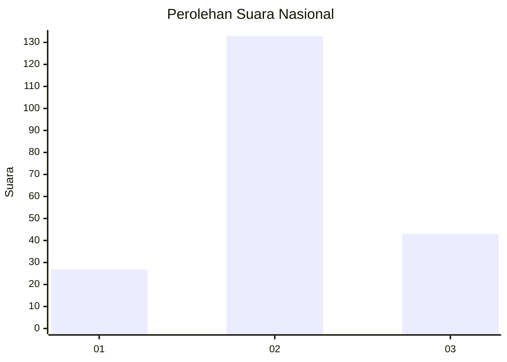
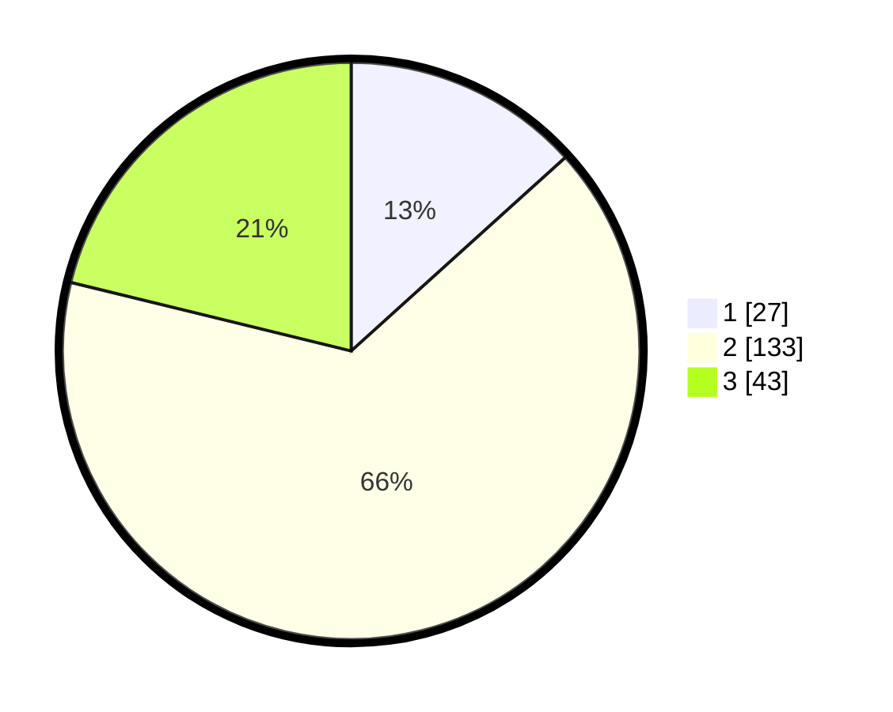

# Hasil

## Grafik

## Tabel

| No. | Nama Paslon    | Suara | Suara (raw) | Persentase |
|:--- |:-------------- | -----:| -----------:| ----------:|
| 1   | ANIES MUHAIMIN | 27    | [27][p-1]   | 13,30      |
| 2   | PRABOWO GIBRAN | 133   | [133][p-2]  | 65,52      |
| 3   | GANJAR MAHFUD  | 43    | [43][p-3]   | 21,18      |

[p-1]: https://github.com/gigit-pemilu/pemilu-2024/blob/main/pilpres/hitung-suara/sub/34-di-yogyakarta/sub/02-bantul/sub/06-pandak/sub/2002-triharjo/sub/033-tps/sub/paslon-1.txt
[p-2]: https://github.com/gigit-pemilu/pemilu-2024/blob/main/pilpres/hitung-suara/sub/34-di-yogyakarta/sub/02-bantul/sub/06-pandak/sub/2002-triharjo/sub/033-tps/sub/paslon-2.txt
[p-3]: https://github.com/gigit-pemilu/pemilu-2024/blob/main/pilpres/hitung-suara/sub/34-di-yogyakarta/sub/02-bantul/sub/06-pandak/sub/2002-triharjo/sub/033-tps/sub/paslon-3.txt

## Foto C Plano

https://sirekap-obj-formc.kpu.go.id/6fc1/pemilu/ppwp/34/02/06/20/02/3402062002033-20240218-201921--1619f76c-9e3a-466e-bb64-314440ac4dcd.jpg

https://sirekap-obj-formc.kpu.go.id/6fc1/pemilu/ppwp/34/02/06/20/02/3402062002033-20240218-202537--a6137bb0-f335-432f-862c-8709dd8b7883.jpg

https://sirekap-obj-formc.kpu.go.id/6fc1/pemilu/ppwp/34/02/06/20/02/3402062002033-20240218-202731--47e36843-d0cf-4e28-ba6f-075dd85ea326.jpg

## Metadata

| Key        | Value               |
| ---------- | ------------------- |
| Time Stamp | 2024-02-24 22:31:28 |

