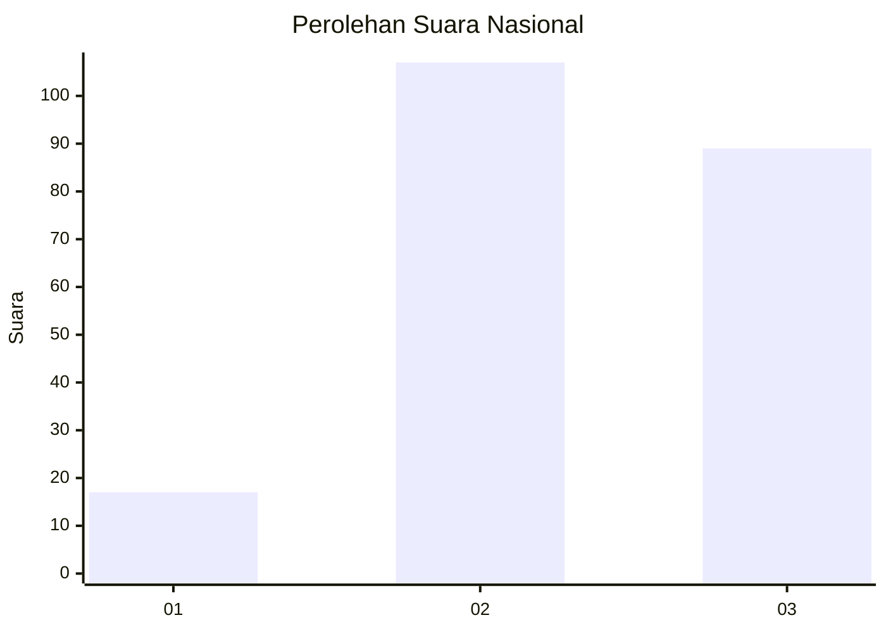
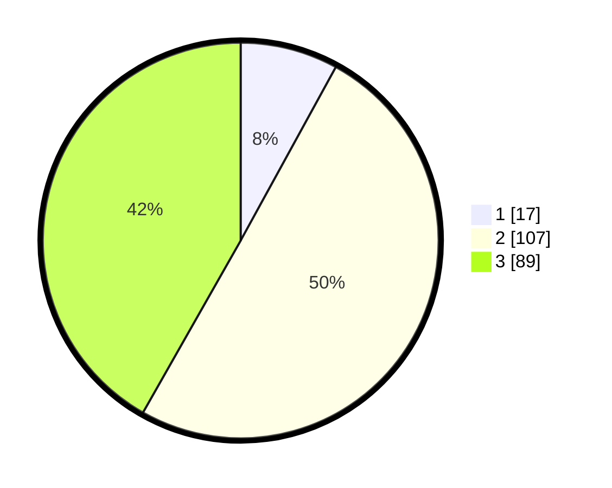

# Hasil

## Grafik

## Tabel

| No. | Nama Paslon    | Suara | Suara (raw) | Persentase |
|:--- |:-------------- | -----:| -----------:| ----------:|
| 1   | ANIES MUHAIMIN | 17    | [17][p-1]   | 7,98       |
| 2   | PRABOWO GIBRAN | 107   | [107][p-2]  | 50,23      |
| 3   | GANJAR MAHFUD  | 89    | [89][p-3]   | 41,78      |

[p-1]: https://github.com/gigit-pemilu/pemilu-2024/blob/main/pilpres/hitung-suara/sub/34-di-yogyakarta/sub/02-bantul/sub/06-pandak/sub/2002-triharjo/sub/034-tps/sub/paslon-1.txt
[p-2]: https://github.com/gigit-pemilu/pemilu-2024/blob/main/pilpres/hitung-suara/sub/34-di-yogyakarta/sub/02-bantul/sub/06-pandak/sub/2002-triharjo/sub/034-tps/sub/paslon-2.txt
[p-3]: https://github.com/gigit-pemilu/pemilu-2024/blob/main/pilpres/hitung-suara/sub/34-di-yogyakarta/sub/02-bantul/sub/06-pandak/sub/2002-triharjo/sub/034-tps/sub/paslon-3.txt

## Foto C Plano

https://sirekap-obj-formc.kpu.go.id/f7e7/pemilu/ppwp/34/02/06/20/02/3402062002034-20240215-010425--90c8b41a-e86e-4922-90c4-c7d0dfcf498e.jpg

https://sirekap-obj-formc.kpu.go.id/f7e7/pemilu/ppwp/34/02/06/20/02/3402062002034-20240215-002908--e79f38b5-cd42-432b-9ad4-7ffd354bfe3e.jpg

https://sirekap-obj-formc.kpu.go.id/f7e7/pemilu/ppwp/34/02/06/20/02/3402062002034-20240215-002945--44f7e991-7431-4b2c-9642-1f00450c15bf.jpg

## Metadata

| Key        | Value               |
| ---------- | ------------------- |
| Time Stamp | 2024-02-25 12:00:00 |

