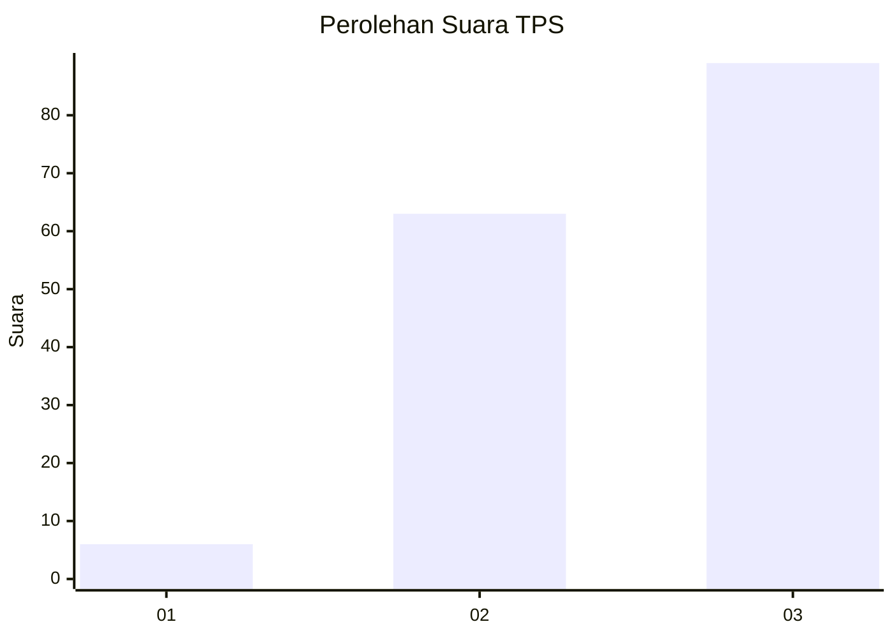
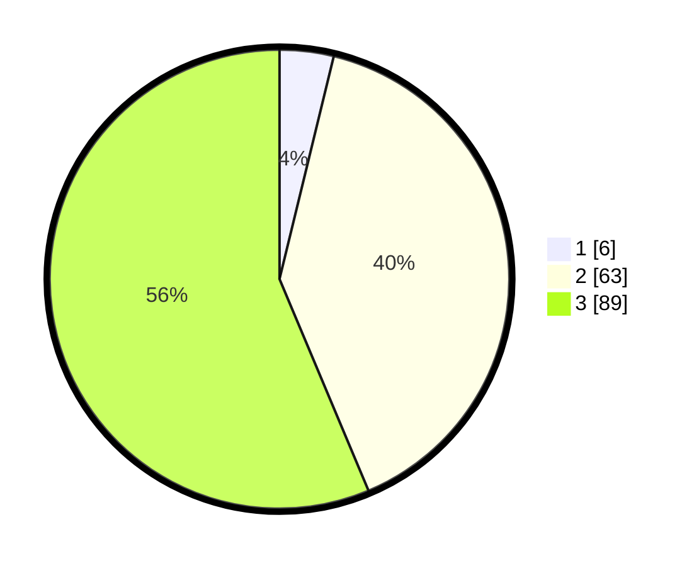

# Hasil

## Grafik

## Tabel

| No. | Nama Paslon    | Suara | Suara (raw) | Persentase |
|:--- |:-------------- | -----:| -----------:| ----------:|
| 1   | ANIES MUHAIMIN | 6     | [6][p-1]    | 3,80       |
| 2   | PRABOWO GIBRAN | 63    | [63][p-2]   | 39,87      |
| 3   | GANJAR MAHFUD  | 89    | [89][p-3]   | 56,33      |

[p-1]: https://github.com/gigit-pemilu/pemilu-2024-34-di-yogyakarta/blob/main/pilpres/hitung-suara/sub/34-di-yogyakarta/sub/02-bantul/sub/06-pandak/sub/2002-triharjo/sub/035-tps/sub/paslon-1.txt
[p-2]: https://github.com/gigit-pemilu/pemilu-2024-34-di-yogyakarta/blob/main/pilpres/hitung-suara/sub/34-di-yogyakarta/sub/02-bantul/sub/06-pandak/sub/2002-triharjo/sub/035-tps/sub/paslon-2.txt
[p-3]: https://github.com/gigit-pemilu/pemilu-2024-34-di-yogyakarta/blob/main/pilpres/hitung-suara/sub/34-di-yogyakarta/sub/02-bantul/sub/06-pandak/sub/2002-triharjo/sub/035-tps/sub/paslon-3.txt

## Foto C Plano

https://sirekap-obj-formc.kpu.go.id/ee04/pemilu/ppwp/34/02/06/20/02/3402062002035-20240217-195800--d84d27a4-2dfc-4362-962d-075e632ccddb.jpg

https://sirekap-obj-formc.kpu.go.id/ee04/pemilu/ppwp/34/02/06/20/02/3402062002035-20240217-213216--a591e7fd-9fbd-4bea-a7c7-4439dbbb283b.jpg

https://sirekap-obj-formc.kpu.go.id/ee04/pemilu/ppwp/34/02/06/20/02/3402062002035-20240217-213813--9f6fde93-f767-4c7d-acd9-54f9285de95c.jpg

## Metadata

| Key        | Value               |
| ---------- | ------------------- |
| Time Stamp | 2024-02-24 22:31:28 |

