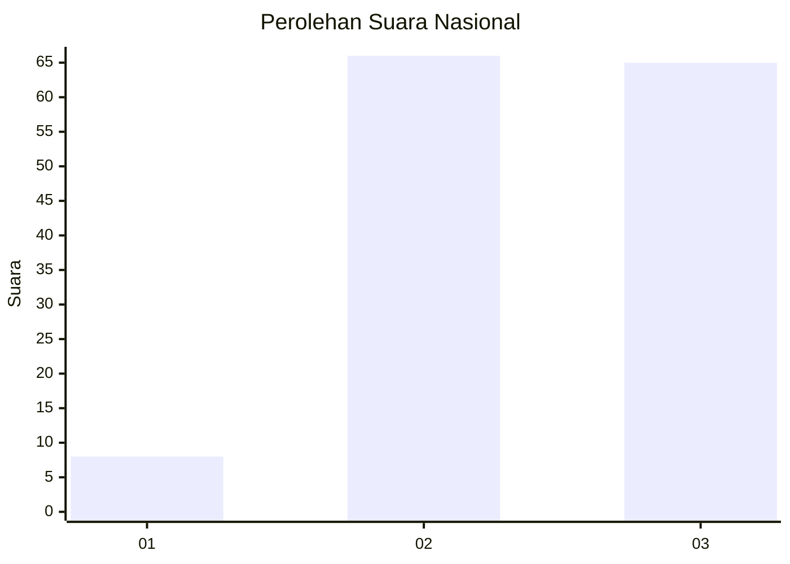
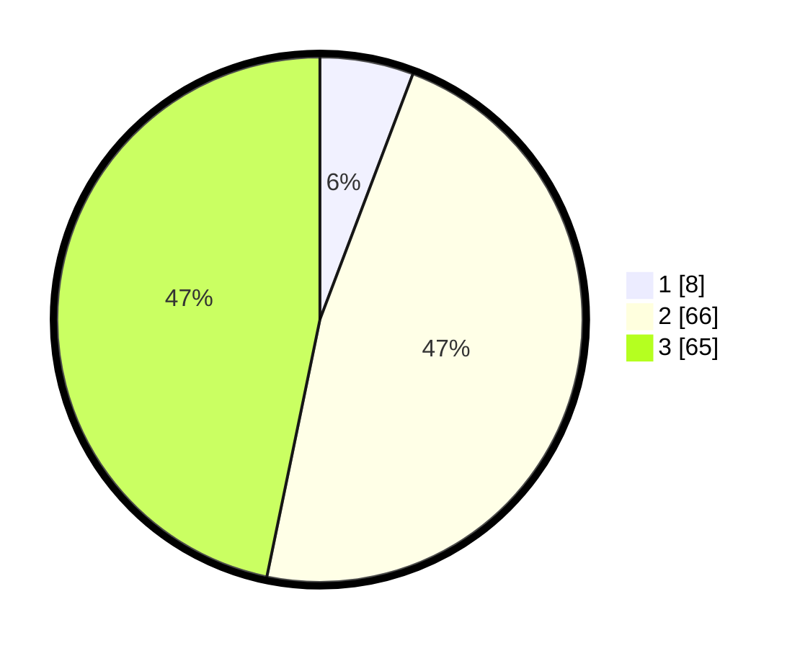

# Hasil

## Grafik

## Tabel

| No. | Nama Paslon    | Suara | Suara (raw) | Persentase |
|:--- |:-------------- | -----:| -----------:| ----------:|
| 1   | ANIES MUHAIMIN | 8     | [8][p-1]    | 5,76       |
| 2   | PRABOWO GIBRAN | 66    | [66][p-2]   | 47,48      |
| 3   | GANJAR MAHFUD  | 65    | [65][p-3]   | 46,76      |

[p-1]: https://github.com/gigit-pemilu/pemilu-2024/blob/main/pilpres/hitung-suara/sub/34-di-yogyakarta/sub/02-bantul/sub/06-pandak/sub/2002-triharjo/sub/036-tps/sub/paslon-1.txt
[p-2]: https://github.com/gigit-pemilu/pemilu-2024/blob/main/pilpres/hitung-suara/sub/34-di-yogyakarta/sub/02-bantul/sub/06-pandak/sub/2002-triharjo/sub/036-tps/sub/paslon-2.txt
[p-3]: https://github.com/gigit-pemilu/pemilu-2024/blob/main/pilpres/hitung-suara/sub/34-di-yogyakarta/sub/02-bantul/sub/06-pandak/sub/2002-triharjo/sub/036-tps/sub/paslon-3.txt

## Foto C Plano

https://sirekap-obj-formc.kpu.go.id/5d82/pemilu/ppwp/34/02/06/20/02/3402062002036-20240214-141211--ce04a505-84d8-4ec3-90f0-bc705142e11f.jpg

https://sirekap-obj-formc.kpu.go.id/5d82/pemilu/ppwp/34/02/06/20/02/3402062002036-20240214-141034--72ff86d8-d1cd-42f4-b964-48cf5858a5a1.jpg

https://sirekap-obj-formc.kpu.go.id/5d82/pemilu/ppwp/34/02/06/20/02/3402062002036-20240216-041444--d7125039-ae84-4014-ac26-be16a0a6c69c.jpg

## Metadata

| Key        | Value               |
| ---------- | ------------------- |
| Time Stamp | 2024-02-16 04:30:27 |

## DATA PEMILIH TETAP

Jumlah pemilih dalam DPT: **159**.
 * L: **80**.
 * P: **79**.

## DATA PENGGUNA HAK PILIH

Jumlah pengguna hak pilih dalam DPT: **142**.
 * L: **70**.
 * P: **72**.

Jumlah pengguna hak pilih dalam DPTb: **0**.
 * L: **0**.
 * P: **0**.

Jumlah pengguna hak pilih dalam DPK: **0**.
 * L: **0**.
 * P: **0**.

Jumlah pengguna hak pilih: **142**.
 * L: **70**.
 * P: **72**.

## JUMLAH SUARA SAH DAN TIDAK SAH

JUMLAH SELURUH SUARA SAH: **139**.

JUMLAH SUARA TIDAK SAH: **3**.

JUMLAH SELURUH SUARA SAH DAN SUARA TIDAK SAH: **142**.

