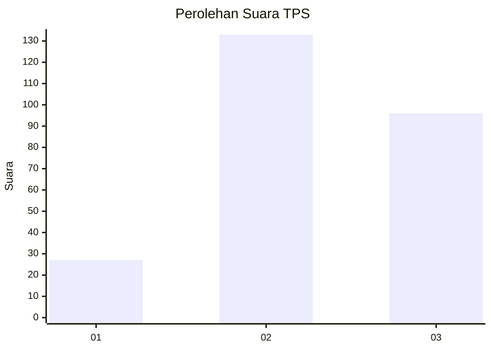
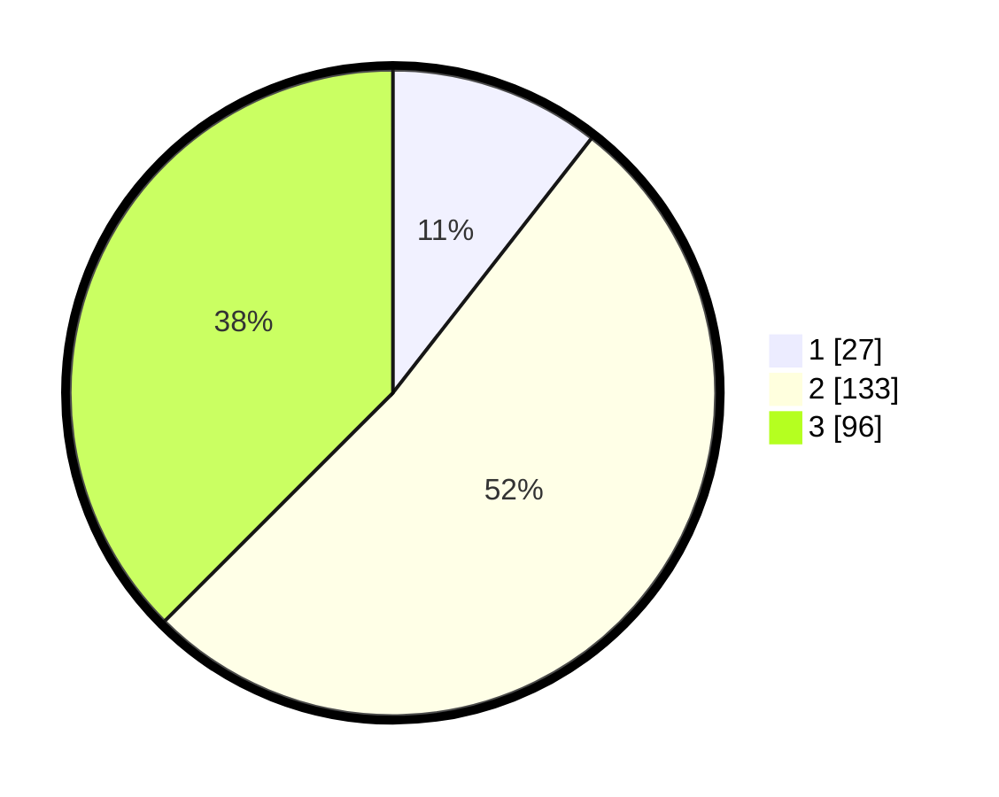

# Hasil

## Grafik

## Tabel

| No. | Nama Paslon    | Suara | Suara (raw) | Persentase |
|:--- |:-------------- | -----:| -----------:| ----------:|
| 1   | ANIES MUHAIMIN | 27    | [27][p-1]   | 10,55      |
| 2   | PRABOWO GIBRAN | 133   | [133][p-2]  | 51,95      |
| 3   | GANJAR MAHFUD  | 96    | [96][p-3]   | 37,50      |

[p-1]: https://github.com/gigit-pemilu/pemilu-2024-34-di-yogyakarta/blob/main/pilpres/hitung-suara/sub/34-di-yogyakarta/sub/02-bantul/sub/06-pandak/sub/2002-triharjo/sub/037-tps/sub/paslon-1.txt
[p-2]: https://github.com/gigit-pemilu/pemilu-2024-34-di-yogyakarta/blob/main/pilpres/hitung-suara/sub/34-di-yogyakarta/sub/02-bantul/sub/06-pandak/sub/2002-triharjo/sub/037-tps/sub/paslon-2.txt
[p-3]: https://github.com/gigit-pemilu/pemilu-2024-34-di-yogyakarta/blob/main/pilpres/hitung-suara/sub/34-di-yogyakarta/sub/02-bantul/sub/06-pandak/sub/2002-triharjo/sub/037-tps/sub/paslon-3.txt

## Foto C Plano

https://sirekap-obj-formc.kpu.go.id/a912/pemilu/ppwp/34/02/06/20/02/3402062002037-20240214-215340--8137e8f8-3468-46bf-ac13-7429cd3dbab4.jpg

https://sirekap-obj-formc.kpu.go.id/a912/pemilu/ppwp/34/02/06/20/02/3402062002037-20240214-215454--c2729ecc-ba4e-41e9-968a-854825c9368f.jpg

https://sirekap-obj-formc.kpu.go.id/a912/pemilu/ppwp/34/02/06/20/02/3402062002037-20240214-215529--337cb8e9-ca75-4932-8e18-71a0476a02e2.jpg

## Metadata

| Key        | Value               |
| ---------- | ------------------- |
| Time Stamp | 2024-02-24 22:31:28 |

