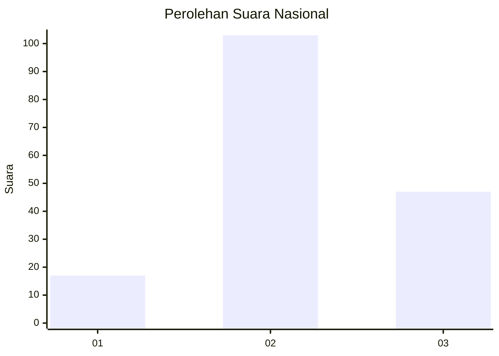
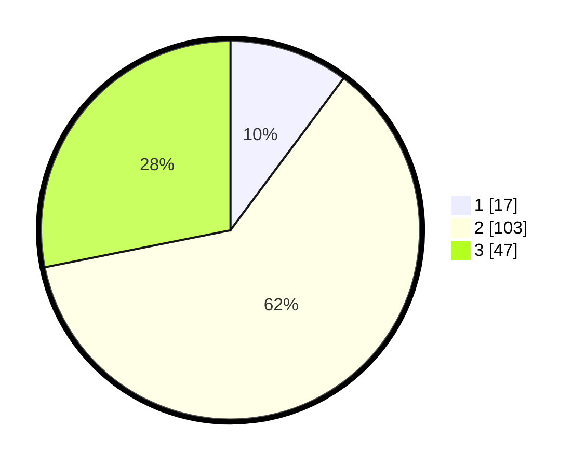

# Hasil

## Grafik

## Tabel

| No. | Nama Paslon    | Suara | Suara (raw) | Persentase |
|:--- |:-------------- | -----:| -----------:| ----------:|
| 1   | ANIES MUHAIMIN | 17    | [17][p-1]   | 10,18      |
| 2   | PRABOWO GIBRAN | 103   | [103][p-2]  | 61,68      |
| 3   | GANJAR MAHFUD  | 47    | [47][p-3]   | 28,14      |

[p-1]: https://github.com/gigit-pemilu/pemilu-2024/blob/main/pilpres/hitung-suara/sub/34-di-yogyakarta/sub/02-bantul/sub/06-pandak/sub/2002-triharjo/sub/039-tps/sub/paslon-1.txt
[p-2]: https://github.com/gigit-pemilu/pemilu-2024/blob/main/pilpres/hitung-suara/sub/34-di-yogyakarta/sub/02-bantul/sub/06-pandak/sub/2002-triharjo/sub/039-tps/sub/paslon-2.txt
[p-3]: https://github.com/gigit-pemilu/pemilu-2024/blob/main/pilpres/hitung-suara/sub/34-di-yogyakarta/sub/02-bantul/sub/06-pandak/sub/2002-triharjo/sub/039-tps/sub/paslon-3.txt

## Foto C Plano

https://sirekap-obj-formc.kpu.go.id/4767/pemilu/ppwp/34/02/06/20/02/3402062002039-20240219-110149--0870653e-3312-40e7-ae44-feb23724b948.jpg

https://sirekap-obj-formc.kpu.go.id/4767/pemilu/ppwp/34/02/06/20/02/3402062002039-20240219-110234--9e599c56-caae-4a65-be7f-04d8f9fba527.jpg

https://sirekap-obj-formc.kpu.go.id/4767/pemilu/ppwp/34/02/06/20/02/3402062002039-20240219-110304--3016a7ae-f8f3-4ef8-b296-a3c32839c40c.jpg

## Metadata

| Key        | Value               |
| ---------- | ------------------- |
| Time Stamp | 2024-02-24 22:31:28 |

