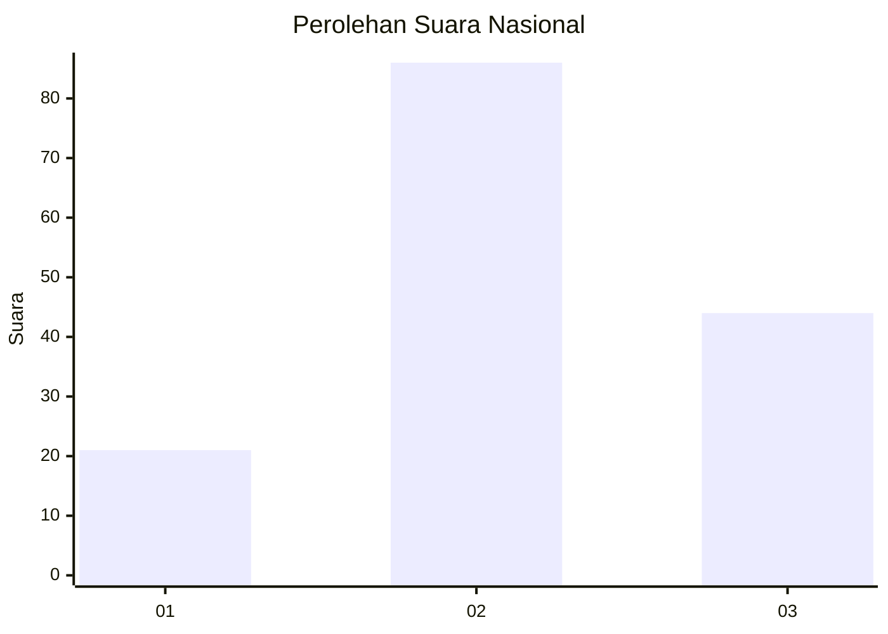
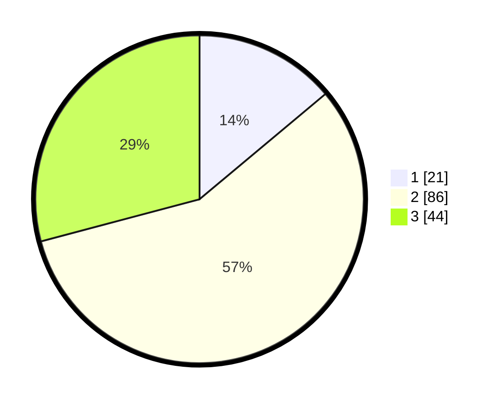

# Hasil

## Grafik

## Tabel

| No. | Nama Paslon    | Suara | Suara (raw) | Persentase |
|:--- |:-------------- | -----:| -----------:| ----------:|
| 1   | ANIES MUHAIMIN | 21    | [21][p-1]   | 13,91      |
| 2   | PRABOWO GIBRAN | 86    | [86][p-2]   | 56,95      |
| 3   | GANJAR MAHFUD  | 44    | [44][p-3]   | 29,14      |

[p-1]: https://github.com/gigit-pemilu/pemilu-2024/blob/main/pilpres/hitung-suara/sub/34-di-yogyakarta/sub/02-bantul/sub/06-pandak/sub/2002-triharjo/sub/040-tps/sub/paslon-1.txt
[p-2]: https://github.com/gigit-pemilu/pemilu-2024/blob/main/pilpres/hitung-suara/sub/34-di-yogyakarta/sub/02-bantul/sub/06-pandak/sub/2002-triharjo/sub/040-tps/sub/paslon-2.txt
[p-3]: https://github.com/gigit-pemilu/pemilu-2024/blob/main/pilpres/hitung-suara/sub/34-di-yogyakarta/sub/02-bantul/sub/06-pandak/sub/2002-triharjo/sub/040-tps/sub/paslon-3.txt

## Foto C Plano

https://sirekap-obj-formc.kpu.go.id/a73a/pemilu/ppwp/34/02/06/20/02/3402062002040-20240219-114436--850c445f-53c1-4053-8b6c-3d06fe39ccf4.jpg

https://sirekap-obj-formc.kpu.go.id/a73a/pemilu/ppwp/34/02/06/20/02/3402062002040-20240219-114506--11b8da4b-32e2-493f-88b1-12a0c0e6280c.jpg

https://sirekap-obj-formc.kpu.go.id/a73a/pemilu/ppwp/34/02/06/20/02/3402062002040-20240219-114602--831fddf6-97b2-488b-a73b-85d2b5d0d6a1.jpg

## Metadata

| Key        | Value               |
| ---------- | ------------------- |
| Time Stamp | 2024-02-24 22:31:28 |

