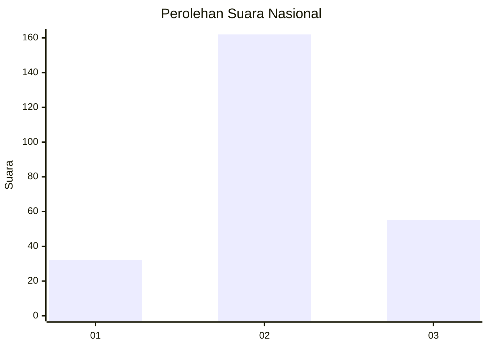
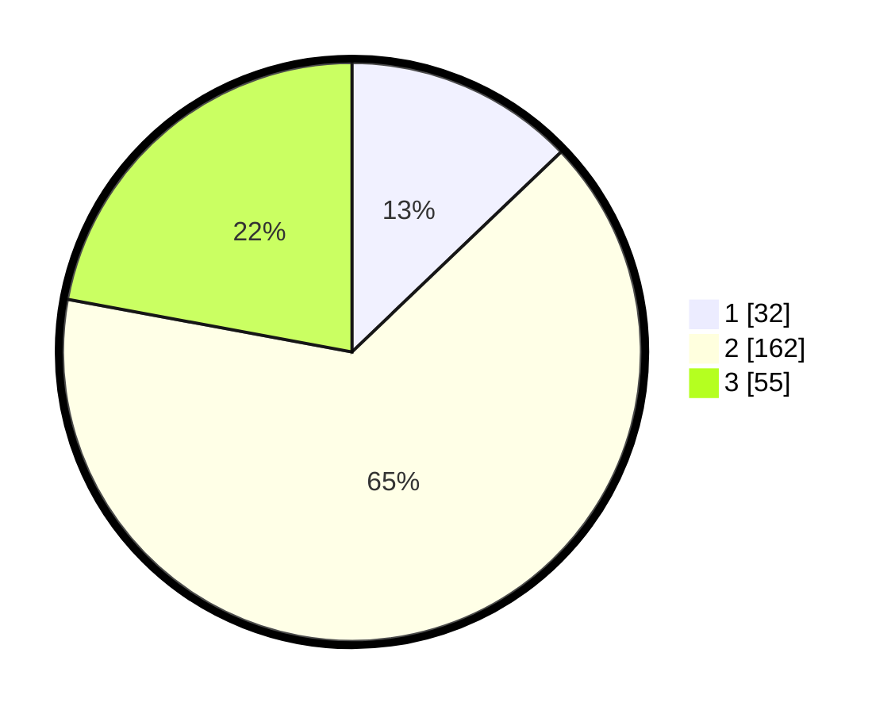

# Hasil

## Grafik

## Tabel

| No. | Nama Paslon    | Suara | Suara (raw) | Persentase |
|:--- |:-------------- | -----:| -----------:| ----------:|
| 1   | ANIES MUHAIMIN | 32    | [32][p-1]   | 12,85      |
| 2   | PRABOWO GIBRAN | 162   | [162][p-2]  | 65,06      |
| 3   | GANJAR MAHFUD  | 55    | [55][p-3]   | 22,09      |

[p-1]: https://github.com/gigit-pemilu/pemilu-2024/blob/main/pilpres/hitung-suara/sub/34-di-yogyakarta/sub/02-bantul/sub/06-pandak/sub/2002-triharjo/sub/042-tps/sub/paslon-1.txt
[p-2]: https://github.com/gigit-pemilu/pemilu-2024/blob/main/pilpres/hitung-suara/sub/34-di-yogyakarta/sub/02-bantul/sub/06-pandak/sub/2002-triharjo/sub/042-tps/sub/paslon-2.txt
[p-3]: https://github.com/gigit-pemilu/pemilu-2024/blob/main/pilpres/hitung-suara/sub/34-di-yogyakarta/sub/02-bantul/sub/06-pandak/sub/2002-triharjo/sub/042-tps/sub/paslon-3.txt

## Foto C Plano

https://sirekap-obj-formc.kpu.go.id/2156/pemilu/ppwp/34/02/06/20/02/3402062002042-20240221-205224--5facb97e-d247-4566-a9c6-7f6c5b4810be.jpg

https://sirekap-obj-formc.kpu.go.id/2156/pemilu/ppwp/34/02/06/20/02/3402062002042-20240221-205304--faf42f1a-c2ef-4d42-9ac6-840f10db5bb2.jpg

https://sirekap-obj-formc.kpu.go.id/2156/pemilu/ppwp/34/02/06/20/02/3402062002042-20240221-205426--29da52a3-8d41-4d85-9bdb-9c107a6d2037.jpg

## Metadata

| Key        | Value               |
| ---------- | ------------------- |
| Time Stamp | 2024-02-25 00:00:00 |

