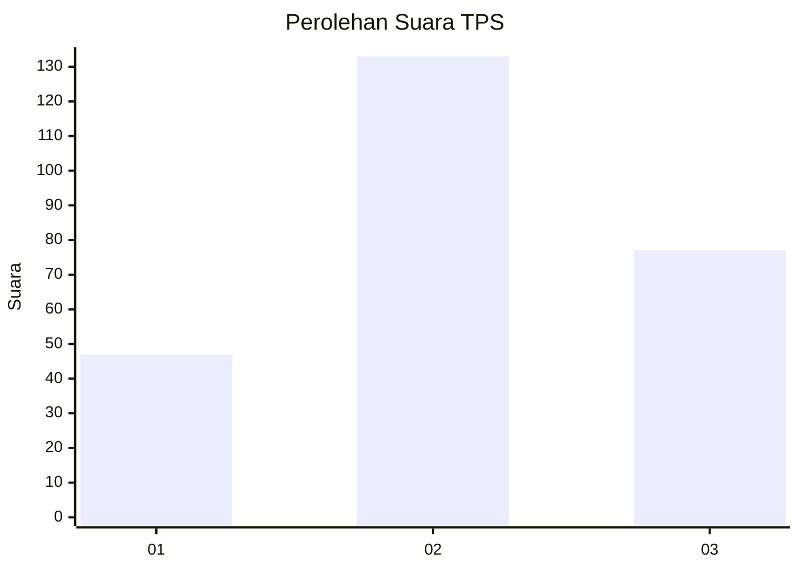
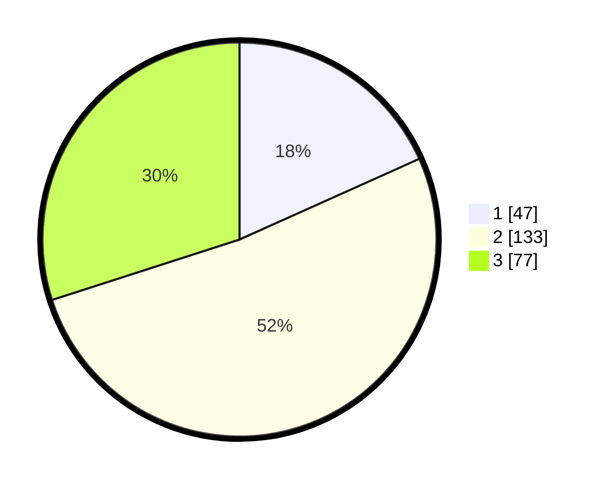

# Hasil

## Grafik

## Tabel

| No. | Nama Paslon    | Suara | Suara (raw) | Persentase |
|:--- |:-------------- | -----:| -----------:| ----------:|
| 1   | ANIES MUHAIMIN | 47    | [47][p-1]   | 18,29      |
| 2   | PRABOWO GIBRAN | 133   | [133][p-2]  | 51,75      |
| 3   | GANJAR MAHFUD  | 77    | [77][p-3]   | 29,96      |

[p-1]: https://github.com/gigit-pemilu/pemilu-2024-34-di-yogyakarta/blob/main/pilpres/hitung-suara/sub/34-di-yogyakarta/sub/02-bantul/sub/06-pandak/sub/2002-triharjo/sub/043-tps/sub/paslon-1.txt
[p-2]: https://github.com/gigit-pemilu/pemilu-2024-34-di-yogyakarta/blob/main/pilpres/hitung-suara/sub/34-di-yogyakarta/sub/02-bantul/sub/06-pandak/sub/2002-triharjo/sub/043-tps/sub/paslon-2.txt
[p-3]: https://github.com/gigit-pemilu/pemilu-2024-34-di-yogyakarta/blob/main/pilpres/hitung-suara/sub/34-di-yogyakarta/sub/02-bantul/sub/06-pandak/sub/2002-triharjo/sub/043-tps/sub/paslon-3.txt

## Foto C Plano

https://sirekap-obj-formc.kpu.go.id/8c99/pemilu/ppwp/34/02/06/20/02/3402062002043-20240214-224749--3f6ddd89-1f22-4a5f-adce-c4849232b8dc.jpg

https://sirekap-obj-formc.kpu.go.id/8c99/pemilu/ppwp/34/02/06/20/02/3402062002043-20240214-225225--bc64d8de-19c0-4a08-a03e-677806fb7a63.jpg

https://sirekap-obj-formc.kpu.go.id/8c99/pemilu/ppwp/34/02/06/20/02/3402062002043-20240214-225333--7d099d1a-9068-48a4-9d37-0461c3577318.jpg

## Metadata

| Key        | Value               |
| ---------- | ------------------- |
| Time Stamp | 2024-02-24 22:31:28 |

