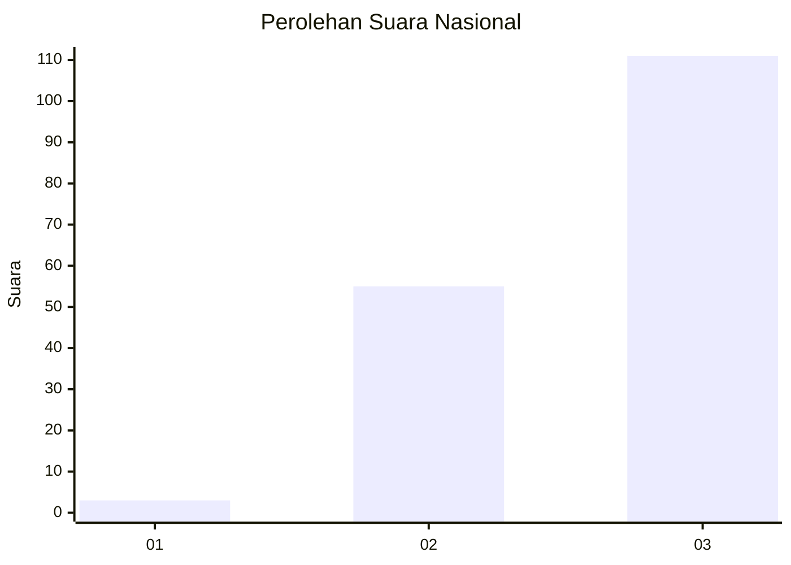
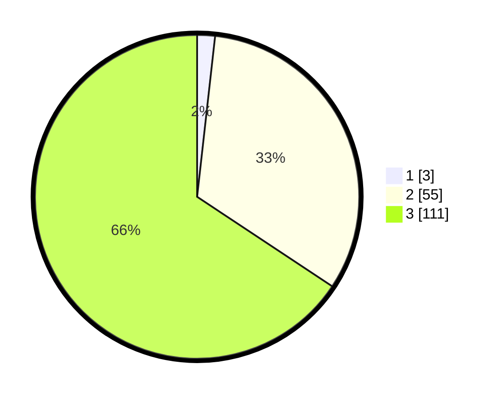

# Hasil

## Grafik

## Tabel

| No. | Nama Paslon    | Suara | Suara (raw) | Persentase |
|:--- |:-------------- | -----:| -----------:| ----------:|
| 1   | ANIES MUHAIMIN | 3     | [3][p-1]    | 1,78       |
| 2   | PRABOWO GIBRAN | 55    | [55][p-2]   | 32,54      |
| 3   | GANJAR MAHFUD  | 111   | [111][p-3]  | 65,68      |

[p-1]: https://github.com/gigit-pemilu/pemilu-2024/blob/main/pilpres/hitung-suara/sub/34-di-yogyakarta/sub/02-bantul/sub/06-pandak/sub/2003-gilangharjo/sub/001-tps/sub/paslon-1.txt
[p-2]: https://github.com/gigit-pemilu/pemilu-2024/blob/main/pilpres/hitung-suara/sub/34-di-yogyakarta/sub/02-bantul/sub/06-pandak/sub/2003-gilangharjo/sub/001-tps/sub/paslon-2.txt
[p-3]: https://github.com/gigit-pemilu/pemilu-2024/blob/main/pilpres/hitung-suara/sub/34-di-yogyakarta/sub/02-bantul/sub/06-pandak/sub/2003-gilangharjo/sub/001-tps/sub/paslon-3.txt

## Foto C Plano

https://sirekap-obj-formc.kpu.go.id/7eed/pemilu/ppwp/34/02/06/20/03/3402062003001-20240221-193442--78de36d5-1eba-4e3c-be93-9091595893dd.jpg

https://sirekap-obj-formc.kpu.go.id/7eed/pemilu/ppwp/34/02/06/20/03/3402062003001-20240221-193517--c77bfa90-e788-4d05-991f-986896950efa.jpg

https://sirekap-obj-formc.kpu.go.id/7eed/pemilu/ppwp/34/02/06/20/03/3402062003001-20240221-193554--4e1a7627-e8bd-4082-a0a9-870ab3a15309.jpg

## Metadata

| Key        | Value               |
| ---------- | ------------------- |
| Time Stamp | 2024-02-24 22:31:28 |

