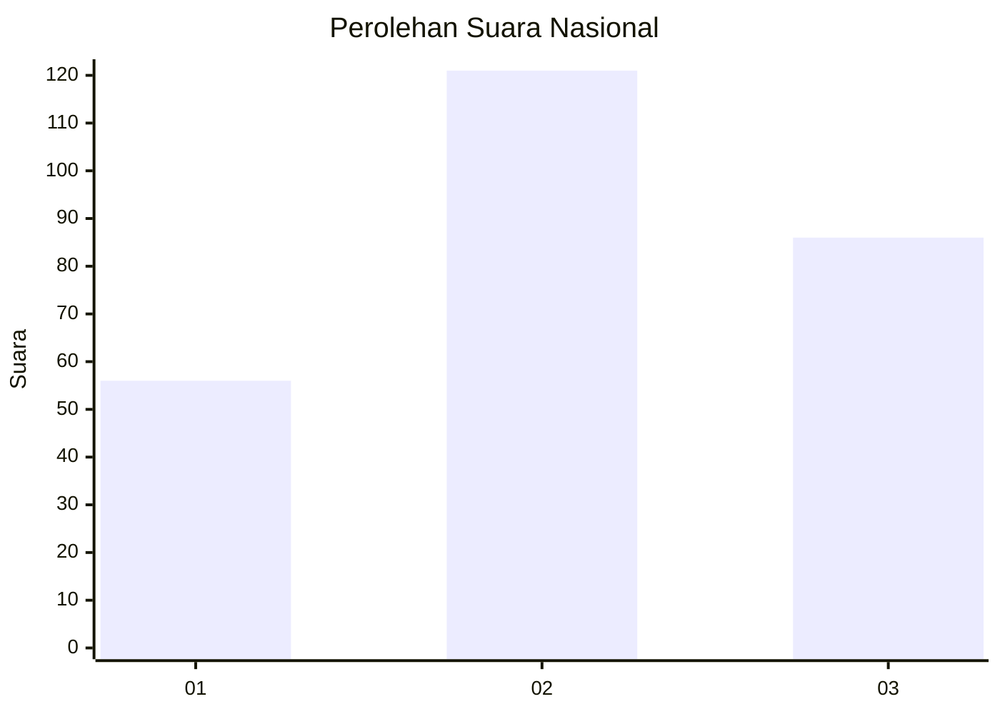
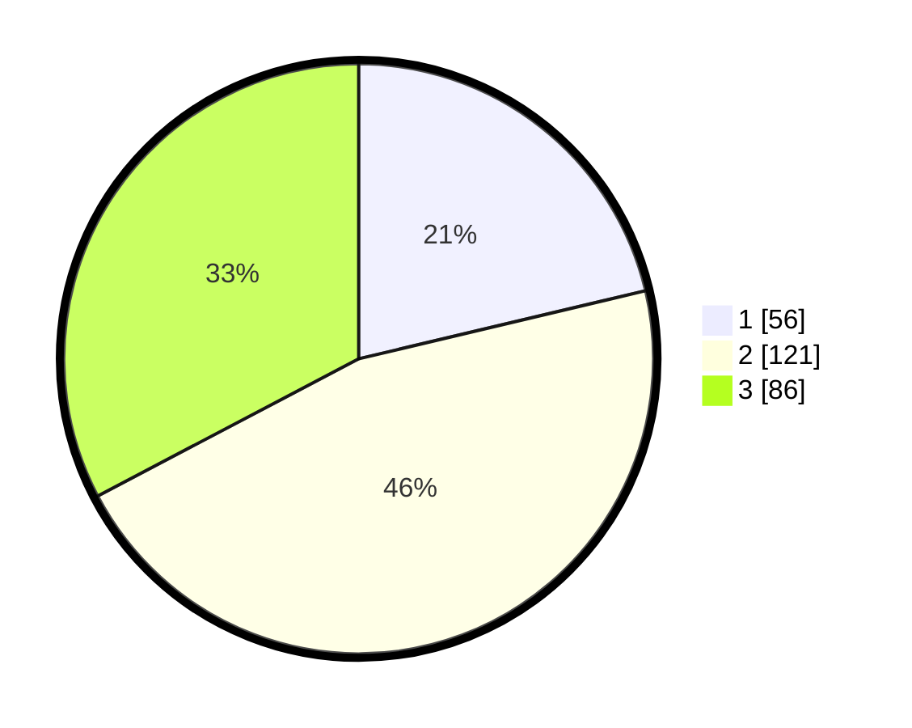

# Hasil

## Grafik

## Tabel

| No. | Nama Paslon    | Suara | Suara (raw) | Persentase |
|:--- |:-------------- | -----:| -----------:| ----------:|
| 1   | ANIES MUHAIMIN | 56    | [56][p-1]   | 21,29      |
| 2   | PRABOWO GIBRAN | 121   | [121][p-2]  | 46,01      |
| 3   | GANJAR MAHFUD  | 86    | [86][p-3]   | 32,70      |

[p-1]: https://github.com/gigit-pemilu/pemilu-2024/blob/main/pilpres/hitung-suara/sub/34-di-yogyakarta/sub/02-bantul/sub/06-pandak/sub/2003-gilangharjo/sub/004-tps/sub/paslon-1.txt
[p-2]: https://github.com/gigit-pemilu/pemilu-2024/blob/main/pilpres/hitung-suara/sub/34-di-yogyakarta/sub/02-bantul/sub/06-pandak/sub/2003-gilangharjo/sub/004-tps/sub/paslon-2.txt
[p-3]: https://github.com/gigit-pemilu/pemilu-2024/blob/main/pilpres/hitung-suara/sub/34-di-yogyakarta/sub/02-bantul/sub/06-pandak/sub/2003-gilangharjo/sub/004-tps/sub/paslon-3.txt

## Foto C Plano

https://sirekap-obj-formc.kpu.go.id/0e50/pemilu/ppwp/34/02/06/20/03/3402062003004-20240216-210545--c063314a-adf3-406e-b5ab-402bfe8a7e29.jpg

https://sirekap-obj-formc.kpu.go.id/0e50/pemilu/ppwp/34/02/06/20/03/3402062003004-20240216-210409--425ba216-7fda-4210-9103-157a85b0e85a.jpg

https://sirekap-obj-formc.kpu.go.id/0e50/pemilu/ppwp/34/02/06/20/03/3402062003004-20240216-210452--a9e0be42-c920-42ad-9c84-081e32df51a9.jpg

## Metadata

| Key        | Value               |
| ---------- | ------------------- |
| Time Stamp | 2024-02-24 22:31:28 |

