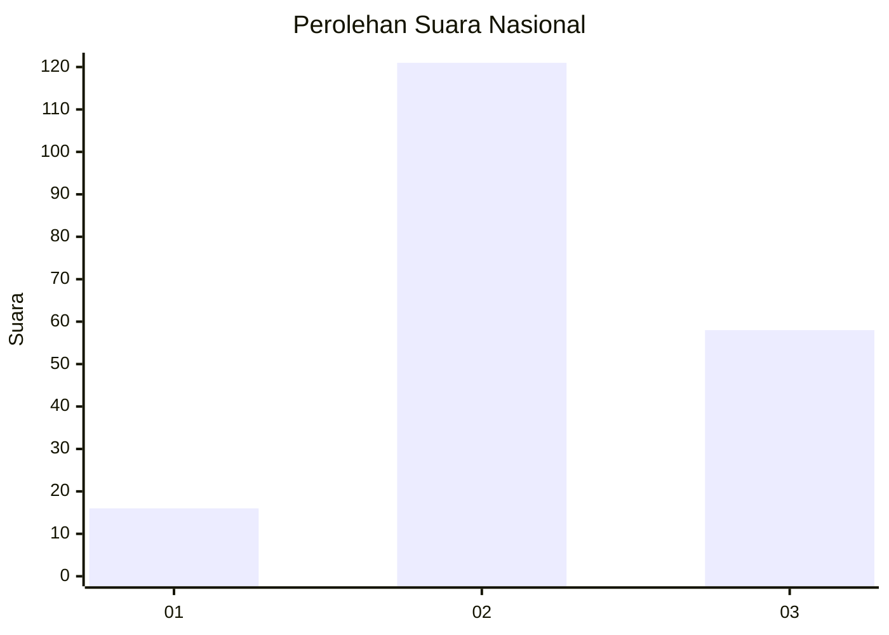
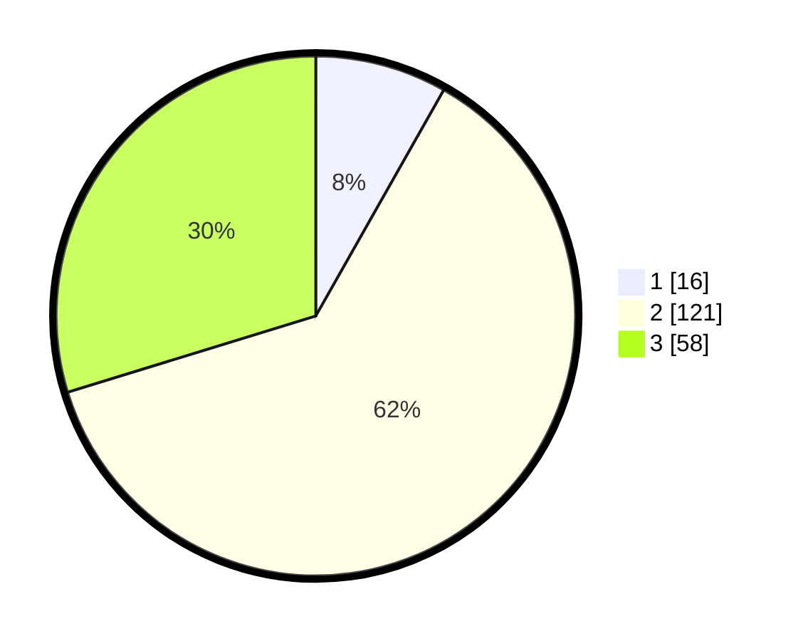

# Hasil

## Grafik

## Tabel

| No. | Nama Paslon    | Suara | Suara (raw) | Persentase |
|:--- |:-------------- | -----:| -----------:| ----------:|
| 1   | ANIES MUHAIMIN | 16    | [16][p-1]   | 8,21       |
| 2   | PRABOWO GIBRAN | 121   | [121][p-2]  | 62,05      |
| 3   | GANJAR MAHFUD  | 58    | [58][p-3]   | 29,74      |

[p-1]: https://github.com/gigit-pemilu/pemilu-2024/blob/main/pilpres/hitung-suara/sub/34-di-yogyakarta/sub/02-bantul/sub/06-pandak/sub/2003-gilangharjo/sub/005-tps/sub/paslon-1.txt
[p-2]: https://github.com/gigit-pemilu/pemilu-2024/blob/main/pilpres/hitung-suara/sub/34-di-yogyakarta/sub/02-bantul/sub/06-pandak/sub/2003-gilangharjo/sub/005-tps/sub/paslon-2.txt
[p-3]: https://github.com/gigit-pemilu/pemilu-2024/blob/main/pilpres/hitung-suara/sub/34-di-yogyakarta/sub/02-bantul/sub/06-pandak/sub/2003-gilangharjo/sub/005-tps/sub/paslon-3.txt

## Foto C Plano

https://sirekap-obj-formc.kpu.go.id/a543/pemilu/ppwp/34/02/06/20/03/3402062003005-20240214-232922--9e4e7ba3-9a26-4cad-b845-be0b35afcb3e.jpg

https://sirekap-obj-formc.kpu.go.id/a543/pemilu/ppwp/34/02/06/20/03/3402062003005-20240214-233038--2da8e5a9-1be9-48c7-8afb-c87336b1af85.jpg

https://sirekap-obj-formc.kpu.go.id/a543/pemilu/ppwp/34/02/06/20/03/3402062003005-20240214-233125--8304dd50-f0f0-4e50-97e3-7f722d59fb2e.jpg

## Metadata

| Key        | Value               |
| ---------- | ------------------- |
| Time Stamp | 2024-02-25 11:00:00 |

