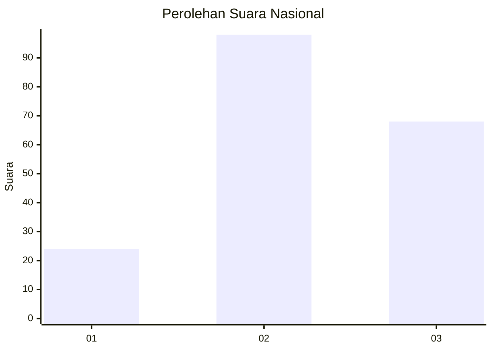
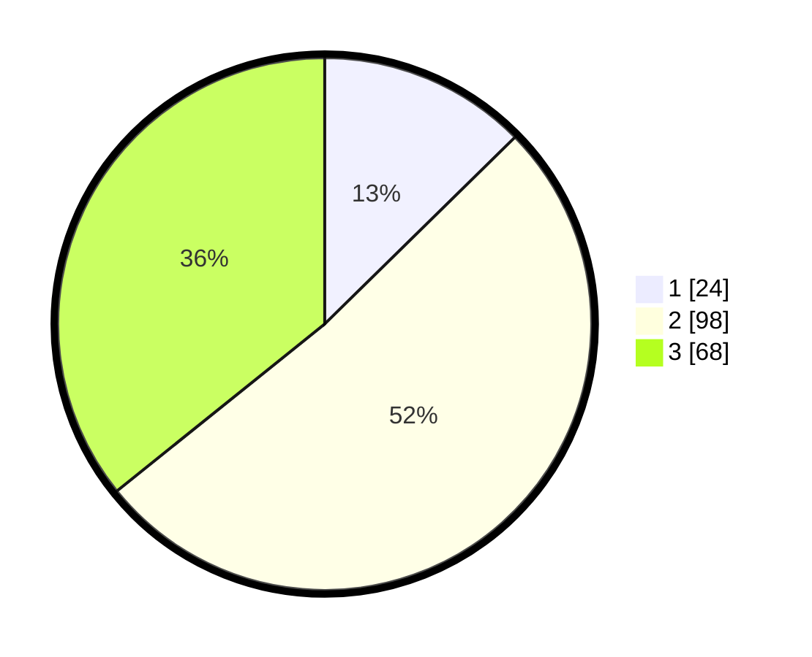

# Hasil

## Grafik

## Tabel

| No. | Nama Paslon    | Suara | Suara (raw) | Persentase |
|:--- |:-------------- | -----:| -----------:| ----------:|
| 1   | ANIES MUHAIMIN | 24    | [24][p-1]   | 12,63      |
| 2   | PRABOWO GIBRAN | 98    | [98][p-2]   | 51,58      |
| 3   | GANJAR MAHFUD  | 68    | [68][p-3]   | 35,79      |

[p-1]: https://github.com/gigit-pemilu/pemilu-2024/blob/main/pilpres/hitung-suara/sub/34-di-yogyakarta/sub/02-bantul/sub/06-pandak/sub/2003-gilangharjo/sub/006-tps/sub/paslon-1.txt
[p-2]: https://github.com/gigit-pemilu/pemilu-2024/blob/main/pilpres/hitung-suara/sub/34-di-yogyakarta/sub/02-bantul/sub/06-pandak/sub/2003-gilangharjo/sub/006-tps/sub/paslon-2.txt
[p-3]: https://github.com/gigit-pemilu/pemilu-2024/blob/main/pilpres/hitung-suara/sub/34-di-yogyakarta/sub/02-bantul/sub/06-pandak/sub/2003-gilangharjo/sub/006-tps/sub/paslon-3.txt

## Foto C Plano

https://sirekap-obj-formc.kpu.go.id/86d6/pemilu/ppwp/34/02/06/20/03/3402062003006-20240216-205015--441d2abe-2144-4395-943b-68b626409b95.jpg

https://sirekap-obj-formc.kpu.go.id/86d6/pemilu/ppwp/34/02/06/20/03/3402062003006-20240216-205147--4d03475d-5269-4559-a0eb-b52010fba266.jpg

https://sirekap-obj-formc.kpu.go.id/86d6/pemilu/ppwp/34/02/06/20/03/3402062003006-20240216-205322--a2f37e21-4d39-40e7-87a6-620e37429185.jpg

## Metadata

| Key        | Value               |
| ---------- | ------------------- |
| Time Stamp | 2024-02-26 11:00:00 |

