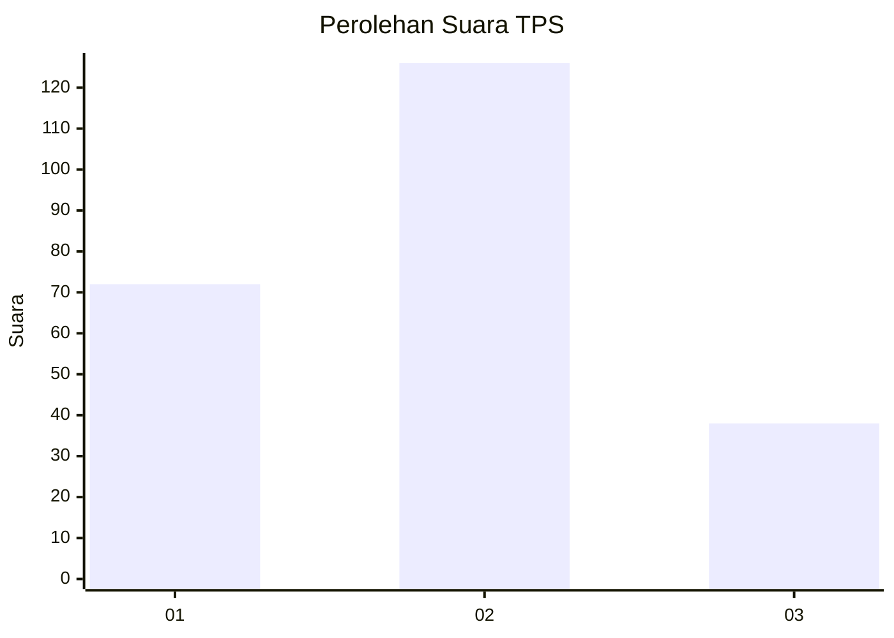
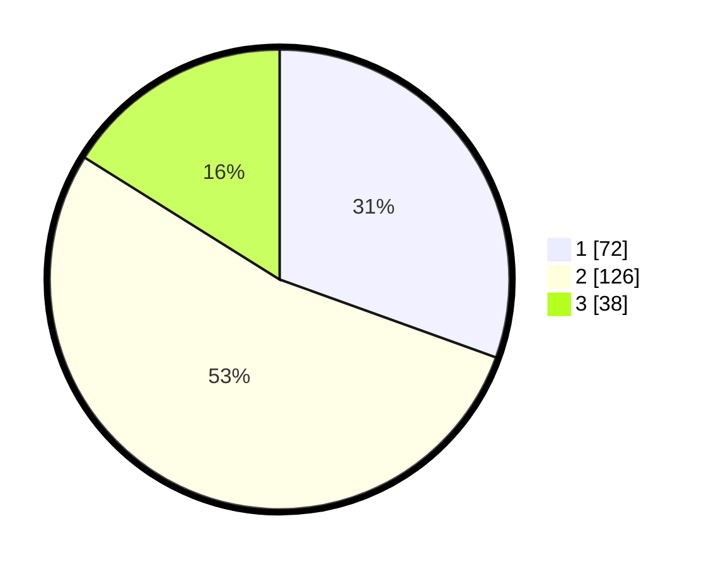

# Hasil

## Grafik

## Tabel

| No. | Nama Paslon    | Suara | Suara (raw) | Persentase |
|:--- |:-------------- | -----:| -----------:| ----------:|
| 1   | ANIES MUHAIMIN | 72    | [72][p-1]   | 30,51      |
| 2   | PRABOWO GIBRAN | 126   | [126][p-2]  | 53,39      |
| 3   | GANJAR MAHFUD  | 38    | [38][p-3]   | 16,10      |

[p-1]: https://github.com/gigit-pemilu/pemilu-2024-34-di-yogyakarta/blob/main/pilpres/hitung-suara/sub/34-di-yogyakarta/sub/02-bantul/sub/06-pandak/sub/2003-gilangharjo/sub/008-tps/sub/paslon-1.txt
[p-2]: https://github.com/gigit-pemilu/pemilu-2024-34-di-yogyakarta/blob/main/pilpres/hitung-suara/sub/34-di-yogyakarta/sub/02-bantul/sub/06-pandak/sub/2003-gilangharjo/sub/008-tps/sub/paslon-2.txt
[p-3]: https://github.com/gigit-pemilu/pemilu-2024-34-di-yogyakarta/blob/main/pilpres/hitung-suara/sub/34-di-yogyakarta/sub/02-bantul/sub/06-pandak/sub/2003-gilangharjo/sub/008-tps/sub/paslon-3.txt

## Foto C Plano

https://sirekap-obj-formc.kpu.go.id/c954/pemilu/ppwp/34/02/06/20/03/3402062003008-20240215-013915--6bacad0d-226c-41ec-9181-9450925ecbe5.jpg

https://sirekap-obj-formc.kpu.go.id/c954/pemilu/ppwp/34/02/06/20/03/3402062003008-20240215-014212--7d61880d-c290-4f5a-9e76-d1852e2f9307.jpg

https://sirekap-obj-formc.kpu.go.id/c954/pemilu/ppwp/34/02/06/20/03/3402062003008-20240215-014743--b1164d6a-1cf0-49f0-9944-23bef713d87c.jpg

## Metadata

| Key        | Value               |
| ---------- | ------------------- |
| Time Stamp | 2024-02-15 15:00:29 |

