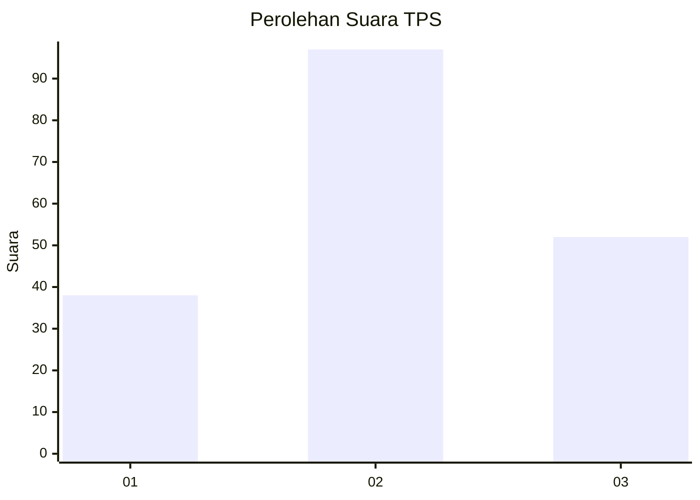
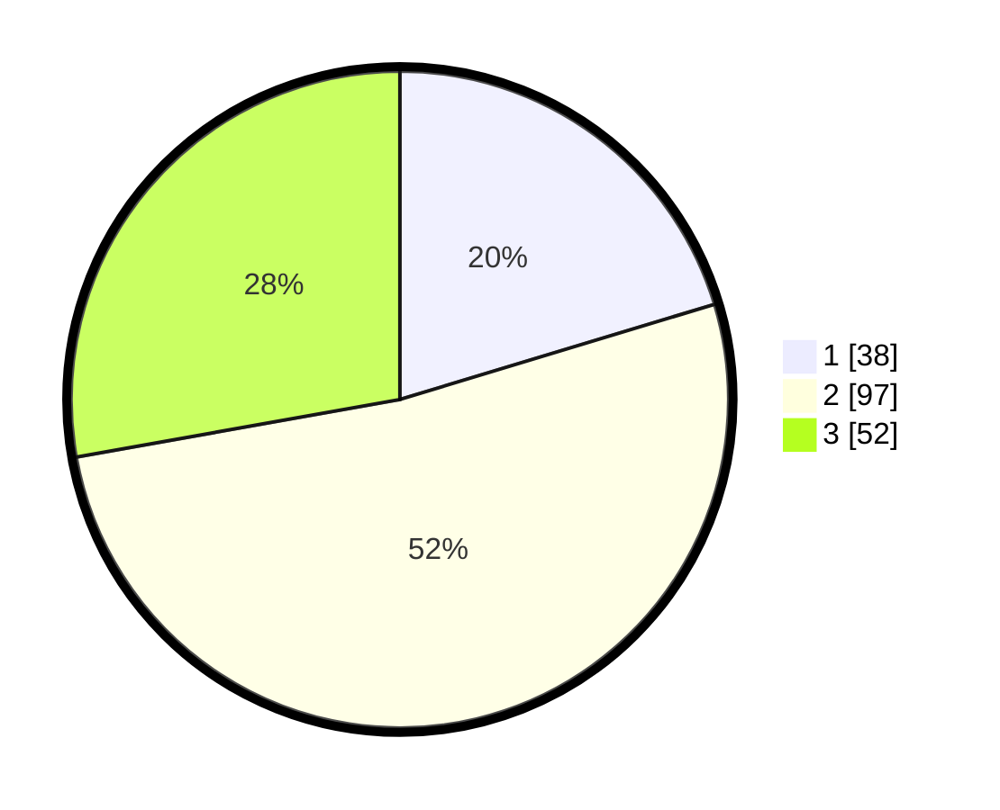

# Hasil

## Grafik

## Tabel

| No. | Nama Paslon    | Suara | Suara (raw) | Persentase |
|:--- |:-------------- | -----:| -----------:| ----------:|
| 1   | ANIES MUHAIMIN | 38    | [38][p-1]   | 20,32      |
| 2   | PRABOWO GIBRAN | 97    | [97][p-2]   | 51,87      |
| 3   | GANJAR MAHFUD  | 52    | [52][p-3]   | 27,81      |

[p-1]: https://github.com/gigit-pemilu/pemilu-2024-34-di-yogyakarta/blob/main/pilpres/hitung-suara/sub/34-di-yogyakarta/sub/02-bantul/sub/06-pandak/sub/2003-gilangharjo/sub/009-tps/sub/paslon-1.txt
[p-2]: https://github.com/gigit-pemilu/pemilu-2024-34-di-yogyakarta/blob/main/pilpres/hitung-suara/sub/34-di-yogyakarta/sub/02-bantul/sub/06-pandak/sub/2003-gilangharjo/sub/009-tps/sub/paslon-2.txt
[p-3]: https://github.com/gigit-pemilu/pemilu-2024-34-di-yogyakarta/blob/main/pilpres/hitung-suara/sub/34-di-yogyakarta/sub/02-bantul/sub/06-pandak/sub/2003-gilangharjo/sub/009-tps/sub/paslon-3.txt

## Foto C Plano

https://sirekap-obj-formc.kpu.go.id/af01/pemilu/ppwp/34/02/06/20/03/3402062003009-20240214-224401--66b6729d-86bf-419f-846a-7623d299a068.jpg

https://sirekap-obj-formc.kpu.go.id/af01/pemilu/ppwp/34/02/06/20/03/3402062003009-20240214-223342--df92f305-aac7-4c1d-8c7b-3cfcffa23881.jpg

https://sirekap-obj-formc.kpu.go.id/af01/pemilu/ppwp/34/02/06/20/03/3402062003009-20240214-223630--2994b9da-4861-4b60-905f-6bacced81884.jpg

## Metadata

| Key        | Value               |
| ---------- | ------------------- |
| Time Stamp | 2024-02-25 12:00:00 |

