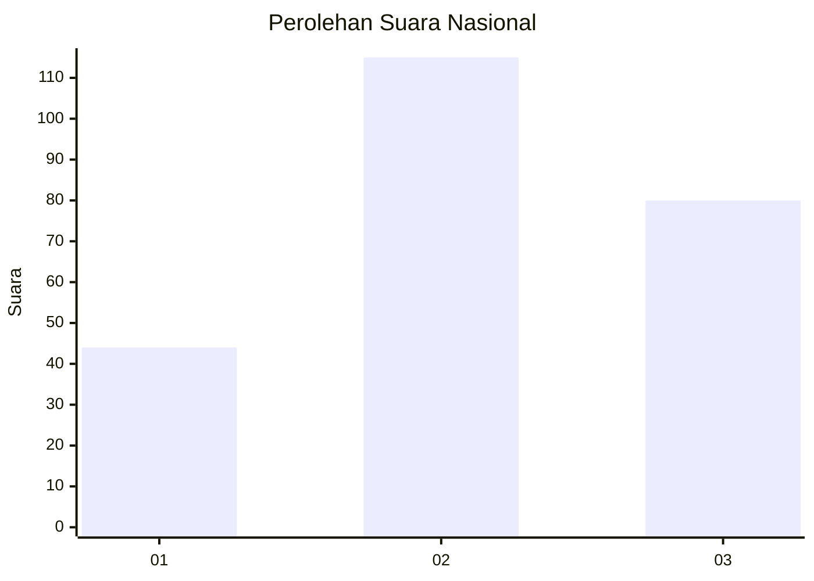
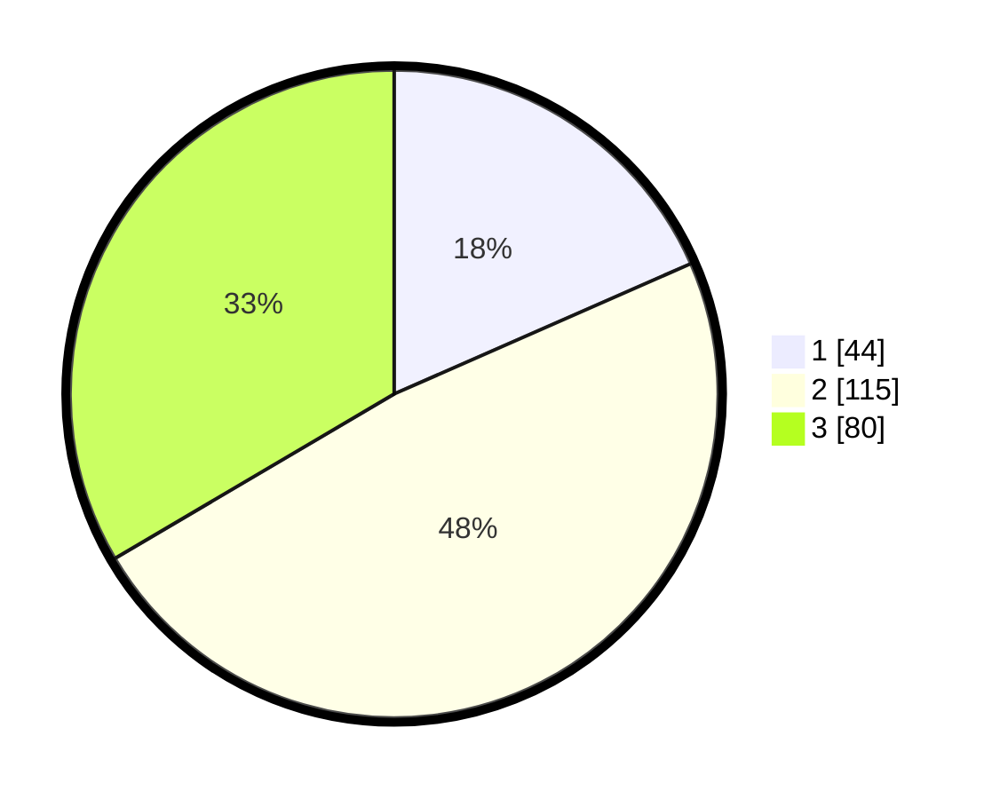

# Hasil

## Grafik

## Tabel

| No. | Nama Paslon    | Suara | Suara (raw) | Persentase |
|:--- |:-------------- | -----:| -----------:| ----------:|
| 1   | ANIES MUHAIMIN | 44    | [44][p-1]   | 18,41      |
| 2   | PRABOWO GIBRAN | 115   | [115][p-2]  | 48,12      |
| 3   | GANJAR MAHFUD  | 80    | [80][p-3]   | 33,47      |

[p-1]: https://github.com/gigit-pemilu/pemilu-2024/blob/main/pilpres/hitung-suara/sub/34-di-yogyakarta/sub/02-bantul/sub/06-pandak/sub/2003-gilangharjo/sub/010-tps/sub/paslon-1.txt
[p-2]: https://github.com/gigit-pemilu/pemilu-2024/blob/main/pilpres/hitung-suara/sub/34-di-yogyakarta/sub/02-bantul/sub/06-pandak/sub/2003-gilangharjo/sub/010-tps/sub/paslon-2.txt
[p-3]: https://github.com/gigit-pemilu/pemilu-2024/blob/main/pilpres/hitung-suara/sub/34-di-yogyakarta/sub/02-bantul/sub/06-pandak/sub/2003-gilangharjo/sub/010-tps/sub/paslon-3.txt

## Foto C Plano

https://sirekap-obj-formc.kpu.go.id/6c83/pemilu/ppwp/34/02/06/20/03/3402062003010-20240214-200031--b014ca85-1de6-448b-91e3-969900d3c003.jpg

https://sirekap-obj-formc.kpu.go.id/6c83/pemilu/ppwp/34/02/06/20/03/3402062003010-20240214-200222--361ca9d7-6125-4340-bd26-03a63a43ba1d.jpg

https://sirekap-obj-formc.kpu.go.id/6c83/pemilu/ppwp/34/02/06/20/03/3402062003010-20240214-200849--063ffd3a-5a7b-46d4-9a46-6f375ef54738.jpg

## Metadata

| Key        | Value               |
| ---------- | ------------------- |
| Time Stamp | 2024-02-24 22:31:28 |

