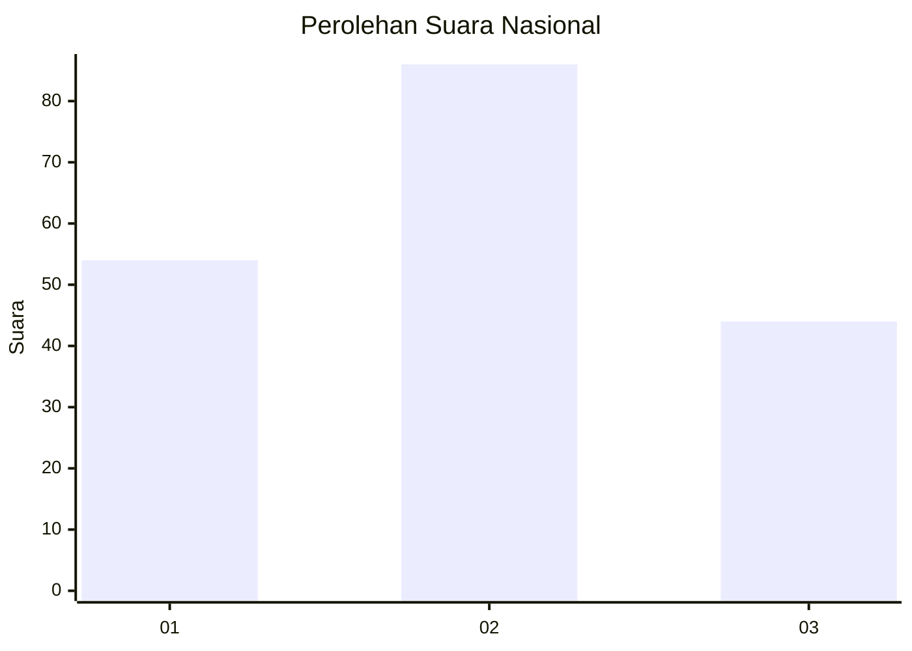
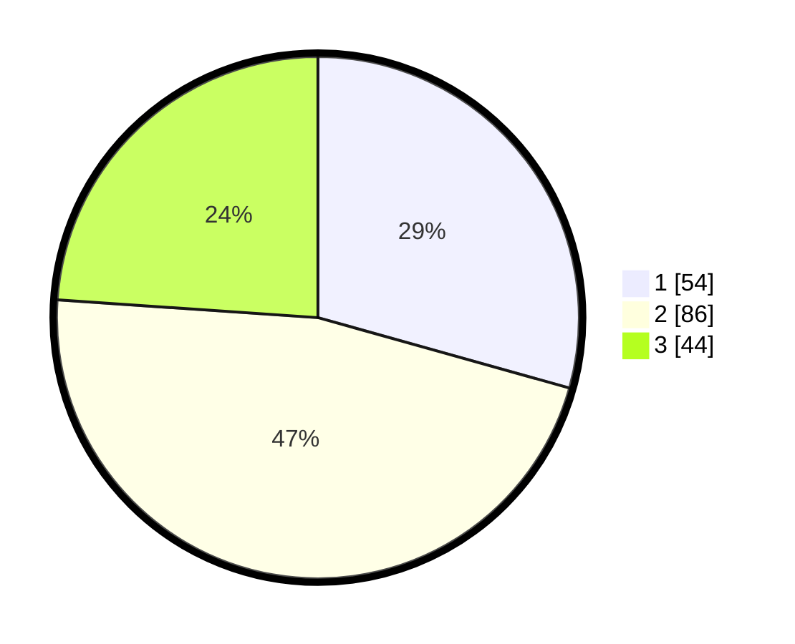

# Hasil

## Grafik

## Tabel

| No. | Nama Paslon    | Suara | Suara (raw) | Persentase |
|:--- |:-------------- | -----:| -----------:| ----------:|
| 1   | ANIES MUHAIMIN | 54    | [54][p-1]   | 29,35      |
| 2   | PRABOWO GIBRAN | 86    | [86][p-2]   | 46,74      |
| 3   | GANJAR MAHFUD  | 44    | [44][p-3]   | 23,91      |

[p-1]: https://github.com/gigit-pemilu/pemilu-2024/blob/main/pilpres/hitung-suara/sub/34-di-yogyakarta/sub/02-bantul/sub/06-pandak/sub/2003-gilangharjo/sub/011-tps/sub/paslon-1.txt
[p-2]: https://github.com/gigit-pemilu/pemilu-2024/blob/main/pilpres/hitung-suara/sub/34-di-yogyakarta/sub/02-bantul/sub/06-pandak/sub/2003-gilangharjo/sub/011-tps/sub/paslon-2.txt
[p-3]: https://github.com/gigit-pemilu/pemilu-2024/blob/main/pilpres/hitung-suara/sub/34-di-yogyakarta/sub/02-bantul/sub/06-pandak/sub/2003-gilangharjo/sub/011-tps/sub/paslon-3.txt

## Foto C Plano

https://sirekap-obj-formc.kpu.go.id/570f/pemilu/ppwp/34/02/06/20/03/3402062003011-20240217-165804--8d42d50a-2e0c-40ca-8ff1-2b007dea22cf.jpg

https://sirekap-obj-formc.kpu.go.id/570f/pemilu/ppwp/34/02/06/20/03/3402062003011-20240217-165902--24f88137-b912-4ce6-9f9d-e922ca7decfa.jpg

https://sirekap-obj-formc.kpu.go.id/570f/pemilu/ppwp/34/02/06/20/03/3402062003011-20240217-170006--a32d61c5-e965-4eb1-8827-8b4932a71259.jpg

## Metadata

| Key        | Value               |
| ---------- | ------------------- |
| Time Stamp | 2024-02-25 11:00:00 |

