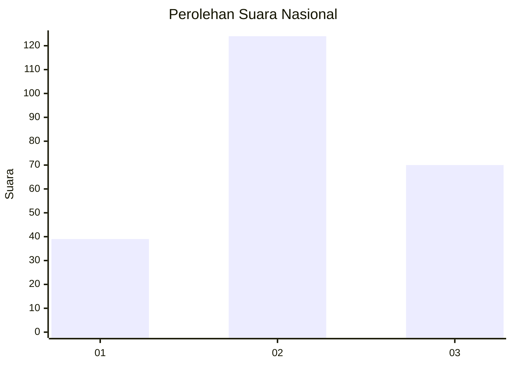
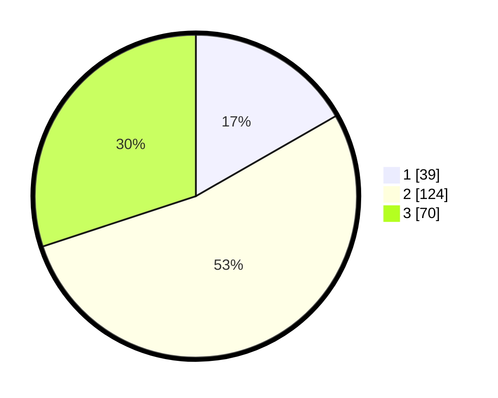

# Hasil

## Grafik

## Tabel

| No. | Nama Paslon    | Suara | Suara (raw) | Persentase |
|:--- |:-------------- | -----:| -----------:| ----------:|
| 1   | ANIES MUHAIMIN | 39    | [39][p-1]   | 16,74      |
| 2   | PRABOWO GIBRAN | 124   | [124][p-2]  | 53,22      |
| 3   | GANJAR MAHFUD  | 70    | [70][p-3]   | 30,04      |

[p-1]: https://github.com/gigit-pemilu/pemilu-2024/blob/main/pilpres/hitung-suara/sub/34-di-yogyakarta/sub/02-bantul/sub/06-pandak/sub/2003-gilangharjo/sub/012-tps/sub/paslon-1.txt
[p-2]: https://github.com/gigit-pemilu/pemilu-2024/blob/main/pilpres/hitung-suara/sub/34-di-yogyakarta/sub/02-bantul/sub/06-pandak/sub/2003-gilangharjo/sub/012-tps/sub/paslon-2.txt
[p-3]: https://github.com/gigit-pemilu/pemilu-2024/blob/main/pilpres/hitung-suara/sub/34-di-yogyakarta/sub/02-bantul/sub/06-pandak/sub/2003-gilangharjo/sub/012-tps/sub/paslon-3.txt

## Foto C Plano

https://sirekap-obj-formc.kpu.go.id/b66d/pemilu/ppwp/34/02/06/20/03/3402062003012-20240217-164722--e0a683be-732c-4880-bd2c-02a9b7735263.jpg

https://sirekap-obj-formc.kpu.go.id/b66d/pemilu/ppwp/34/02/06/20/03/3402062003012-20240217-164811--49b24d11-d451-4de0-b6bd-8039eefcf01c.jpg

https://sirekap-obj-formc.kpu.go.id/b66d/pemilu/ppwp/34/02/06/20/03/3402062003012-20240217-164846--1ab8975f-b514-438a-a2c7-376dd976f674.jpg

## Metadata

| Key        | Value               |
| ---------- | ------------------- |
| Time Stamp | 2024-02-24 22:31:28 |

