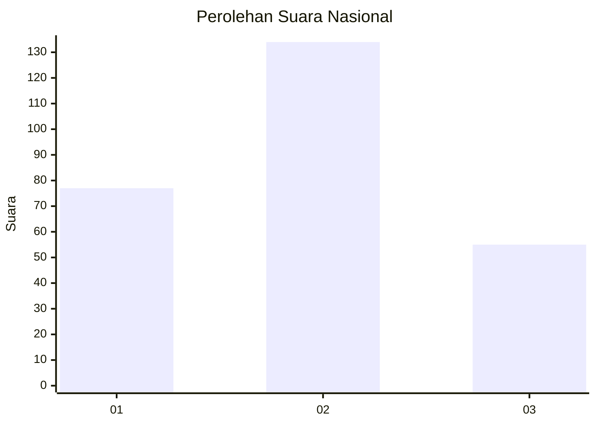
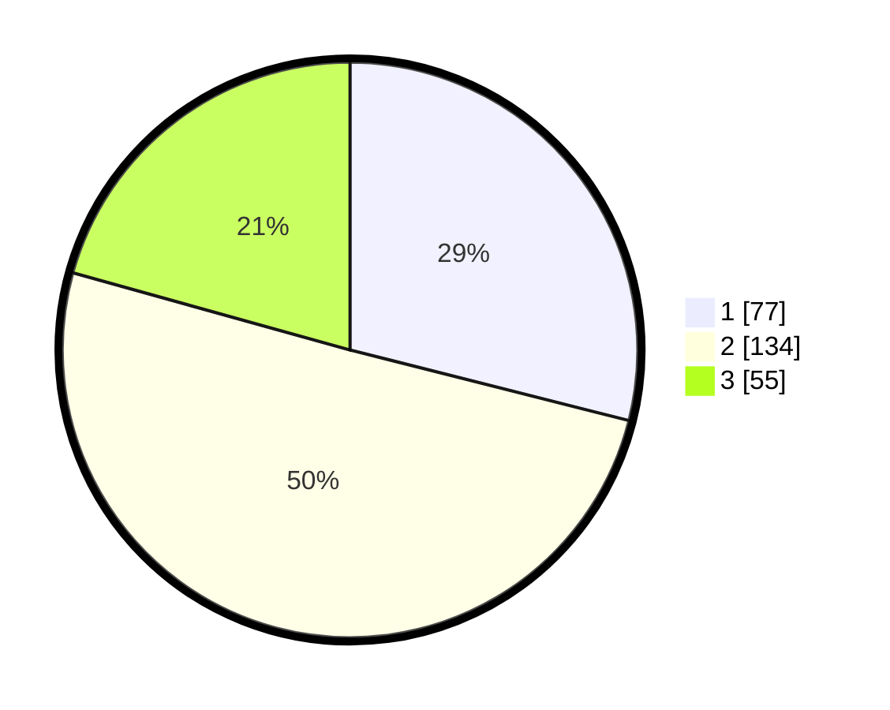

# Hasil

## Grafik

## Tabel

| No. | Nama Paslon    | Suara | Suara (raw) | Persentase |
|:--- |:-------------- | -----:| -----------:| ----------:|
| 1   | ANIES MUHAIMIN | 77    | [77][p-1]   | 28,95      |
| 2   | PRABOWO GIBRAN | 134   | [134][p-2]  | 50,38      |
| 3   | GANJAR MAHFUD  | 55    | [55][p-3]   | 20,68      |

[p-1]: https://github.com/gigit-pemilu/pemilu-2024/blob/main/pilpres/hitung-suara/sub/34-di-yogyakarta/sub/02-bantul/sub/06-pandak/sub/2003-gilangharjo/sub/013-tps/sub/paslon-1.txt
[p-2]: https://github.com/gigit-pemilu/pemilu-2024/blob/main/pilpres/hitung-suara/sub/34-di-yogyakarta/sub/02-bantul/sub/06-pandak/sub/2003-gilangharjo/sub/013-tps/sub/paslon-2.txt
[p-3]: https://github.com/gigit-pemilu/pemilu-2024/blob/main/pilpres/hitung-suara/sub/34-di-yogyakarta/sub/02-bantul/sub/06-pandak/sub/2003-gilangharjo/sub/013-tps/sub/paslon-3.txt

## Foto C Plano

https://sirekap-obj-formc.kpu.go.id/fca3/pemilu/ppwp/34/02/06/20/03/3402062003013-20240221-192034--c72dd2fe-060d-433e-b795-8eff7ed46f84.jpg

https://sirekap-obj-formc.kpu.go.id/fca3/pemilu/ppwp/34/02/06/20/03/3402062003013-20240221-192201--831b7004-ba82-4142-9b2d-0507e25e434a.jpg

https://sirekap-obj-formc.kpu.go.id/fca3/pemilu/ppwp/34/02/06/20/03/3402062003013-20240221-192318--d4c5f27d-9c12-46f7-82dd-7e1cd9e25083.jpg

## Metadata

| Key        | Value               |
| ---------- | ------------------- |
| Time Stamp | 2024-02-24 22:31:28 |

