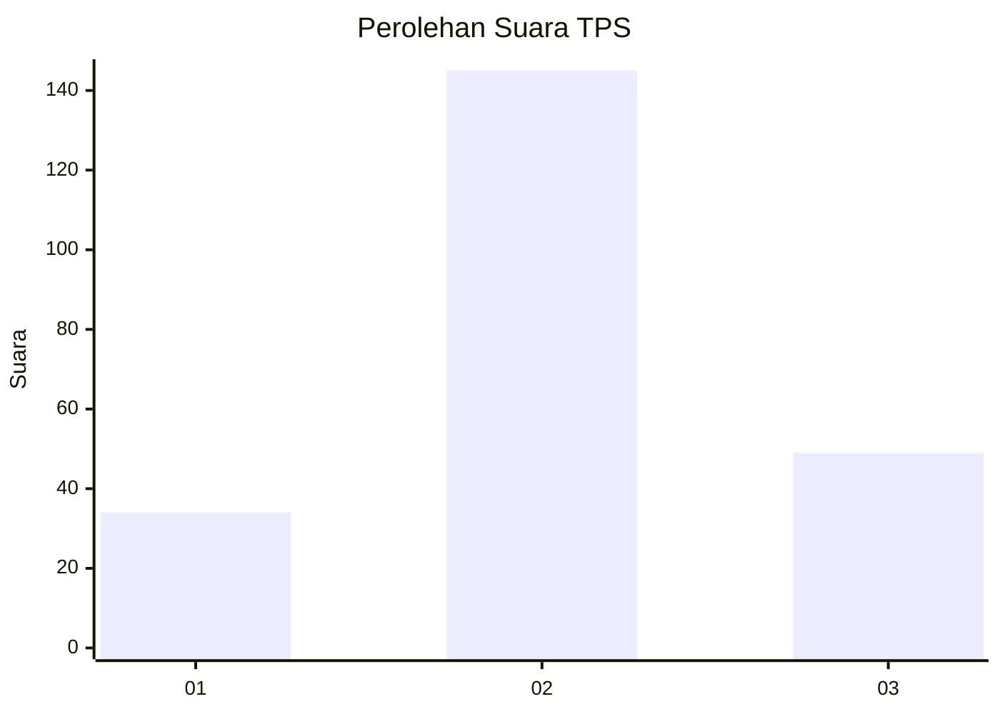
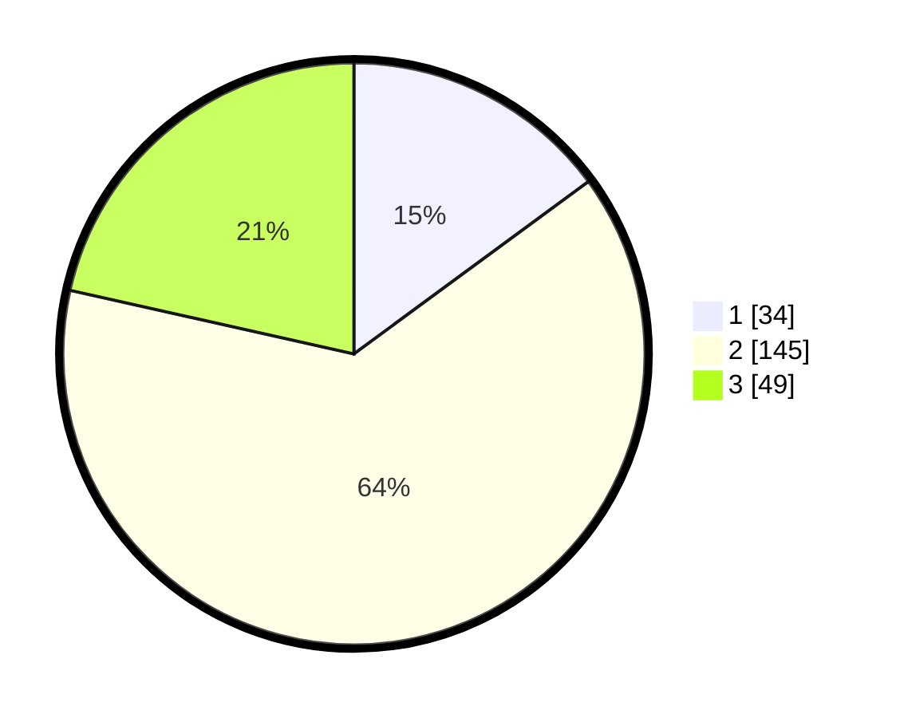

# Hasil

## Grafik

## Tabel

| No. | Nama Paslon    | Suara | Suara (raw) | Persentase |
|:--- |:-------------- | -----:| -----------:| ----------:|
| 1   | ANIES MUHAIMIN | 34    | [34][p-1]   | 14,91      |
| 2   | PRABOWO GIBRAN | 145   | [145][p-2]  | 63,60      |
| 3   | GANJAR MAHFUD  | 49    | [49][p-3]   | 21,49      |

[p-1]: https://github.com/gigit-pemilu/pemilu-2024-34-di-yogyakarta/blob/main/pilpres/hitung-suara/sub/34-di-yogyakarta/sub/02-bantul/sub/06-pandak/sub/2003-gilangharjo/sub/016-tps/sub/paslon-1.txt
[p-2]: https://github.com/gigit-pemilu/pemilu-2024-34-di-yogyakarta/blob/main/pilpres/hitung-suara/sub/34-di-yogyakarta/sub/02-bantul/sub/06-pandak/sub/2003-gilangharjo/sub/016-tps/sub/paslon-2.txt
[p-3]: https://github.com/gigit-pemilu/pemilu-2024-34-di-yogyakarta/blob/main/pilpres/hitung-suara/sub/34-di-yogyakarta/sub/02-bantul/sub/06-pandak/sub/2003-gilangharjo/sub/016-tps/sub/paslon-3.txt

## Foto C Plano

https://sirekap-obj-formc.kpu.go.id/70c4/pemilu/ppwp/34/02/06/20/03/3402062003016-20240218-101935--fdd516e9-b6b3-4543-b6ad-7adeaf03f5e6.jpg

https://sirekap-obj-formc.kpu.go.id/70c4/pemilu/ppwp/34/02/06/20/03/3402062003016-20240218-102027--66c2e2f0-c0c6-404c-a9f7-16a8a2defbf4.jpg

https://sirekap-obj-formc.kpu.go.id/70c4/pemilu/ppwp/34/02/06/20/03/3402062003016-20240218-102125--2610766b-0dcb-46a0-aea6-0a3394af62b2.jpg

## Metadata

| Key        | Value               |
| ---------- | ------------------- |
| Time Stamp | 2024-02-24 22:31:28 |

