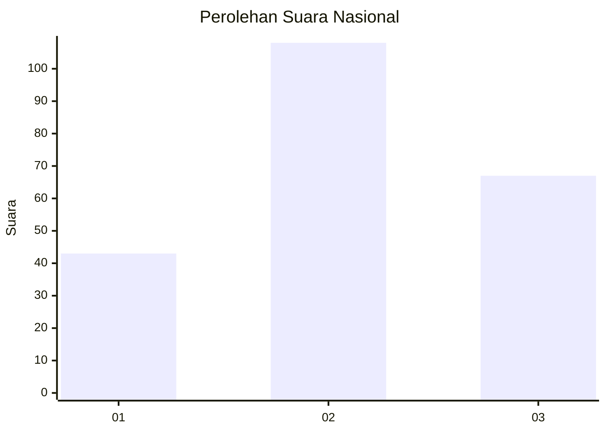
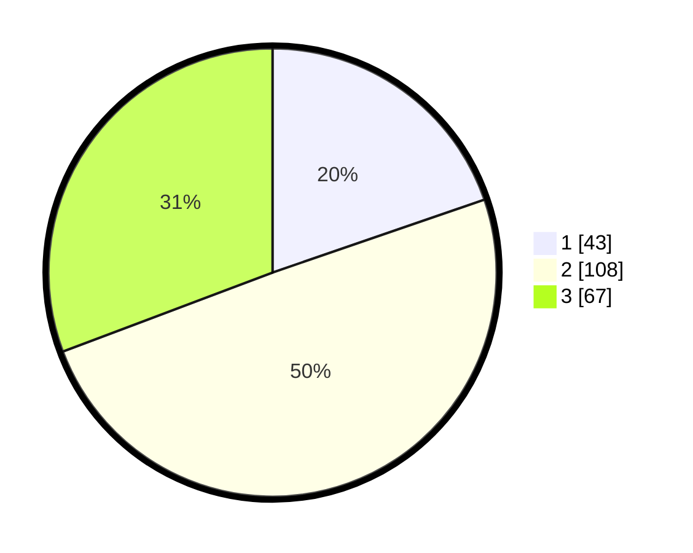

# Hasil

## Grafik

## Tabel

| No. | Nama Paslon    | Suara | Suara (raw) | Persentase |
|:--- |:-------------- | -----:| -----------:| ----------:|
| 1   | ANIES MUHAIMIN | 43    | [43][p-1]   | 19,72      |
| 2   | PRABOWO GIBRAN | 108   | [108][p-2]  | 49,54      |
| 3   | GANJAR MAHFUD  | 67    | [67][p-3]   | 30,73      |

[p-1]: https://github.com/gigit-pemilu/pemilu-2024/blob/main/pilpres/hitung-suara/sub/34-di-yogyakarta/sub/02-bantul/sub/06-pandak/sub/2003-gilangharjo/sub/017-tps/sub/paslon-1.txt
[p-2]: https://github.com/gigit-pemilu/pemilu-2024/blob/main/pilpres/hitung-suara/sub/34-di-yogyakarta/sub/02-bantul/sub/06-pandak/sub/2003-gilangharjo/sub/017-tps/sub/paslon-2.txt
[p-3]: https://github.com/gigit-pemilu/pemilu-2024/blob/main/pilpres/hitung-suara/sub/34-di-yogyakarta/sub/02-bantul/sub/06-pandak/sub/2003-gilangharjo/sub/017-tps/sub/paslon-3.txt

## Foto C Plano

https://sirekap-obj-formc.kpu.go.id/6aa5/pemilu/ppwp/34/02/06/20/03/3402062003017-20240218-123446--a8bbb46b-f7af-4483-91db-9e5a817a42b6.jpg

https://sirekap-obj-formc.kpu.go.id/6aa5/pemilu/ppwp/34/02/06/20/03/3402062003017-20240218-123811--5b0a7514-b2aa-425e-9270-c790440f99a0.jpg

https://sirekap-obj-formc.kpu.go.id/6aa5/pemilu/ppwp/34/02/06/20/03/3402062003017-20240218-113154--05f51a99-8c97-4681-8ff8-00d9bec5a5cd.jpg

## Metadata

| Key        | Value               |
| ---------- | ------------------- |
| Time Stamp | 2024-02-24 22:31:28 |

