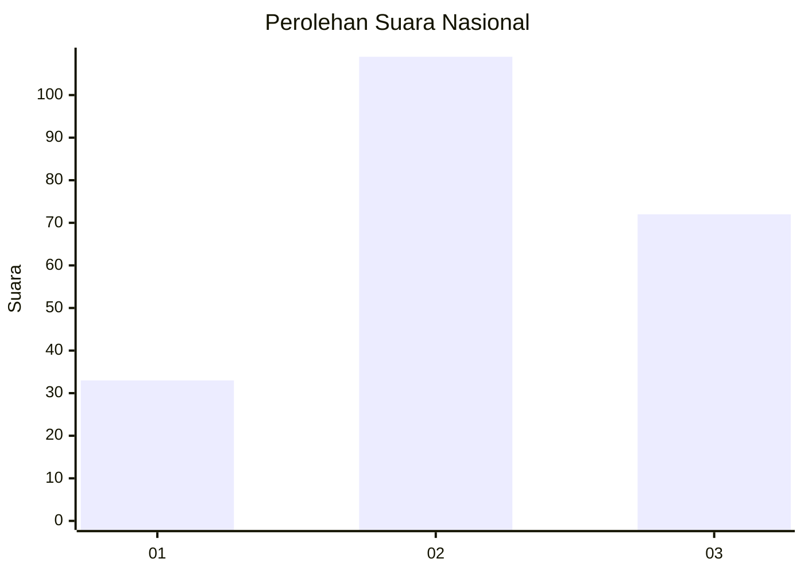
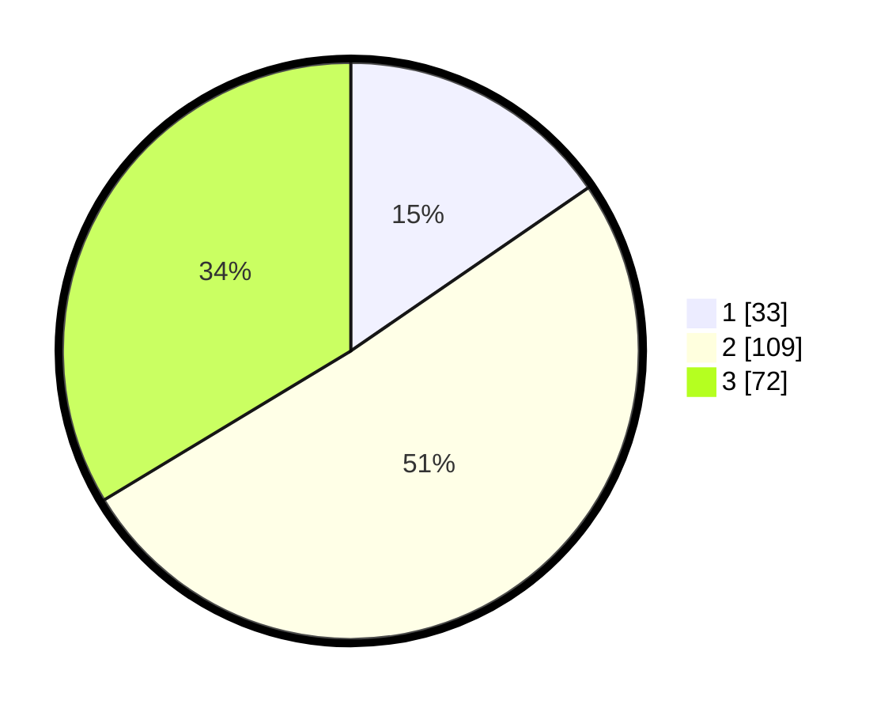

# Hasil

## Grafik

## Tabel

| No. | Nama Paslon    | Suara | Suara (raw) | Persentase |
|:--- |:-------------- | -----:| -----------:| ----------:|
| 1   | ANIES MUHAIMIN | 33    | [33][p-1]   | 15,42      |
| 2   | PRABOWO GIBRAN | 109   | [109][p-2]  | 50,93      |
| 3   | GANJAR MAHFUD  | 72    | [72][p-3]   | 33,64      |

[p-1]: https://github.com/gigit-pemilu/pemilu-2024/blob/main/pilpres/hitung-suara/sub/34-di-yogyakarta/sub/02-bantul/sub/06-pandak/sub/2003-gilangharjo/sub/018-tps/sub/paslon-1.txt
[p-2]: https://github.com/gigit-pemilu/pemilu-2024/blob/main/pilpres/hitung-suara/sub/34-di-yogyakarta/sub/02-bantul/sub/06-pandak/sub/2003-gilangharjo/sub/018-tps/sub/paslon-2.txt
[p-3]: https://github.com/gigit-pemilu/pemilu-2024/blob/main/pilpres/hitung-suara/sub/34-di-yogyakarta/sub/02-bantul/sub/06-pandak/sub/2003-gilangharjo/sub/018-tps/sub/paslon-3.txt

## Foto C Plano

https://sirekap-obj-formc.kpu.go.id/2ad6/pemilu/ppwp/34/02/06/20/03/3402062003018-20240214-204250--4c131b39-425b-4321-bc4e-610d428d8f66.jpg

https://sirekap-obj-formc.kpu.go.id/2ad6/pemilu/ppwp/34/02/06/20/03/3402062003018-20240214-204309--cc6887be-4807-44d0-af77-2b5bb2061400.jpg

https://sirekap-obj-formc.kpu.go.id/2ad6/pemilu/ppwp/34/02/06/20/03/3402062003018-20240214-204319--c3656eca-7ffa-490f-8b4f-0822f5c30a5e.jpg

## Metadata

| Key        | Value               |
| ---------- | ------------------- |
| Time Stamp | 2024-02-25 00:00:00 |

