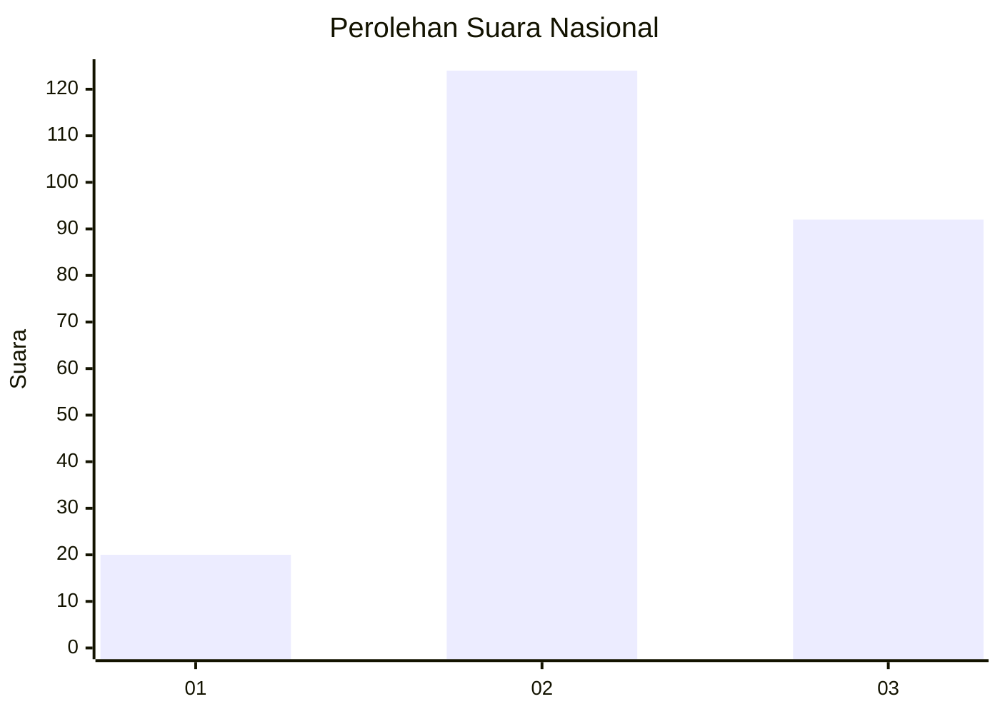
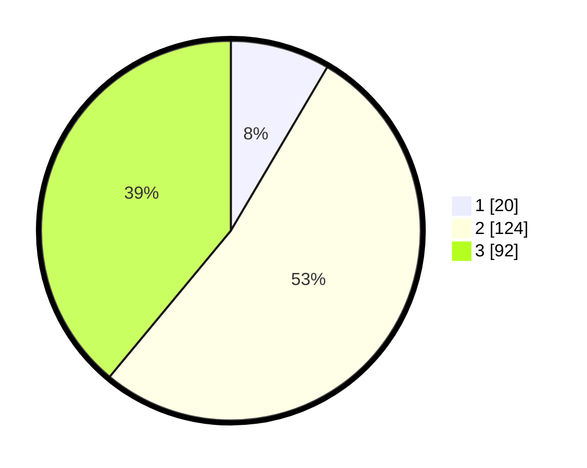

# Hasil

## Grafik

## Tabel

| No. | Nama Paslon    | Suara | Suara (raw) | Persentase |
|:--- |:-------------- | -----:| -----------:| ----------:|
| 1   | ANIES MUHAIMIN | 20    | [20][p-1]   | 8,47       |
| 2   | PRABOWO GIBRAN | 124   | [124][p-2]  | 52,54      |
| 3   | GANJAR MAHFUD  | 92    | [92][p-3]   | 38,98      |

[p-1]: https://github.com/gigit-pemilu/pemilu-2024/blob/main/pilpres/hitung-suara/sub/34-di-yogyakarta/sub/02-bantul/sub/06-pandak/sub/2003-gilangharjo/sub/020-tps/sub/paslon-1.txt
[p-2]: https://github.com/gigit-pemilu/pemilu-2024/blob/main/pilpres/hitung-suara/sub/34-di-yogyakarta/sub/02-bantul/sub/06-pandak/sub/2003-gilangharjo/sub/020-tps/sub/paslon-2.txt
[p-3]: https://github.com/gigit-pemilu/pemilu-2024/blob/main/pilpres/hitung-suara/sub/34-di-yogyakarta/sub/02-bantul/sub/06-pandak/sub/2003-gilangharjo/sub/020-tps/sub/paslon-3.txt

## Foto C Plano

https://sirekap-obj-formc.kpu.go.id/909c/pemilu/ppwp/34/02/06/20/03/3402062003020-20240218-144143--11353f63-2d9c-4bf9-bbec-c526c06a8205.jpg

https://sirekap-obj-formc.kpu.go.id/909c/pemilu/ppwp/34/02/06/20/03/3402062003020-20240218-144226--be35f782-0636-4131-bedd-19c408b3fca1.jpg

https://sirekap-obj-formc.kpu.go.id/909c/pemilu/ppwp/34/02/06/20/03/3402062003020-20240218-144348--029948f5-c5ef-4817-8dc2-2b35bf65ec67.jpg

## Metadata

| Key        | Value               |
| ---------- | ------------------- |
| Time Stamp | 2024-02-25 16:00:00 |

