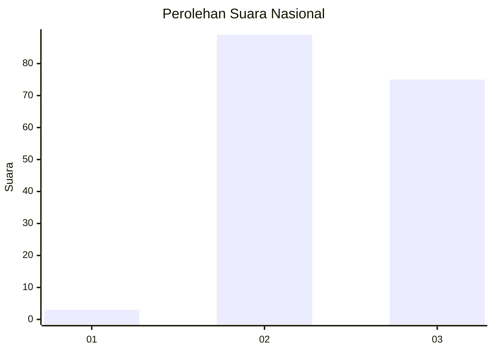
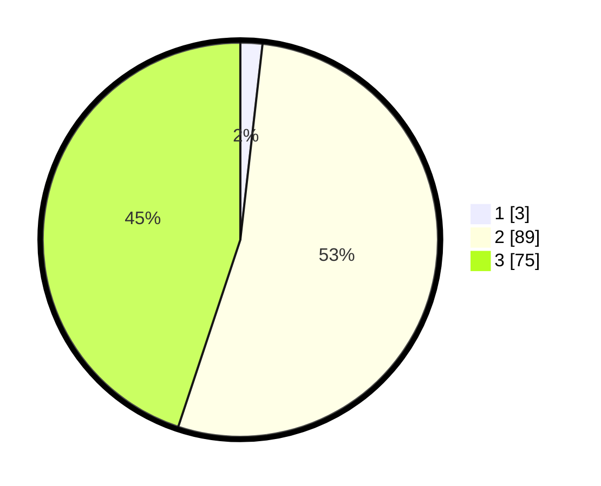

# Hasil

## Grafik

## Tabel

| No. | Nama Paslon    | Suara | Suara (raw) | Persentase |
|:--- |:-------------- | -----:| -----------:| ----------:|
| 1   | ANIES MUHAIMIN | 3     | [3][p-1]    | 1,80       |
| 2   | PRABOWO GIBRAN | 89    | [89][p-2]   | 53,29      |
| 3   | GANJAR MAHFUD  | 75    | [75][p-3]   | 44,91      |

[p-1]: https://github.com/gigit-pemilu/pemilu-2024/blob/main/pilpres/hitung-suara/sub/34-di-yogyakarta/sub/02-bantul/sub/06-pandak/sub/2003-gilangharjo/sub/022-tps/sub/paslon-1.txt
[p-2]: https://github.com/gigit-pemilu/pemilu-2024/blob/main/pilpres/hitung-suara/sub/34-di-yogyakarta/sub/02-bantul/sub/06-pandak/sub/2003-gilangharjo/sub/022-tps/sub/paslon-2.txt
[p-3]: https://github.com/gigit-pemilu/pemilu-2024/blob/main/pilpres/hitung-suara/sub/34-di-yogyakarta/sub/02-bantul/sub/06-pandak/sub/2003-gilangharjo/sub/022-tps/sub/paslon-3.txt

## Foto C Plano

https://sirekap-obj-formc.kpu.go.id/cd94/pemilu/ppwp/34/02/06/20/03/3402062003022-20240221-194911--6ca49b4f-2489-4dd0-be6f-d36e5b8fc909.jpg

https://sirekap-obj-formc.kpu.go.id/cd94/pemilu/ppwp/34/02/06/20/03/3402062003022-20240221-194939--2ffa43e8-2ef3-4d76-b9ff-72960f2d9830.jpg

https://sirekap-obj-formc.kpu.go.id/cd94/pemilu/ppwp/34/02/06/20/03/3402062003022-20240221-195009--0d526eec-16cf-4afb-9a7f-d6ffb3b76ea7.jpg

## Metadata

| Key        | Value               |
| ---------- | ------------------- |
| Time Stamp | 2024-02-24 22:31:28 |

