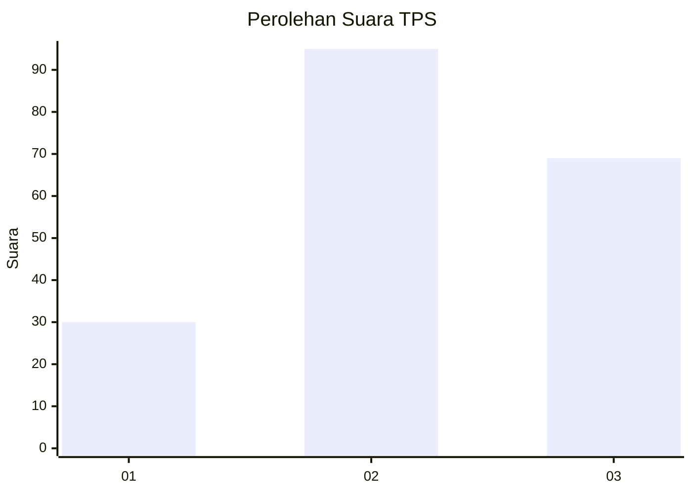
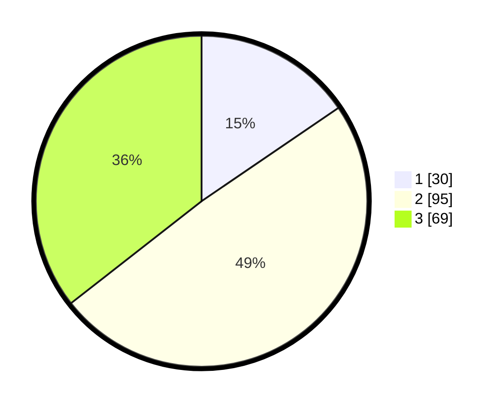

# Hasil

## Grafik

## Tabel

| No. | Nama Paslon    | Suara | Suara (raw) | Persentase |
|:--- |:-------------- | -----:| -----------:| ----------:|
| 1   | ANIES MUHAIMIN | 30    | [30][p-1]   | 15,46      |
| 2   | PRABOWO GIBRAN | 95    | [95][p-2]   | 48,97      |
| 3   | GANJAR MAHFUD  | 69    | [69][p-3]   | 35,57      |

[p-1]: https://github.com/gigit-pemilu/pemilu-2024-34-di-yogyakarta/blob/main/pilpres/hitung-suara/sub/34-di-yogyakarta/sub/02-bantul/sub/06-pandak/sub/2003-gilangharjo/sub/023-tps/sub/paslon-1.txt
[p-2]: https://github.com/gigit-pemilu/pemilu-2024-34-di-yogyakarta/blob/main/pilpres/hitung-suara/sub/34-di-yogyakarta/sub/02-bantul/sub/06-pandak/sub/2003-gilangharjo/sub/023-tps/sub/paslon-2.txt
[p-3]: https://github.com/gigit-pemilu/pemilu-2024-34-di-yogyakarta/blob/main/pilpres/hitung-suara/sub/34-di-yogyakarta/sub/02-bantul/sub/06-pandak/sub/2003-gilangharjo/sub/023-tps/sub/paslon-3.txt

## Foto C Plano

https://sirekap-obj-formc.kpu.go.id/95a7/pemilu/ppwp/34/02/06/20/03/3402062003023-20240214-200857--006b4904-761e-43d2-a312-5396371de13b.jpg

https://sirekap-obj-formc.kpu.go.id/95a7/pemilu/ppwp/34/02/06/20/03/3402062003023-20240214-201128--30aa023b-f4e9-4ae4-8b40-de8122161a87.jpg

https://sirekap-obj-formc.kpu.go.id/95a7/pemilu/ppwp/34/02/06/20/03/3402062003023-20240214-201145--6c15f34c-4264-4a47-b6e8-492e0ac33ce2.jpg

## Metadata

| Key        | Value               |
| ---------- | ------------------- |
| Time Stamp | 2024-02-24 22:31:28 |

