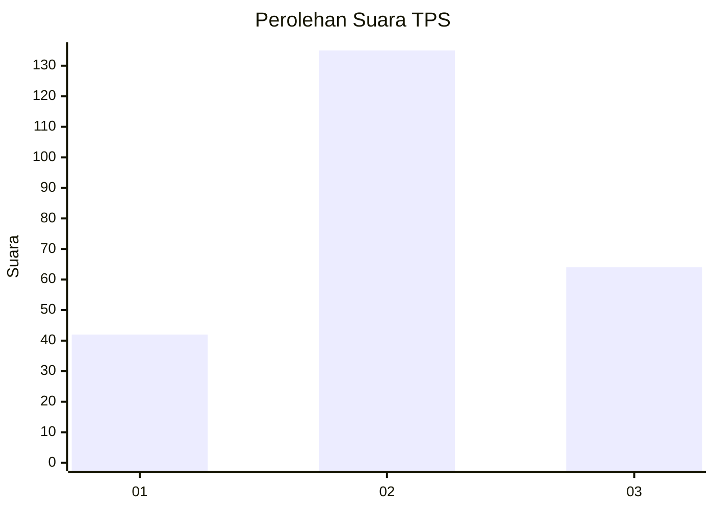
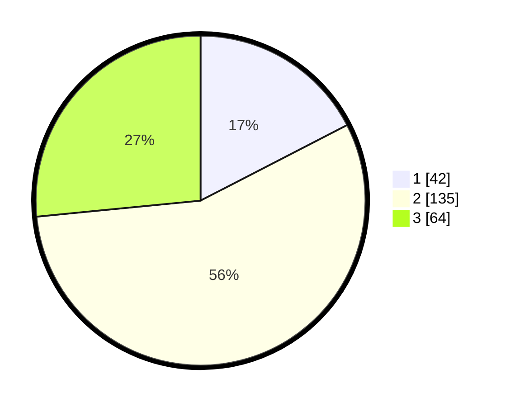

# Hasil

## Grafik

## Tabel

| No. | Nama Paslon    | Suara | Suara (raw) | Persentase |
|:--- |:-------------- | -----:| -----------:| ----------:|
| 1   | ANIES MUHAIMIN | 42    | [42][p-1]   | 17,43      |
| 2   | PRABOWO GIBRAN | 135   | [135][p-2]  | 56,02      |
| 3   | GANJAR MAHFUD  | 64    | [64][p-3]   | 26,56      |

[p-1]: https://github.com/gigit-pemilu/pemilu-2024-34-di-yogyakarta/blob/main/pilpres/hitung-suara/sub/34-di-yogyakarta/sub/02-bantul/sub/06-pandak/sub/2003-gilangharjo/sub/024-tps/sub/paslon-1.txt
[p-2]: https://github.com/gigit-pemilu/pemilu-2024-34-di-yogyakarta/blob/main/pilpres/hitung-suara/sub/34-di-yogyakarta/sub/02-bantul/sub/06-pandak/sub/2003-gilangharjo/sub/024-tps/sub/paslon-2.txt
[p-3]: https://github.com/gigit-pemilu/pemilu-2024-34-di-yogyakarta/blob/main/pilpres/hitung-suara/sub/34-di-yogyakarta/sub/02-bantul/sub/06-pandak/sub/2003-gilangharjo/sub/024-tps/sub/paslon-3.txt

## Foto C Plano

https://sirekap-obj-formc.kpu.go.id/7fb3/pemilu/ppwp/34/02/06/20/03/3402062003024-20240215-024755--674a3e4d-963e-4d5e-9a01-c584a8b26da2.jpg

https://sirekap-obj-formc.kpu.go.id/7fb3/pemilu/ppwp/34/02/06/20/03/3402062003024-20240214-155928--a126e5fc-4b35-4014-a530-e506a85dc2c4.jpg

https://sirekap-obj-formc.kpu.go.id/7fb3/pemilu/ppwp/34/02/06/20/03/3402062003024-20240214-160131--98edbdb9-a623-499a-92e5-f2a9276b7fda.jpg

## Metadata

| Key        | Value               |
| ---------- | ------------------- |
| Time Stamp | 2024-02-24 22:31:28 |

