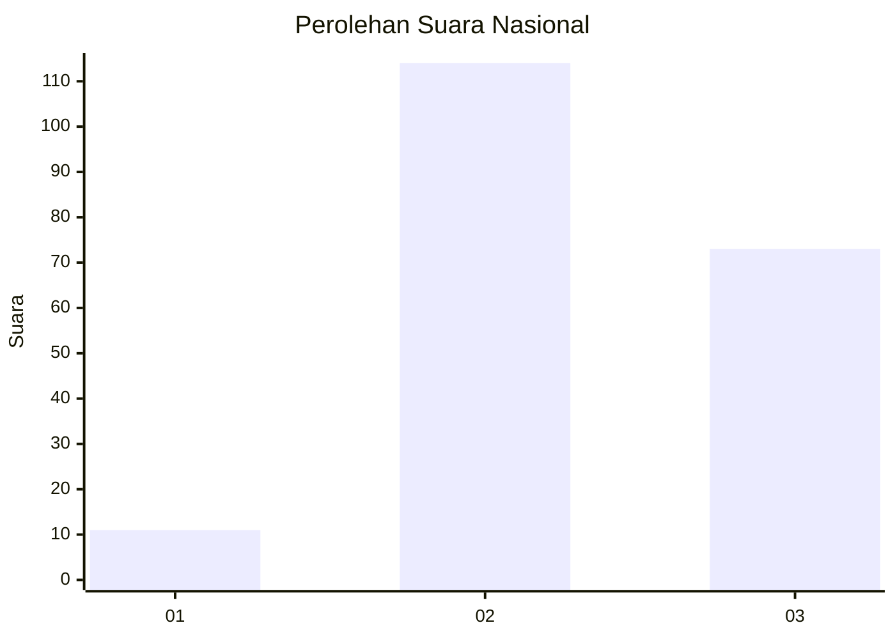
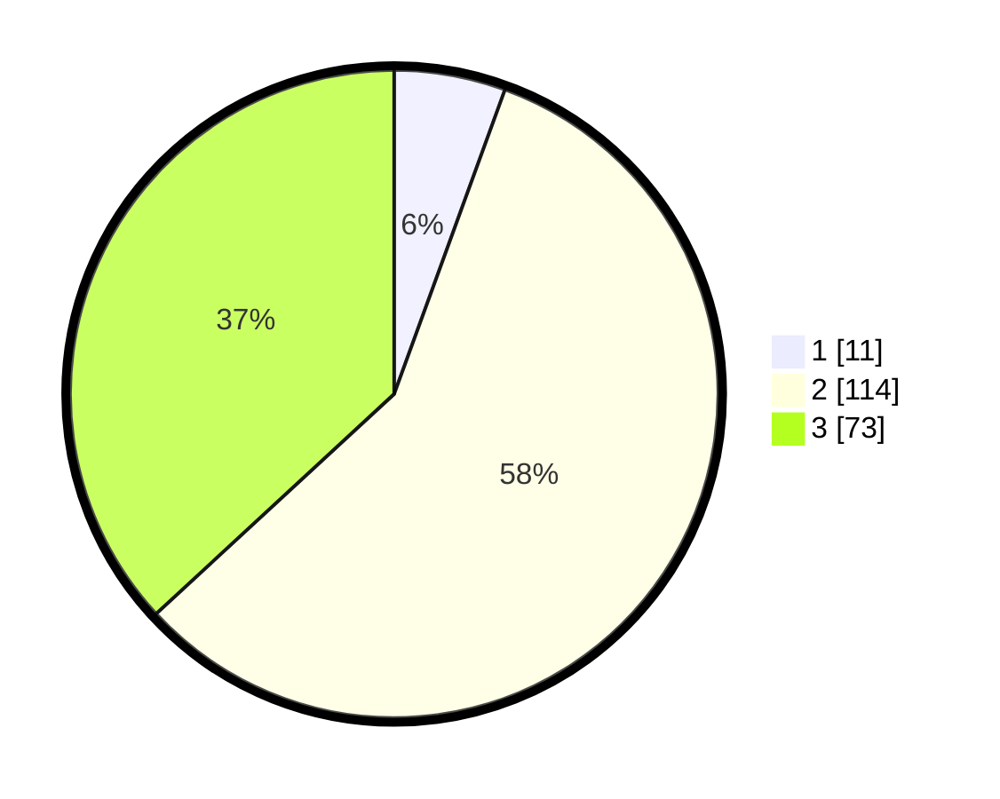

# Hasil

## Grafik

## Tabel

| No. | Nama Paslon    | Suara | Suara (raw) | Persentase |
|:--- |:-------------- | -----:| -----------:| ----------:|
| 1   | ANIES MUHAIMIN | 11    | [11][p-1]   | 5,56       |
| 2   | PRABOWO GIBRAN | 114   | [114][p-2]  | 57,58      |
| 3   | GANJAR MAHFUD  | 73    | [73][p-3]   | 36,87      |

[p-1]: https://github.com/gigit-pemilu/pemilu-2024/blob/main/pilpres/hitung-suara/sub/34-di-yogyakarta/sub/02-bantul/sub/06-pandak/sub/2003-gilangharjo/sub/026-tps/sub/paslon-1.txt
[p-2]: https://github.com/gigit-pemilu/pemilu-2024/blob/main/pilpres/hitung-suara/sub/34-di-yogyakarta/sub/02-bantul/sub/06-pandak/sub/2003-gilangharjo/sub/026-tps/sub/paslon-2.txt
[p-3]: https://github.com/gigit-pemilu/pemilu-2024/blob/main/pilpres/hitung-suara/sub/34-di-yogyakarta/sub/02-bantul/sub/06-pandak/sub/2003-gilangharjo/sub/026-tps/sub/paslon-3.txt

## Foto C Plano

https://sirekap-obj-formc.kpu.go.id/380a/pemilu/ppwp/34/02/06/20/03/3402062003026-20240221-195259--125df927-63a1-4d53-9158-37a5af01395e.jpg

https://sirekap-obj-formc.kpu.go.id/380a/pemilu/ppwp/34/02/06/20/03/3402062003026-20240221-195326--b46af7b2-a04d-4759-839f-937743068467.jpg

https://sirekap-obj-formc.kpu.go.id/380a/pemilu/ppwp/34/02/06/20/03/3402062003026-20240221-195404--e11064bf-ebc1-4cc6-948a-c2ea15a5e841.jpg

## Metadata

| Key        | Value               |
| ---------- | ------------------- |
| Time Stamp | 2024-02-25 18:00:00 |

