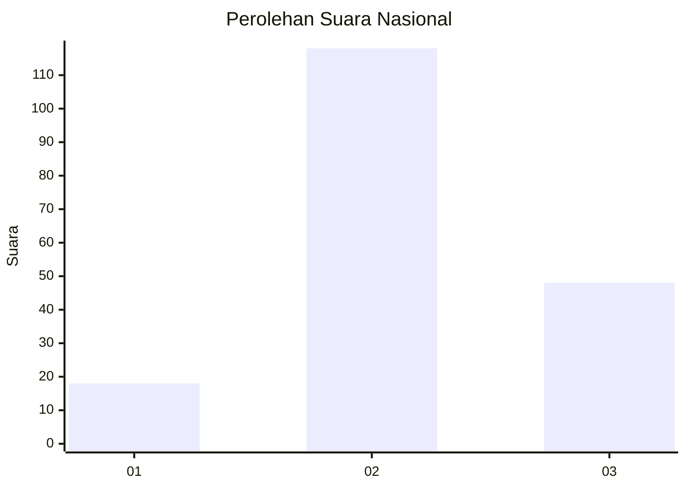
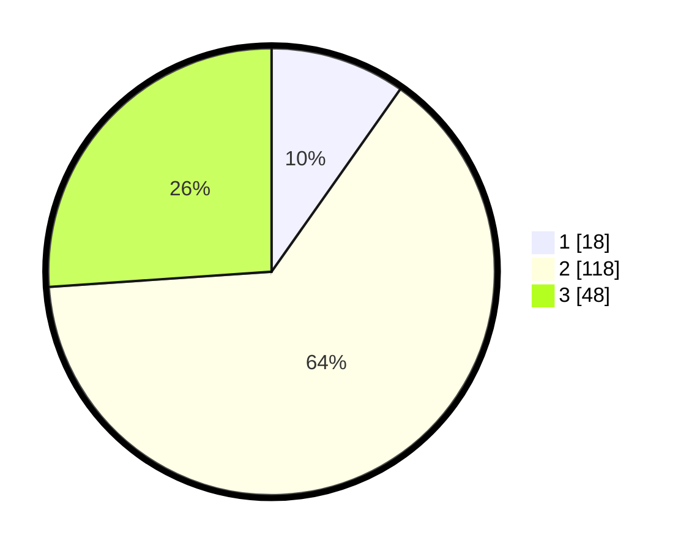

# Hasil

## Grafik

## Tabel

| No. | Nama Paslon    | Suara | Suara (raw) | Persentase |
|:--- |:-------------- | -----:| -----------:| ----------:|
| 1   | ANIES MUHAIMIN | 18    | [18][p-1]   | 9,78       |
| 2   | PRABOWO GIBRAN | 118   | [118][p-2]  | 64,13      |
| 3   | GANJAR MAHFUD  | 48    | [48][p-3]   | 26,09      |

[p-1]: https://github.com/gigit-pemilu/pemilu-2024/blob/main/pilpres/hitung-suara/sub/34-di-yogyakarta/sub/02-bantul/sub/06-pandak/sub/2003-gilangharjo/sub/027-tps/sub/paslon-1.txt
[p-2]: https://github.com/gigit-pemilu/pemilu-2024/blob/main/pilpres/hitung-suara/sub/34-di-yogyakarta/sub/02-bantul/sub/06-pandak/sub/2003-gilangharjo/sub/027-tps/sub/paslon-2.txt
[p-3]: https://github.com/gigit-pemilu/pemilu-2024/blob/main/pilpres/hitung-suara/sub/34-di-yogyakarta/sub/02-bantul/sub/06-pandak/sub/2003-gilangharjo/sub/027-tps/sub/paslon-3.txt

## Foto C Plano

https://sirekap-obj-formc.kpu.go.id/2b55/pemilu/ppwp/34/02/06/20/03/3402062003027-20240215-022748--f58b1bbb-72f9-4fdd-9434-a34c568badd5.jpg

https://sirekap-obj-formc.kpu.go.id/2b55/pemilu/ppwp/34/02/06/20/03/3402062003027-20240215-021913--92340cb1-8078-4946-b280-9c6a4c9c5862.jpg

https://sirekap-obj-formc.kpu.go.id/2b55/pemilu/ppwp/34/02/06/20/03/3402062003027-20240215-022518--dbdb0411-45c7-48e8-b5f2-91071d26591a.jpg

## Metadata

| Key        | Value               |
| ---------- | ------------------- |
| Time Stamp | 2024-02-24 22:31:28 |

