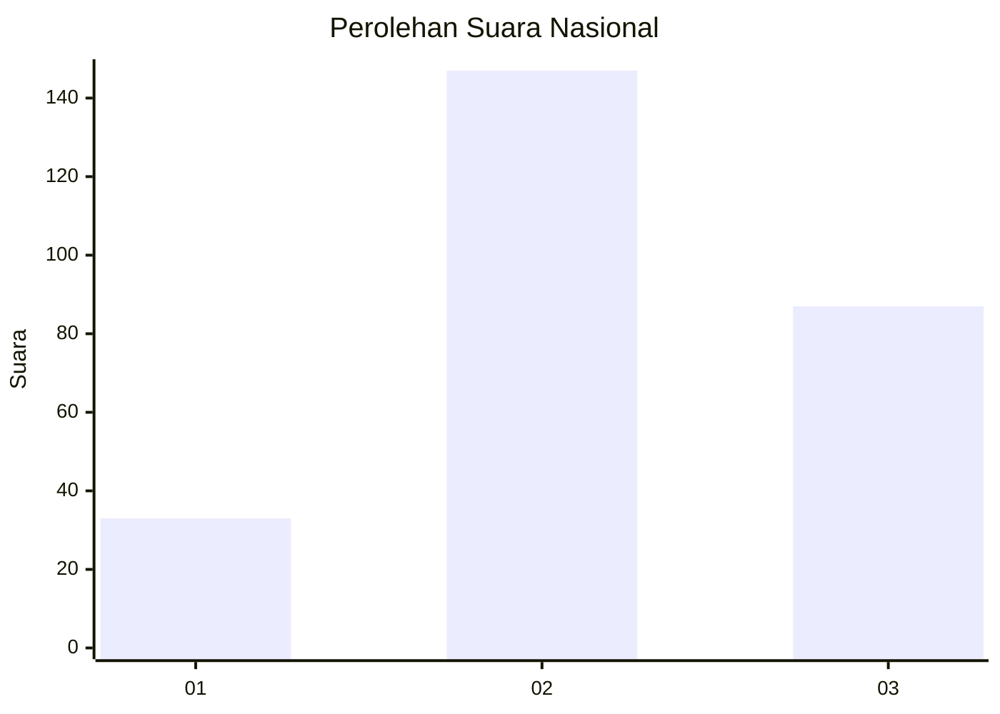
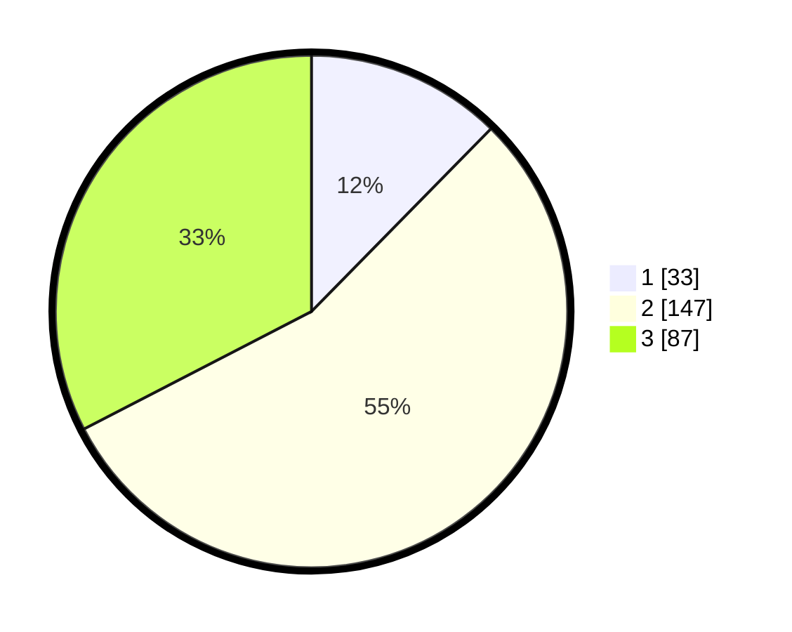

# Hasil

## Grafik

## Tabel

| No. | Nama Paslon    | Suara | Suara (raw) | Persentase |
|:--- |:-------------- | -----:| -----------:| ----------:|
| 1   | ANIES MUHAIMIN | 33    | [33][p-1]   | 12,36      |
| 2   | PRABOWO GIBRAN | 147   | [147][p-2]  | 55,06      |
| 3   | GANJAR MAHFUD  | 87    | [87][p-3]   | 32,58      |

[p-1]: https://github.com/gigit-pemilu/pemilu-2024/blob/main/pilpres/hitung-suara/sub/34-di-yogyakarta/sub/02-bantul/sub/06-pandak/sub/2003-gilangharjo/sub/029-tps/sub/paslon-1.txt
[p-2]: https://github.com/gigit-pemilu/pemilu-2024/blob/main/pilpres/hitung-suara/sub/34-di-yogyakarta/sub/02-bantul/sub/06-pandak/sub/2003-gilangharjo/sub/029-tps/sub/paslon-2.txt
[p-3]: https://github.com/gigit-pemilu/pemilu-2024/blob/main/pilpres/hitung-suara/sub/34-di-yogyakarta/sub/02-bantul/sub/06-pandak/sub/2003-gilangharjo/sub/029-tps/sub/paslon-3.txt

## Foto C Plano

https://sirekap-obj-formc.kpu.go.id/3b0f/pemilu/ppwp/34/02/06/20/03/3402062003029-20240215-002923--d2f24915-b912-4e2a-8b11-2765913c2b72.jpg

https://sirekap-obj-formc.kpu.go.id/3b0f/pemilu/ppwp/34/02/06/20/03/3402062003029-20240215-003105--2d342b7a-b781-4cd2-a6b2-be765c01898a.jpg

https://sirekap-obj-formc.kpu.go.id/3b0f/pemilu/ppwp/34/02/06/20/03/3402062003029-20240215-003213--dcb20acd-ba5a-494a-90e5-252d7808936b.jpg

## Metadata

| Key        | Value               |
| ---------- | ------------------- |
| Time Stamp | 2024-02-24 22:31:28 |

