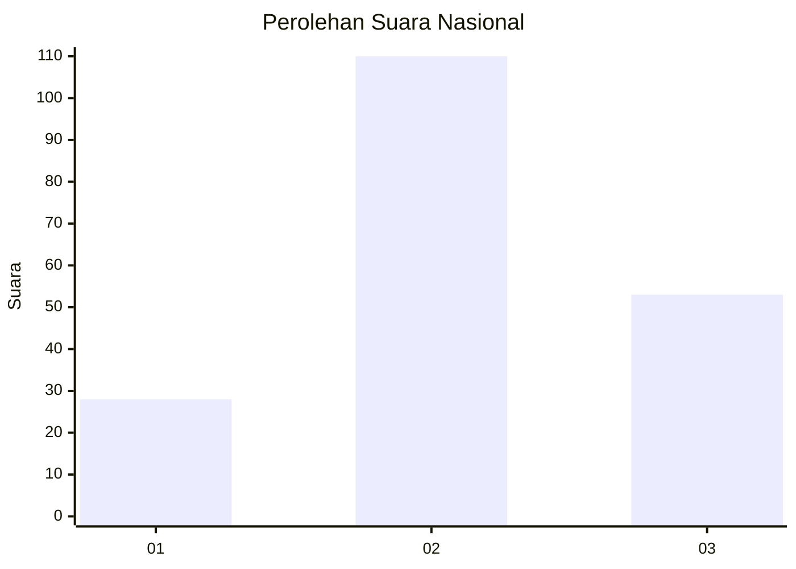
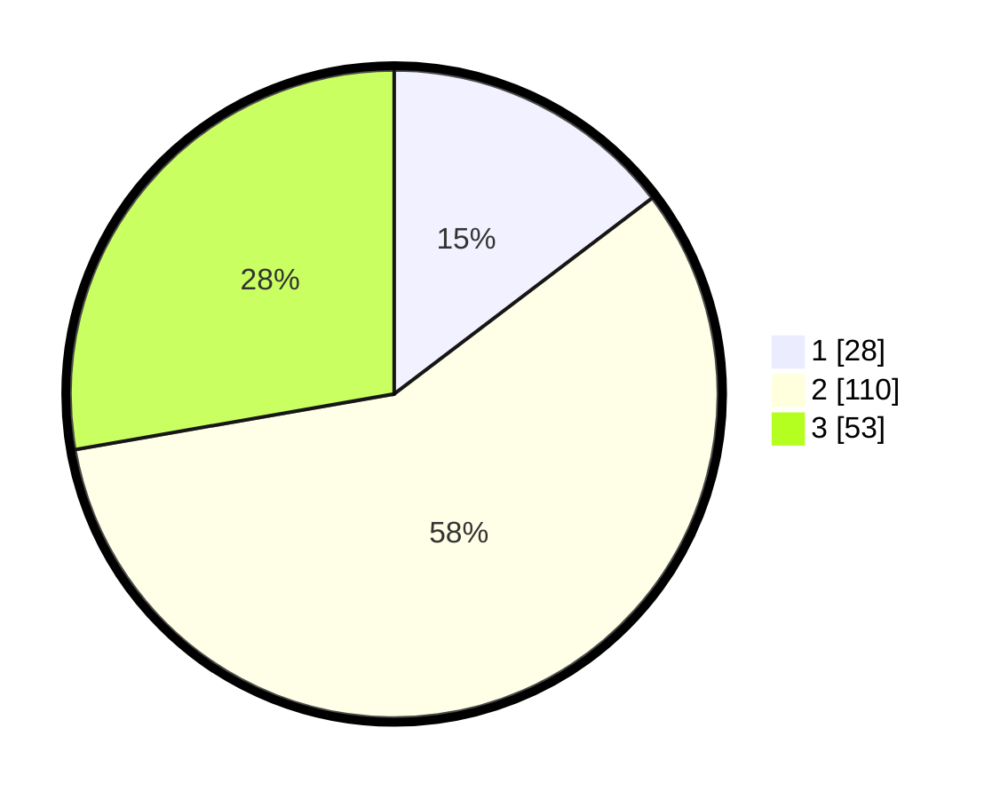

# Hasil

## Grafik

## Tabel

| No. | Nama Paslon    | Suara | Suara (raw) | Persentase |
|:--- |:-------------- | -----:| -----------:| ----------:|
| 1   | ANIES MUHAIMIN | 28    | [28][p-1]   | 14,66      |
| 2   | PRABOWO GIBRAN | 110   | [110][p-2]  | 57,59      |
| 3   | GANJAR MAHFUD  | 53    | [53][p-3]   | 27,75      |

[p-1]: https://github.com/gigit-pemilu/pemilu-2024/blob/main/pilpres/hitung-suara/sub/34-di-yogyakarta/sub/02-bantul/sub/06-pandak/sub/2003-gilangharjo/sub/030-tps/sub/paslon-1.txt
[p-2]: https://github.com/gigit-pemilu/pemilu-2024/blob/main/pilpres/hitung-suara/sub/34-di-yogyakarta/sub/02-bantul/sub/06-pandak/sub/2003-gilangharjo/sub/030-tps/sub/paslon-2.txt
[p-3]: https://github.com/gigit-pemilu/pemilu-2024/blob/main/pilpres/hitung-suara/sub/34-di-yogyakarta/sub/02-bantul/sub/06-pandak/sub/2003-gilangharjo/sub/030-tps/sub/paslon-3.txt

## Foto C Plano

https://sirekap-obj-formc.kpu.go.id/26c1/pemilu/ppwp/34/02/06/20/03/3402062003030-20240219-095732--3b11dd94-32bb-4bcb-ae7a-fe97568d814e.jpg

https://sirekap-obj-formc.kpu.go.id/26c1/pemilu/ppwp/34/02/06/20/03/3402062003030-20240219-095834--a85dde39-b7dd-4607-91c0-40a7738ae61c.jpg

https://sirekap-obj-formc.kpu.go.id/26c1/pemilu/ppwp/34/02/06/20/03/3402062003030-20240219-100025--78a51233-133c-466d-98c4-036cd7af53f2.jpg

## Metadata

| Key        | Value               |
| ---------- | ------------------- |
| Time Stamp | 2024-02-24 22:31:28 |

