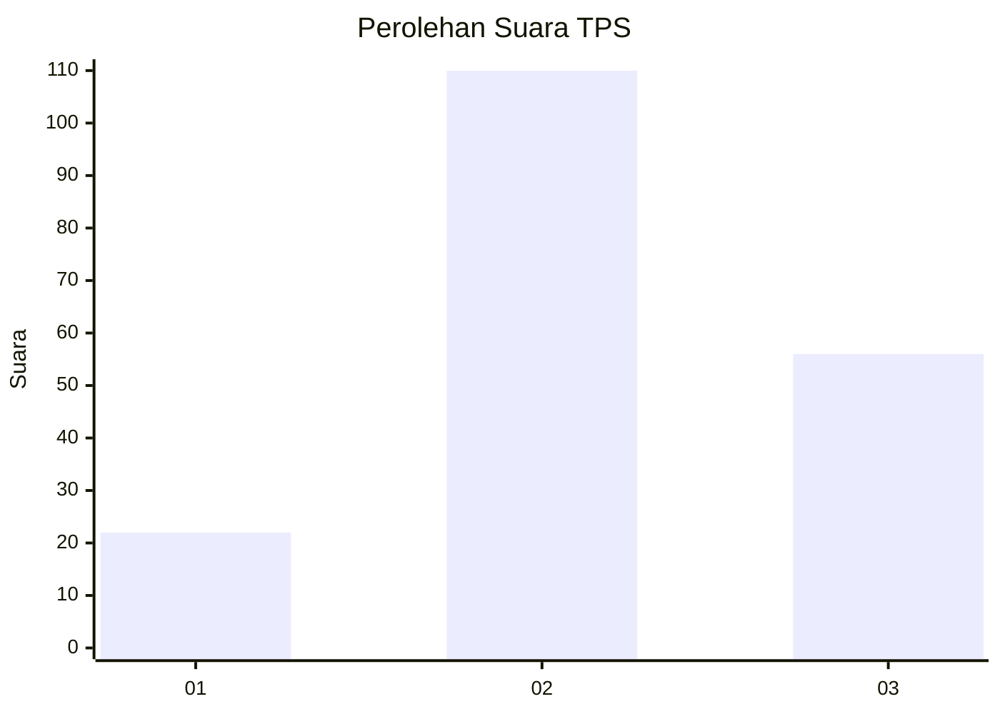
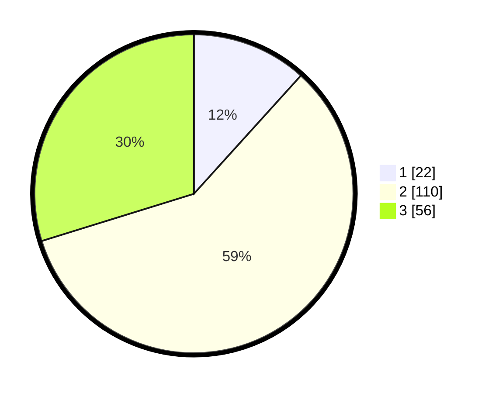

# Hasil

## Grafik

## Tabel

| No. | Nama Paslon    | Suara | Suara (raw) | Persentase |
|:--- |:-------------- | -----:| -----------:| ----------:|
| 1   | ANIES MUHAIMIN | 22    | [22][p-1]   | 11,70      |
| 2   | PRABOWO GIBRAN | 110   | [110][p-2]  | 58,51      |
| 3   | GANJAR MAHFUD  | 56    | [56][p-3]   | 29,79      |

[p-1]: https://github.com/gigit-pemilu/pemilu-2024-34-di-yogyakarta/blob/main/pilpres/hitung-suara/sub/34-di-yogyakarta/sub/02-bantul/sub/06-pandak/sub/2003-gilangharjo/sub/031-tps/sub/paslon-1.txt
[p-2]: https://github.com/gigit-pemilu/pemilu-2024-34-di-yogyakarta/blob/main/pilpres/hitung-suara/sub/34-di-yogyakarta/sub/02-bantul/sub/06-pandak/sub/2003-gilangharjo/sub/031-tps/sub/paslon-2.txt
[p-3]: https://github.com/gigit-pemilu/pemilu-2024-34-di-yogyakarta/blob/main/pilpres/hitung-suara/sub/34-di-yogyakarta/sub/02-bantul/sub/06-pandak/sub/2003-gilangharjo/sub/031-tps/sub/paslon-3.txt

## Foto C Plano

https://sirekap-obj-formc.kpu.go.id/b845/pemilu/ppwp/34/02/06/20/03/3402062003031-20240219-114455--eec2da49-2acb-4d9a-a366-32ee0d77f5b3.jpg

https://sirekap-obj-formc.kpu.go.id/b845/pemilu/ppwp/34/02/06/20/03/3402062003031-20240219-114319--7b4e2323-d724-4dfb-adc1-2d0019a7ba45.jpg

https://sirekap-obj-formc.kpu.go.id/b845/pemilu/ppwp/34/02/06/20/03/3402062003031-20240219-114549--fee4f2e4-8f11-4f0d-8b0d-5ddac33c2a9b.jpg

## Metadata

| Key        | Value               |
| ---------- | ------------------- |
| Time Stamp | 2024-02-24 22:31:28 |

