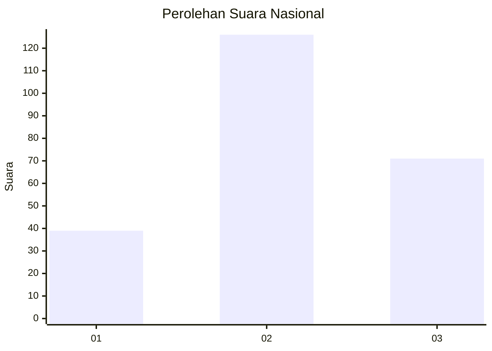
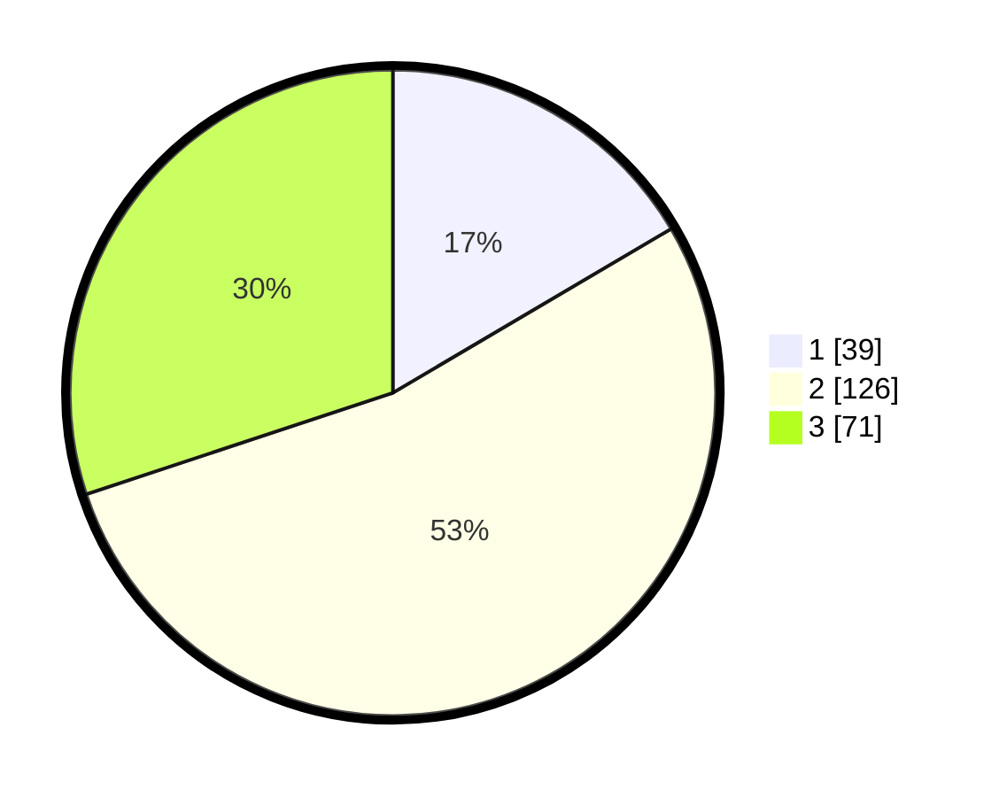

# Hasil

## Grafik

## Tabel

| No. | Nama Paslon    | Suara | Suara (raw) | Persentase |
|:--- |:-------------- | -----:| -----------:| ----------:|
| 1   | ANIES MUHAIMIN | 39    | [39][p-1]   | 16,53      |
| 2   | PRABOWO GIBRAN | 126   | [126][p-2]  | 53,39      |
| 3   | GANJAR MAHFUD  | 71    | [71][p-3]   | 30,08      |

[p-1]: https://github.com/gigit-pemilu/pemilu-2024/blob/main/pilpres/hitung-suara/sub/34-di-yogyakarta/sub/02-bantul/sub/06-pandak/sub/2003-gilangharjo/sub/032-tps/sub/paslon-1.txt
[p-2]: https://github.com/gigit-pemilu/pemilu-2024/blob/main/pilpres/hitung-suara/sub/34-di-yogyakarta/sub/02-bantul/sub/06-pandak/sub/2003-gilangharjo/sub/032-tps/sub/paslon-2.txt
[p-3]: https://github.com/gigit-pemilu/pemilu-2024/blob/main/pilpres/hitung-suara/sub/34-di-yogyakarta/sub/02-bantul/sub/06-pandak/sub/2003-gilangharjo/sub/032-tps/sub/paslon-3.txt

## Foto C Plano

https://sirekap-obj-formc.kpu.go.id/3b7d/pemilu/ppwp/34/02/06/20/03/3402062003032-20240219-124900--465366e7-2272-441b-9c23-6899adcb1834.jpg

https://sirekap-obj-formc.kpu.go.id/3b7d/pemilu/ppwp/34/02/06/20/03/3402062003032-20240219-124934--36fcd0c8-2096-4eae-8d98-ad8e883f8e75.jpg

https://sirekap-obj-formc.kpu.go.id/3b7d/pemilu/ppwp/34/02/06/20/03/3402062003032-20240219-125003--ee863654-6640-4e2d-8710-a64c5450f6f0.jpg

## Metadata

| Key        | Value               |
| ---------- | ------------------- |
| Time Stamp | 2024-02-24 22:31:28 |

