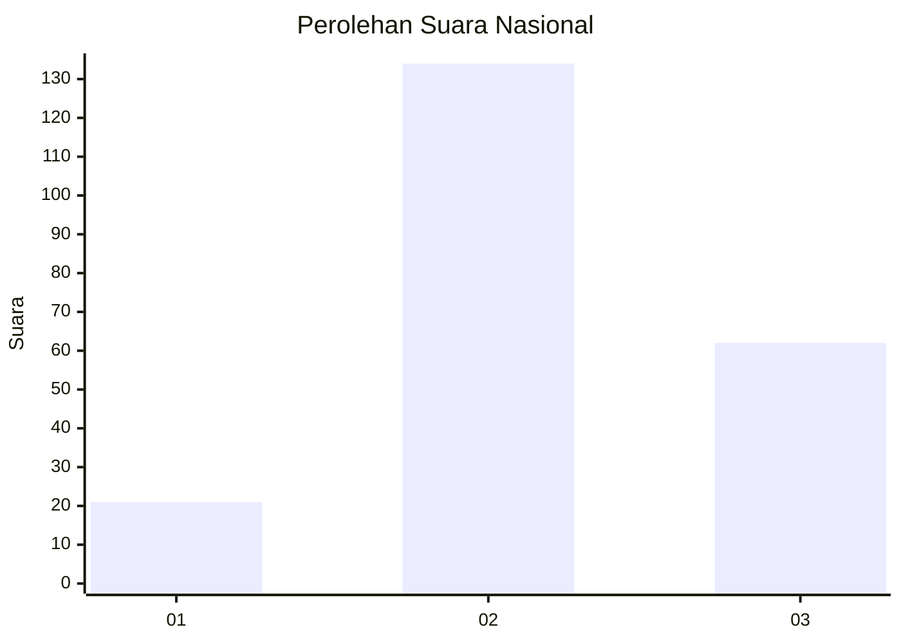
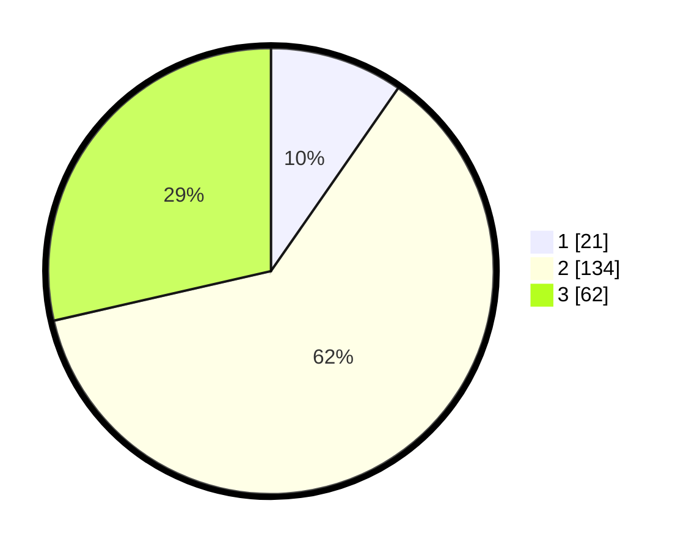

# Hasil

## Grafik

## Tabel

| No. | Nama Paslon    | Suara | Suara (raw) | Persentase |
|:--- |:-------------- | -----:| -----------:| ----------:|
| 1   | ANIES MUHAIMIN | 21    | [21][p-1]   | 9,68       |
| 2   | PRABOWO GIBRAN | 134   | [134][p-2]  | 61,75      |
| 3   | GANJAR MAHFUD  | 62    | [62][p-3]   | 28,57      |

[p-1]: https://github.com/gigit-pemilu/pemilu-2024/blob/main/pilpres/hitung-suara/sub/34-di-yogyakarta/sub/02-bantul/sub/06-pandak/sub/2003-gilangharjo/sub/033-tps/sub/paslon-1.txt
[p-2]: https://github.com/gigit-pemilu/pemilu-2024/blob/main/pilpres/hitung-suara/sub/34-di-yogyakarta/sub/02-bantul/sub/06-pandak/sub/2003-gilangharjo/sub/033-tps/sub/paslon-2.txt
[p-3]: https://github.com/gigit-pemilu/pemilu-2024/blob/main/pilpres/hitung-suara/sub/34-di-yogyakarta/sub/02-bantul/sub/06-pandak/sub/2003-gilangharjo/sub/033-tps/sub/paslon-3.txt

## Foto C Plano

https://sirekap-obj-formc.kpu.go.id/710e/pemilu/ppwp/34/02/06/20/03/3402062003033-20240220-093727--c54f9bf4-42e0-42c7-9c3f-7c8757746e86.jpg

https://sirekap-obj-formc.kpu.go.id/710e/pemilu/ppwp/34/02/06/20/03/3402062003033-20240220-093753--1a650ef9-f3c5-46b4-9036-77f4bf550146.jpg

https://sirekap-obj-formc.kpu.go.id/710e/pemilu/ppwp/34/02/06/20/03/3402062003033-20240220-093857--dde97f37-f0cd-48d4-bc6c-64d85cfb8564.jpg

## Metadata

| Key        | Value               |
| ---------- | ------------------- |
| Time Stamp | 2024-02-25 11:00:00 |

