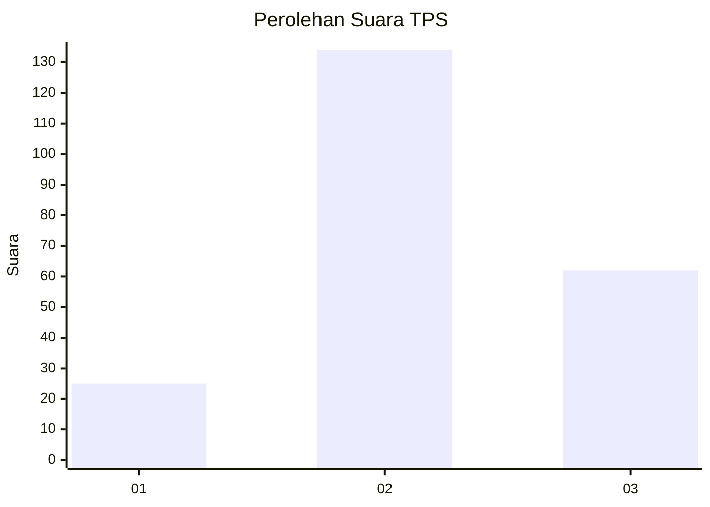
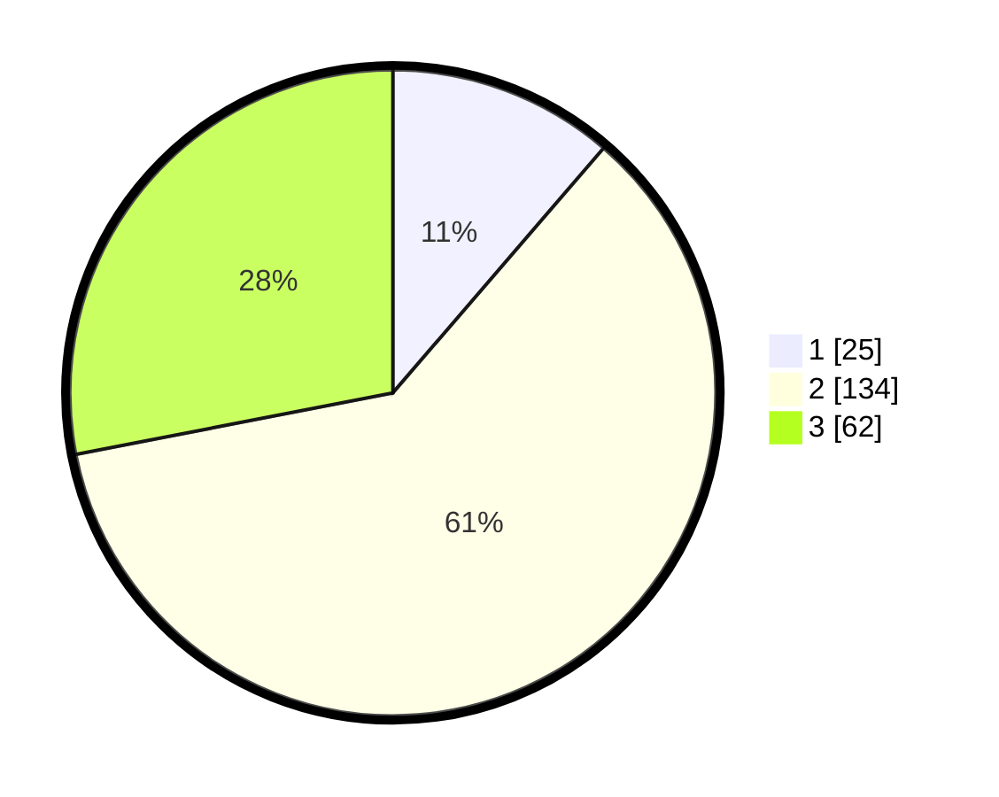

# Hasil

## Grafik

## Tabel

| No. | Nama Paslon    | Suara | Suara (raw) | Persentase |
|:--- |:-------------- | -----:| -----------:| ----------:|
| 1   | ANIES MUHAIMIN | 25    | [25][p-1]   | 11,31      |
| 2   | PRABOWO GIBRAN | 134   | [134][p-2]  | 60,63      |
| 3   | GANJAR MAHFUD  | 62    | [62][p-3]   | 28,05      |

[p-1]: https://github.com/gigit-pemilu/pemilu-2024-34-di-yogyakarta/blob/main/pilpres/hitung-suara/sub/34-di-yogyakarta/sub/02-bantul/sub/06-pandak/sub/2003-gilangharjo/sub/034-tps/sub/paslon-1.txt
[p-2]: https://github.com/gigit-pemilu/pemilu-2024-34-di-yogyakarta/blob/main/pilpres/hitung-suara/sub/34-di-yogyakarta/sub/02-bantul/sub/06-pandak/sub/2003-gilangharjo/sub/034-tps/sub/paslon-2.txt
[p-3]: https://github.com/gigit-pemilu/pemilu-2024-34-di-yogyakarta/blob/main/pilpres/hitung-suara/sub/34-di-yogyakarta/sub/02-bantul/sub/06-pandak/sub/2003-gilangharjo/sub/034-tps/sub/paslon-3.txt

## Foto C Plano

https://sirekap-obj-formc.kpu.go.id/b5be/pemilu/ppwp/34/02/06/20/03/3402062003034-20240215-000231--98e95695-e953-4b24-b36c-3f482f0355d7.jpg

https://sirekap-obj-formc.kpu.go.id/b5be/pemilu/ppwp/34/02/06/20/03/3402062003034-20240214-155243--0b6601bb-6b75-4619-9e8c-056be2a4b628.jpg

https://sirekap-obj-formc.kpu.go.id/b5be/pemilu/ppwp/34/02/06/20/03/3402062003034-20240215-061415--48fb8c5e-bb72-43dc-94e7-ccb53a693da4.jpg

## Metadata

| Key        | Value               |
| ---------- | ------------------- |
| Time Stamp | 2024-02-15 12:00:28 |

