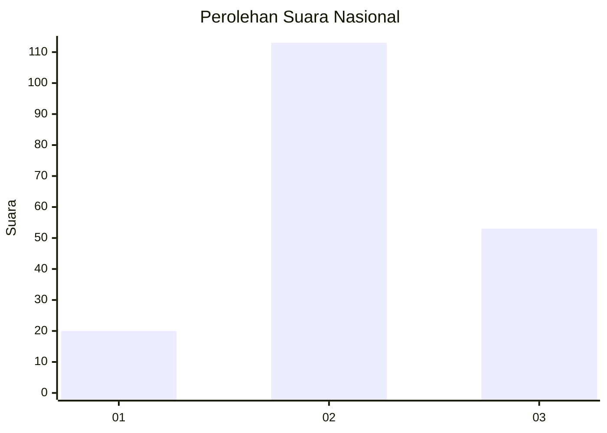
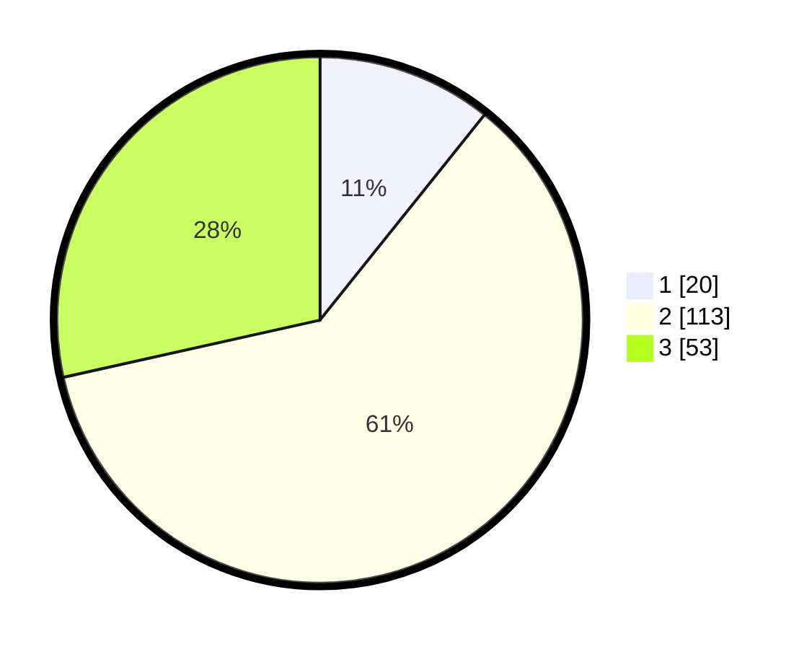

# Hasil

## Grafik

## Tabel

| No. | Nama Paslon    | Suara | Suara (raw) | Persentase |
|:--- |:-------------- | -----:| -----------:| ----------:|
| 1   | ANIES MUHAIMIN | 20    | [20][p-1]   | 10,75      |
| 2   | PRABOWO GIBRAN | 113   | [113][p-2]  | 60,75      |
| 3   | GANJAR MAHFUD  | 53    | [53][p-3]   | 28,49      |

[p-1]: https://github.com/gigit-pemilu/pemilu-2024/blob/main/pilpres/hitung-suara/sub/34-di-yogyakarta/sub/02-bantul/sub/06-pandak/sub/2003-gilangharjo/sub/036-tps/sub/paslon-1.txt
[p-2]: https://github.com/gigit-pemilu/pemilu-2024/blob/main/pilpres/hitung-suara/sub/34-di-yogyakarta/sub/02-bantul/sub/06-pandak/sub/2003-gilangharjo/sub/036-tps/sub/paslon-2.txt
[p-3]: https://github.com/gigit-pemilu/pemilu-2024/blob/main/pilpres/hitung-suara/sub/34-di-yogyakarta/sub/02-bantul/sub/06-pandak/sub/2003-gilangharjo/sub/036-tps/sub/paslon-3.txt

## Foto C Plano

https://sirekap-obj-formc.kpu.go.id/54fb/pemilu/ppwp/34/02/06/20/03/3402062003036-20240221-195706--abcd3892-71e7-4ca3-b0f0-7197cfafa3c1.jpg

https://sirekap-obj-formc.kpu.go.id/54fb/pemilu/ppwp/34/02/06/20/03/3402062003036-20240221-195845--2431a1aa-8408-4726-a1c0-edc7d49da4e9.jpg

https://sirekap-obj-formc.kpu.go.id/54fb/pemilu/ppwp/34/02/06/20/03/3402062003036-20240221-195915--fcee149e-0dd9-492a-a353-4fb35c26b1f4.jpg

## Metadata

| Key        | Value               |
| ---------- | ------------------- |
| Time Stamp | 2024-02-24 22:31:28 |

