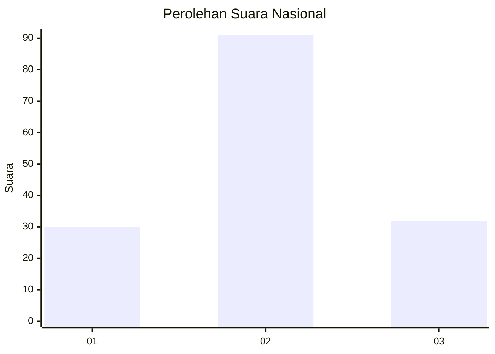
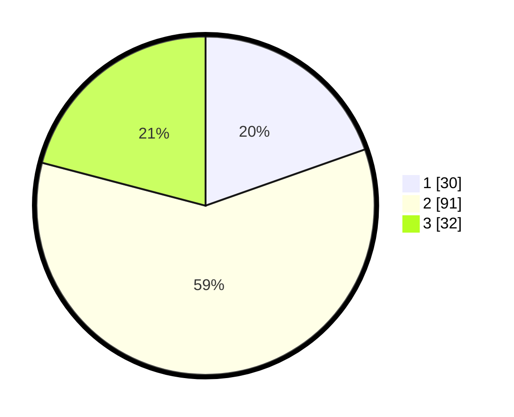

# Hasil

## Grafik

## Tabel

| No. | Nama Paslon    | Suara | Suara (raw) | Persentase |
|:--- |:-------------- | -----:| -----------:| ----------:|
| 1   | ANIES MUHAIMIN | 30    | [30][p-1]   | 19,61      |
| 2   | PRABOWO GIBRAN | 91    | [91][p-2]   | 59,48      |
| 3   | GANJAR MAHFUD  | 32    | [32][p-3]   | 20,92      |

[p-1]: https://github.com/gigit-pemilu/pemilu-2024/blob/main/pilpres/hitung-suara/sub/34-di-yogyakarta/sub/02-bantul/sub/06-pandak/sub/2003-gilangharjo/sub/038-tps/sub/paslon-1.txt
[p-2]: https://github.com/gigit-pemilu/pemilu-2024/blob/main/pilpres/hitung-suara/sub/34-di-yogyakarta/sub/02-bantul/sub/06-pandak/sub/2003-gilangharjo/sub/038-tps/sub/paslon-2.txt
[p-3]: https://github.com/gigit-pemilu/pemilu-2024/blob/main/pilpres/hitung-suara/sub/34-di-yogyakarta/sub/02-bantul/sub/06-pandak/sub/2003-gilangharjo/sub/038-tps/sub/paslon-3.txt

## Foto C Plano

https://sirekap-obj-formc.kpu.go.id/238c/pemilu/ppwp/34/02/06/20/03/3402062003038-20240214-215939--639be16a-c324-40e9-8495-2af28a09a72b.jpg

https://sirekap-obj-formc.kpu.go.id/238c/pemilu/ppwp/34/02/06/20/03/3402062003038-20240214-220029--45212ee9-61c1-4467-a0db-18fb937c5e89.jpg

https://sirekap-obj-formc.kpu.go.id/238c/pemilu/ppwp/34/02/06/20/03/3402062003038-20240214-220118--84ca53da-9d5d-46f5-ac80-e24059f9d9ab.jpg

## Metadata

| Key        | Value               |
| ---------- | ------------------- |
| Time Stamp | 2024-02-24 22:31:28 |

